# 🎯 Theory & Concepts — Recognizing Your Own Emotions

---

## ⚡ Quick Reference (TL;DR)

> **Emotional Recognition** is the ability to notice and correctly label what you are feeling *in the moment*. It is the #1 foundation skill of Emotional Intelligence — you cannot manage what you cannot name.

| Core Idea | One-Line Summary |
|---|---|
| Emotions are data | They are signals, not problems to suppress |
| Name it to tame it | Labeling an emotion reduces its intensity by 50% |
| Body first, brain second | Emotions start physically before you think them |
| Granularity matters | "Frustrated" vs "Overwhelmed" — precision changes response |

---

## 📖 Core Concepts Explained Simply

### What IS an Emotion?

An emotion is a **biological signal** your brain generates in response to an event. It involves:

1. **A physical sensation** (tight chest, racing heart, warmth in face)
2. **A thought or interpretation** ("this is a threat" / "this is exciting")
3. **An urge to act** (fight, flee, freeze, approach)

> 💡 **The key insight:** Emotions happen *to* you before you are consciously aware of them. Recognizing them means catching them *just after* they start — not suppressing them later.

---

### The "Name It to Tame It" Science

Research by neuroscientist **Dr. Matthew Lieberman (UCLA)** showed that:

- Putting feelings into words activates the **prefrontal cortex** (rational brain)
- This *simultaneously reduces* activation in the **amygdala** (emotional alarm center)
- Result: The emotional intensity drops significantly just by labeling it

**🧠 Brain Circuit: Emotion vs Rational Thinking**

**📊 fMRI Evidence — Labeling Emotions Reduces Amygdala Activity**

> *Source: Lieberman et al., UCLA — putting feelings into words (affect labeling) reduced amygdala activation in fMRI studies.*

---

### Emotional Granularity — Why Precision Matters

Most people use only 3 words: *happy, sad, angry*. But there are hundreds of distinct emotions. **Emotional Granularity** is training yourself to use precise labels.

| Vague Label | More Precise Labels |
|---|---|
| Angry | Frustrated / Resentful / Irritated / Furious / Betrayed |
| Sad | Disappointed / Lonely / Grief / Melancholic / Helpless |
| Nervous | Anxious / Apprehensive / Dread / Overwhelmed / Insecure |
| Happy | Grateful / Excited / Content / Proud / Relieved |

> 🔑 **Why it matters:** When you label "I'm feeling resentful" instead of just "I'm angry," you automatically know what action is needed differently.

---

## 📊 How Emotion Recognition Works — Flowchart

```mermaid
graph TD
    A[⚡ An Event Happens] --> B[Body Reacts First\ne.g. tight chest, fast heartbeat]
    B --> C{Are you paying\nattention?}
    C -- No --> D[Emotion goes unnoticed\nReactive behavior follows]
    C -- Yes --> E[Pause & Scan your body]
    E --> F[Ask: What am I feeling right now?]
    F --> G{Can you name it\nprecisely?}
    G -- No --> H[Use Emotion Wheel\nto find the right word]
    G -- Yes --> I[✅ You have recognized\nthe emotion]
    H --> I
    I --> J[Now you can CHOOSE\nhow to respond]
```

---

### The Emotion Wheel (Visual Guide)

> **Study Tip:** Notice how emotions fade in intensity as you move outward from the center.

### Simplified Text Version

---

## 🔑 Key Takeaways

1. **Emotions are signals, not weaknesses** — they carry useful information
2. **Recognition is the first step** — you cannot regulate what you haven't noticed
3. **The body speaks first** — learn to scan physical sensations as cues
4. **Precision = Power** — the more specific your label, the better your response
5. **"Name it to tame it"** — labeling reduces emotional intensity scientifically

---

*Next → [`02_Techniques_and_Frameworks.md`](./02_Techniques_and_Frameworks.md)*
