# 🧰 Techniques & Frameworks — Recognizing Your Own Emotions

---

## ⚡ Quick Reference (TL;DR)

| Technique | When to Use | Time Needed |
|---|---|---|
| **STOP Technique** | In the moment, real-time | 30 seconds |
| **Body Scan** | Before meetings / after conflicts | 2 minutes |
| **Emotion Labeling (R.A.I.N)** | When overwhelmed or confused | 5 minutes |
| **Daily Emotion Check-in** | Morning / Evening ritual | 1 minute |
| **The Pause Protocol** | Before reacting to something triggering | 10 seconds |

---

## 🧰 Framework 1 — The STOP Technique

**Best for:** Real-time, in-the-moment awareness — before sending an email, entering a difficult meeting, or reacting to criticism.

```mermaid
graph LR
    S["🛑 S — Stop\nPause what you're doing"] --> T["🌬️ T — Take a Breath\nOne slow, deep breath"]
    T --> O["👁️ O — Observe\nWhat am I feeling right now?"]
    O --> P["▶️ P — Proceed\nAct with intention, not reaction"]
```

> 🧠 **Mnemonic:** Think of a **STOP sign** — red means pause before you proceed.

---

## 🧰 Framework 2 — R.A.I.N (For Deeper Emotions)

**Best for:** When you feel overwhelmed, confused, or can't shake a negative feeling.

| Letter | Step | What to Do |
|---|---|---|
| **R** | Recognize | Notice that an emotion is present. "There is anger here." |
| **A** | Allow | Let it exist without fighting or suppressing it. "It's okay to feel this." |
| **I** | Investigate | Get curious. "Where do I feel this in my body?" "What triggered this?" |
| **N** | Nurture | Respond with self-compassion. "What do I need right now?" |

```mermaid
graph TD
    R[R — Recognize\nAn emotion is present] --> A[A — Allow\nDon't fight it, let it be]
    A --> I[I — Investigate\nGet curious, ask questions]
    I --> N[N — Nurture\nBe kind to yourself]
    N --> X[✅ Clarity & Calm\nNow you can respond wisely]
```

> 🧠 **Mnemonic:** Think of **rain washing something clean** — emotions become clearer when you let them "rain through" without resistance.

---

## 🧰 Framework 3 — The Body Scan (Physical Emotion Detection)

**Best for:** Catching emotions *before* they escalate. Most emotions show up in the body before your brain registers them.

**Step-by-step:**

1. **Pause** — Close your eyes if possible or just soften your gaze
2. **Top to Bottom** — Slowly scan from head → shoulders → chest → stomach → hands
3. **Notice** — Any tightness? Warmth? Heaviness? Fluttering?
4. **Name it** — What emotion matches that physical sensation?

| Physical Sensation | Likely Emotion |
|---|---|
| Tight chest | Anxiety / Fear / Dread |
| Warmth in face | Embarrassment / Anger |
| Heavy shoulders | Sadness / Burden / Overwhelm |
| Knot in stomach | Nervousness / Dread |
| Lightness / energy | Joy / Excitement |
| Clenched jaw/fists | Anger / Frustration |

**🌍 Where Emotions Live in the Body — Scientific Map**

> *Source: Nummenmaa et al. — a landmark study mapping bodily sensations to specific emotions across cultures.*

---

## 🧰 Framework 4 — Daily Emotion Check-In (1-Minute Habit)

**Best for:** Building a daily habit of emotional awareness.

Ask yourself these 3 questions:

1. **What am I feeling right now?** *(use a precise word — not just "fine")*
2. **Where do I feel it in my body?**
3. **What might have triggered this?**

> 💡 **Pro Tip:** Do this at 3 fixed times: **Morning** (sets the tone), **After lunch** (mid-day reset), **Evening** (reflection).

---

## 🔑 Key Takeaways

1. **STOP** is your real-time tool — use it before you react
2. **R.A.I.N** is your deep-dive tool — use it when emotions linger
3. **Body Scan** is your early-warning system — emotions live in the body first
4. **Daily check-ins** build the habit so recognition becomes automatic over time

---

*← [`01_Theory_and_Concepts.md`](./01_Theory_and_Concepts.md) | Next → [`03_Practice_Exercises.md`](./03_Practice_Exercises.md)*
