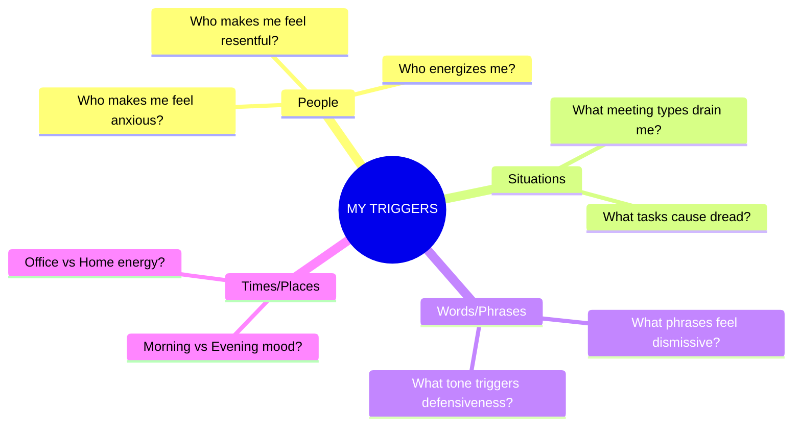

# 💪 Practice Exercises — Recognizing Your Own Emotions

---

## ⚡ Quick Reference (TL;DR)

| Exercise | Frequency | Time | Difficulty |
|---|---|---|---|
| Emotion Word Swap | Daily | 1 min | 🟢 Easy |
| Body Scan Check-In | 3x daily | 2 min | 🟢 Easy |
| Emotion Journal | Daily | 5 min | 🟡 Medium |
| Trigger Mapping | Weekly | 10 min | 🟡 Medium |
| The Mirror Exercise | Weekly | 5 min | 🔴 Hard |

---

## ⚡ Exercise 1 — Emotion Word Swap (Daily, 1 min)

**Goal:** Build emotional vocabulary — stop using vague words like "fine", "okay", "stressed".

**How to do it:**
> Every time you are about to say **"I'm fine"** or **"I'm stressed"** — pause and replace it with a more precise word.

**Practice right now:**

Replace each vague word below with 3 more precise alternatives:

| Vague Word | Your Precise Alternatives |
|---|---|
| Fine | ___________ / ___________ / ___________ |
| Stressed | ___________ / ___________ / ___________ |
| Upset | ___________ / ___________ / ___________ |
| Good | ___________ / ___________ / ___________ |

*(Reference answers: Fine → Content/Relieved/Neutral | Stressed → Overwhelmed/Anxious/Pressured)*

---

## ⚡ Exercise 2 — Body Scan Check-In (3x Daily, 2 min)

**Goal:** Develop the habit of catching emotions in your body before they escalate.

**Reference — Where Do You Feel It?**


**Set 3 phone alarms:** Morning (9am) | Afternoon (2pm) | Evening (8pm)

When the alarm goes off, answer these 3 questions:

```
1. PAUSE — What am I physically feeling right now?
   → Head? Shoulders? Chest? Stomach? Hands?
   
2. NAME IT — What emotion matches this sensation?
   → _______________________________________________
   
3. TRACE IT — What event/thought triggered this?
   → _______________________________________________
```

> ✅ **Success marker:** After 2 weeks, you should start noticing emotions *without* needing the alarm.

---

## ⚡ Exercise 3 — Emotion Journal (Daily, 5 min)

**Goal:** Create a personal emotional pattern log so you can spot recurring triggers.

**Template to use every evening:**

```markdown
## Date: ___________

### Strongest Emotion Today:
- Emotion: _______________
- Intensity (1-10): ___
- Body sensation: _______________
- What triggered it: _______________
- How I responded: _______________
- How I WISH I had responded: _______________

### Gratitude Emotion Note:
One thing that made me feel [specific positive emotion]: _______________
```

---

## ⚡ Exercise 4 — Trigger Mapping (Weekly, 10 min)

**Goal:** Identify YOUR personal emotional triggers before they catch you off-guard.

**After one week of journaling, fill in this map:**



**Written version — fill in your own:**

| Trigger Category | Specific Trigger | Emotion It Causes |
|---|---|---|
| Person | ________________ | ________________ |
| Situation | ________________ | ________________ |
| Word/Tone | ________________ | ________________ |
| Time of day | ________________ | ________________ |

---

## ⚡ Exercise 5 — The Mirror Exercise (Weekly, 5 min)

**Goal:** Recognize emotions through facial expressions — your own and others'.

**How:**

1. Sit quietly in front of a mirror (or use your phone camera)
2. Think of a recent event that triggered an emotion
3. **Observe your face** — what does the emotion look like on you?
4. Practice **consciously labeling** the expression: "This is what my frustration looks like"

> 💡 **Why this works:** Most people have never observed their own emotional expressions. This builds the muscle of recognizing subtle cues — both in yourself and later in others.

---

## 📊 30-Day Progress Tracker

| Week | Emotion Word Swap | Body Scan | Journal | Trigger Map |
|---|---|---|---|---|
| Week 1 | ⬜⬜⬜⬜⬜⬜⬜ | ⬜⬜⬜⬜⬜⬜⬜ | ⬜⬜⬜⬜⬜⬜⬜ | ⬜ |
| Week 2 | ⬜⬜⬜⬜⬜⬜⬜ | ⬜⬜⬜⬜⬜⬜⬜ | ⬜⬜⬜⬜⬜⬜⬜ | ⬜ |
| Week 3 | ⬜⬜⬜⬜⬜⬜⬜ | ⬜⬜⬜⬜⬜⬜⬜ | ⬜⬜⬜⬜⬜⬜⬜ | ⬜ |
| Week 4 | ⬜⬜⬜⬜⬜⬜⬜ | ⬜⬜⬜⬜⬜⬜⬜ | ⬜⬜⬜⬜⬜⬜⬜ | ⬜ |

*(Replace ⬜ with ✅ when done)*

---

*← [`02_Techniques_and_Frameworks.md`](./02_Techniques_and_Frameworks.md) | Next → [`04_Real_World_Examples.md`](./04_Real_World_Examples.md)*
