# 💼 Real-World Examples — Recognizing Your Own Emotions

---

## ⚡ Quick Reference (TL;DR)

> These scenarios show what it looks like **with** vs **without** emotional recognition in real workplace and daily life situations. Study the contrast — that gap is the skill.

---

## 🎬 Scenario 1 — The Dismissive Meeting

**Context:** You present an idea in a team meeting. Your manager says *"We've tried something like that before, it didn't work"* and moves on. You feel something spike inside you.

---

### ❌ Without Emotional Recognition

```
Internal: [Nothing — just a vague bad feeling]
Action:   You go quiet for the rest of the meeting.
          Later you complain to a colleague.
          You avoid contributing in the next 2 meetings.
Outcome:  You feel demotivated. Others see you as disengaged.
          The root cause is never addressed.
```

---

### ✅ With Emotional Recognition

```
Internal: "I notice a tight feeling in my chest and heat in my face.
           I feel... dismissed? No — more precisely, I feel embarrassed
           and a little resentful."
Pause:    [Takes a breath. Uses STOP.]
Choice:   "This emotion is valid, but I don't need to react right now.
           I'll journal this later and decide if I want to follow up
           with my manager privately."
Outcome:  You remain composed in the meeting.
          You address it constructively 1-on-1 later.
          Your idea gets heard properly.
```

**The emotion recognized:** `Embarrassment + Resentment` (not just "upset")
**The turning point:** Naming it precisely led to a *chosen* response, not a reactive one.

---

## 🎬 Scenario 2 — The Deadline Pressure

**Context:** Your client just moved the deadline up by 3 days. Your whole sprint plan collapses. You stare at the screen.

---

### ❌ Without Emotional Recognition

```
Internal: "This is impossible. Whatever."
Action:   Snaps at a teammate who asks a simple question.
          Skips lunch. Works until midnight inefficiently.
          Sends a curt, abrupt email to the client.
Outcome:  Team morale drops. Client relationship is strained.
          Work quality suffers due to stress-driven decisions.
```

---

### ✅ With Emotional Recognition

```
Internal: "I feel a knot in my stomach and my jaw is clenched.
           This is overwhelm — specifically the kind that comes from
           feeling out of control, not from actual impossibility."
Pause:    [Steps away for 2 minutes. Does a body scan.]
Reframe:  "The overwhelm is about loss of control. What CAN I control?"
Choice:   Calls a quick 15-min team sync to re-prioritize.
          Sends a professional email to the client asking for clarification.
Outcome:  Team rallies together. A realistic plan is created.
          Client respects the professional response.
```

**The emotion recognized:** `Overwhelm driven by loss of control` (not just "stressed")
**The turning point:** Identifying the *specific type* of overwhelm led directly to the right solution.

---

## 🎬 Scenario 3 — The Peer Gets Promoted (Not You)

**Context:** You find out your colleague — hired the same year as you — just got promoted. You weren't even informed you were being considered.

---

### ❌ Without Emotional Recognition

```
Internal: "I'm fine. It's whatever. Good for them I guess."
         [Suppressed emotions]
Surface:  Becomes subtly cold toward the colleague.
          Disengages from team projects.
          Starts job hunting impulsively.
Outcome:  Relationships at work deteriorate.
          Decisions made from unprocessed emotion.
```

---

### ✅ With Emotional Recognition

```
Internal: "I feel something heavy in my chest. This is... disappointment.
           And underneath that — if I'm honest — envy. And maybe
           some fear: am I not valued here?"
Allows:   [Sits with the feeling without acting immediately. Uses R.A.I.N.]
Separates: "The envy is just information — it tells me I care about
            growth. The fear is telling me I need clarity on my path."
Action:   Books a 1-on-1 with the manager to discuss career goals.
          Congratulates colleague genuinely.
Outcome:  Gets clarity on promotion criteria.
          Maintains relationships. Takes constructive action.
```

**The emotion recognized:** `Disappointment + Envy + Fear of being undervalued`
**The turning point:** Honest labeling separated the emotions from each other, making each one actionable.

---

## 📊 Pattern Summary

```mermaid
graph LR
    A[Triggering Event] --> B[Unrecognized Emotion]
    B --> C[Reactive Behavior]
    C --> D[❌ Poor Outcomes]

    A --> E[Recognized & Named Emotion]
    E --> F[Deliberate Response]
    F --> G[✅ Better Outcomes]
```



---

## 🔑 Key Takeaways from These Scenarios

1. **The event is the same — the emotional awareness is different.** Recognition is the variable that changes outcomes.
2. **Suppression is not neutrality** — unexpressed emotions leak out as cold behavior, avoidance, and poor decisions.
3. **Precise naming matters** — "overwhelmed due to loss of control" leads to a completely different solution than just "stressed."
4. **Recognition creates a gap** — between stimulus and response. That gap is where your power lives.

---

*← [`03_Practice_Exercises.md`](./03_Practice_Exercises.md) | Next → [`05_Common_Mistakes.md`](./05_Common_Mistakes.md)*
