# ⚠️ Common Mistakes — Recognizing Your Own Emotions

---

## ⚡ Quick Reference (TL;DR)

> Most people *think* they're aware of their emotions when they are actually rationalizing, suppressing, or mislabeling them. These are the most common traps — and how to avoid them.

| # | Mistake | Quick Fix |
|---|---|---|
| 1 | Confusing thoughts with emotions | Use "I feel [emotion word]" not "I feel like [thought]" |
| 2 | Saying "I'm fine" as default | Pause and choose a precise emotion word |
| 3 | Skipping the body — going straight to analysis | Always scan body first |
| 4 | Judging the emotion instead of noticing it | Observe, don't evaluate |
| 5 | Only noticing peak emotions, missing subtle ones | Build a daily check-in habit |

---

## ❌ Mistake 1 — Confusing Thoughts with Emotions

This is the most common and most damaging mistake.

| ❌ "I feel like..." (Thought) | ✅ "I feel..." (Emotion) |
|---|---|
| "I feel like you don't respect me." | "I feel dismissed / disrespected." |
| "I feel like this is unfair." | "I feel frustrated and powerless." |
| "I feel like nobody listens to me." | "I feel lonely and undervalued." |
| "I feel like things are out of control." | "I feel overwhelmed and anxious." |

> 💡 **The Test:** After "I feel," can you substitute an emotion word from the emotion wheel? If yes → emotion. If it's a full clause or judgment → it's a thought, not an emotion.

---

## ❌ Mistake 2 — Emotional Suppression (The "I'm Fine" Trap)

**What it looks like:**

- Saying "I'm fine" when clearly not
- Telling yourself "I shouldn't feel this way"
- Pushing through without acknowledging what you're feeling

**Why people do it:**

- Cultural conditioning ("don't be emotional at work")
- Fear that feeling = weakness
- Speed — no time to check in

**What actually happens:**

```mermaid
graph TD
    A[Emotion occurs] --> B[Suppress it: I'm fine]
    B --> C[Emotion goes underground]
    C --> D[Builds up over time]
    D --> E[Explodes disproportionately\nor leaks as passive behavior]
    E --> F[❌ Damaged relationships\nor burnout]

    A --> G[Recognize and name it]
    G --> H[Process it consciously]
    H --> I[✅ Guided, deliberate response]
```



> 🔑 **Fix:** Replace "I'm fine" with a 2-second check — even silently to yourself. You don't have to share the emotion, but you must *acknowledge* it internally.

---

## ❌ Mistake 3 — Skipping the Body & Going Straight to Analysis

**What it looks like:**

- Immediately trying to *think through* why you feel bad
- Jumping to solutions before acknowledging the feeling
- Living "in the head" and ignoring physical signals

**The problem:** The body registers emotion 200–500 milliseconds *before* the conscious brain does (per neuroscience research). Skipping the body means missing the emotion at its most accessible moment.

**Fix — Body First, Brain Second:**

```
❌ Wrong order:   Event → Analyze → Maybe notice feeling
✅ Right order:   Event → Body Scan → Name Emotion → Analyze
```

---

## ❌ Mistake 4 — Judging the Emotion Instead of Noticing It

**What it looks like:**

- "I shouldn't be feeling envious — it's petty."
- "Being scared of this is embarrassing."
- "I'm being irrational for feeling this way."

**Why this is harmful:**
Judging an emotion **adds a second emotion** (shame/guilt) on top of the first one, making it harder to process either. It also stops you from understanding what the original emotion was actually telling you.

**Fix — The Scientist Mindset:**
Treat your emotions like data points, not moral judgments.

| ❌ Judge Mode | ✅ Scientist Mode |
|---|---|
| "I'm being stupid for feeling this." | "That's interesting — why is fear showing up here?" |
| "This envy makes me a bad person." | "The envy tells me I care deeply about this goal." |
| "I'm overreacting." | "I feel disproportionately triggered — what's beneath this?" |

---

## ❌ Mistake 5 — Only Noticing Peak Emotions (Missing Subtle Ones)

**What it looks like:**

- Only recognizing emotions when they are at 8/10 intensity or higher
- Missing low-grade anxiety, mild resentment, or quiet excitement
- Thinking "I don't really feel much" when actually running on autopilot

**Why subtle emotions matter:**
Low-grade irritation that goes unnoticed for 3 weeks becomes an explosive outburst. Quiet anxiety that is ignored becomes chronic stress. The stakes are always lower when you catch emotions early.

```mermaid
graph LR
    A[😐 Level 2 — Mild irritation\nEasy to address] --> B[😠 Level 5 — Noticeable frustration\nHarder but manageable]
    B --> C[😡 Level 8 — Anger\nDifficult to control]
    C --> D[🤬 Level 10 — Explosion\nDamage done]

    style A fill:#c8f7c5,stroke:#27ae60
    style B fill:#ffeaa7,stroke:#f39c12
    style C fill:#ffb3b3,stroke:#e74c3c
    style D fill:#e74c3c,stroke:#c0392b,color:#fff
```



> ✅ **Fix:** Build a daily check-in habit (3x/day, 1 minute each) so you catch emotions at Level 2–3, not at Level 8–10.

---

*← [`04_Real_World_Examples.md`](./04_Real_World_Examples.md) | Next → [`06_Tools_and_Resources.md`](./06_Tools_and_Resources.md)*
