# 📝 Assessment & Self-Reflection — Recognizing Your Own Emotions

---

## ⚡ Quick Reference (TL;DR)

> Use this file to **measure where you are now**, **track your growth**, and **reflect monthly** on how your emotional recognition is improving. Honest self-assessment is the fastest path to improvement.

---

## 🎯 Self-Assessment Quiz — Where Are You Right Now?

Rate yourself honestly on each statement from **1 to 5**:

- **1** = Almost never | **2** = Rarely | **3** = Sometimes | **4** = Often | **5** = Almost always

| # | Statement | Your Score (1–5) |
|---|---|---|
| 1 | I can name what I am feeling with a precise emotion word (not just "fine" or "stressed") | |
| 2 | I notice emotions in my body before they escalate | |
| 3 | I can tell the difference between a thought ("I feel like you don't care") and an emotion ("I feel dismissed") | |
| 4 | I recognize when an emotion is influencing my decisions or behavior in the moment | |
| 5 | I can identify the specific trigger that caused an emotion, not just the emotion itself | |
| 6 | I notice subtle, low-intensity emotions (mild anxiety, quiet excitement) not just peak ones | |
| 7 | I observe my emotions without judging myself for having them | |
| **TOTAL** | | **/35** |

---

### 📊 Your Score Interpretation

```mermaid
graph LR
    A["7–14\n🔴 Beginner\nStart with daily body scans\nand emotion journaling"] --> B["15–21\n🟡 Developing\nFocus on precision —\nuse emotion wheel daily"]
    B --> C["22–28\n🟢 Proficient\nWork on subtle emotions\nand trigger patterns"]
    C --> D["29–35\n⭐ Advanced\nFocus on teaching others\nand edge cases"]
```



---

## 📓 Monthly Reflection Prompts

*Do this at the end of each month. Write your answers in a journal or directly below.*

### Month: _______________

**1. Wins — Moments where I caught an emotion early and responded well:**

```
Example: "In last Tuesday's meeting, I noticed defensiveness rising 
when my idea was challenged. Instead of shutting down, I named it 
internally and asked a clarifying question instead."

My own example: ________________________________________________
```

**2. Misses — Moments where a unrecognized emotion drove poor behavior:**

```
Example: "I sent a curt Slack message without realizing I was 
frustrated from a different conversation. The emotion leaked."

My own example: ________________________________________________
```

**3. Pattern I noticed this month:**

```
My most frequent emotion this month was: _______________________
It was most often triggered by: ________________________________
The body sensation I now associate with it: _____________________
```

**4. Vocabulary Growth — New emotion words I started using:**

```
1. _____________________________________________________________
2. _____________________________________________________________
3. _____________________________________________________________
```

**5. My score compared to last month:**

| Assessment Area | Last Month | This Month | Change |
|---|---|---|---|
| Naming precisely | /5 | /5 | |
| Noticing in body | /5 | /5 | |
| Catching subtle emotions | /5 | /5 | |
| **Total** | /35 | /35 | |

---

## 📊 6-Month Progress Tracker

| Month | Total Score | Biggest Win | Area to Focus On |
|---|---|---|---|
| Month 1 | /35 | | |
| Month 2 | /35 | | |
| Month 3 | /35 | | |
| Month 4 | /35 | | |
| Month 5 | /35 | | |
| Month 6 | /35 | | |

---

## 🏁 Mastery Checklist

Check these off when you feel genuinely confident in each:

- [ ] I can identify an emotion within 30 seconds of it arising
- [ ] I consistently use precise emotion words (not just "stressed" or "angry")
- [ ] I can recognize my top 5 personal emotional triggers
- [ ] I know what each of my key emotions feels like in my body
- [ ] I catch subtle emotions (Level 2–3) before they escalate to Level 8–10
- [ ] I can recognize emotions without judging myself for having them
- [ ] I can distinguish between emotions and the thoughts that accompany them
- [ ] I recognize when emotions are influencing my professional decisions in real time

---

*← [`06_Tools_and_Resources.md`](./06_Tools_and_Resources.md) | 🏠 Back to [`README.md`](./README.md)*

---

> *"Between stimulus and response there is a space. In that space is our power to choose our response."* — Viktor Frankl
