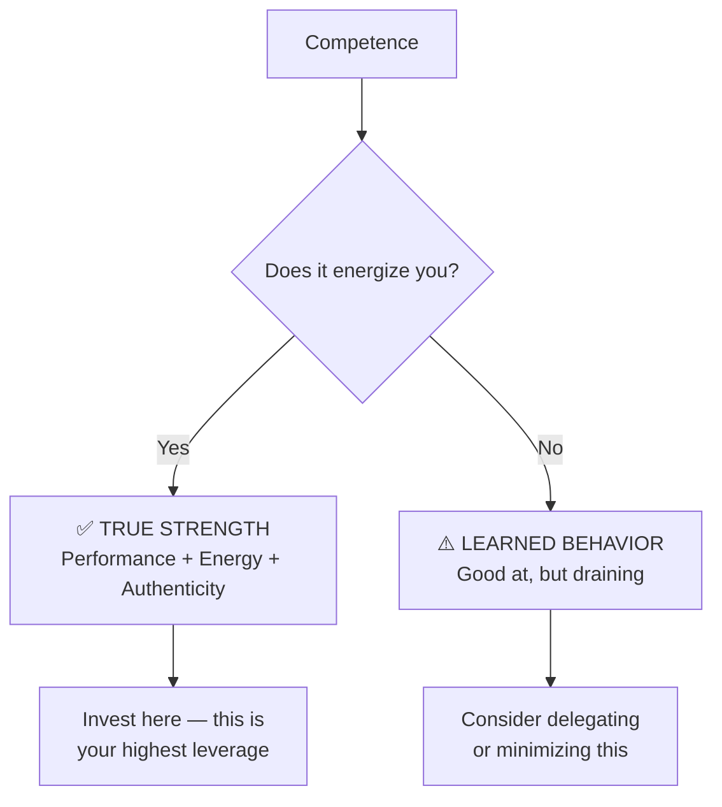

# 🎯 Theory & Concepts — Knowing Your Strengths and Limits

---

## ⚡ Quick Reference (TL;DR)

> **Knowing your strengths and limits** is the ability to have an accurate, honest map of what you are good at, where you struggle, and where your growth edges lie. It prevents overconfidence, underconfidence, and enables better decisions about effort, delegation, and development.

| Core Idea | One-Line Summary |
|---|---|
| Strengths are not just talents | They are also values and energizing activities |
| Limits are not fixed | They are current boundaries — most can be expanded |
| Blind spots are costly | What you don't know about yourself affects everyone around you |
| Self-assessment ≠ accurate | External feedback is essential to calibrate your self-image |

---

## 📖 Core Concepts Explained Simply

### What IS a Strength?

A strength is not just "something you're good at." According to the **VIA Institute on Character** and Martin Seligman's research, a true strength is:

1. **Performance** — You execute it well, measurably
2. **Energy** — It feels energizing, not draining
3. **Authenticity** — It feels like "the real you" when you use it

> 💡 **The key insight:** You can be *competent* at something and it still not be a strength if it drains you. True strengths build you up.

---

### What IS a Limit?

A limit is a **current boundary** in one of three categories:

| Type of Limit | What it Means | Example |
|---|---|---|
| **Skill Gap** | You haven't learned it yet | Public speaking, data analysis |
| **Energy Drain** | You can do it, but it costs you | Detailed admin work for a big-picture thinker |
| **Values Conflict** | You resist it because it conflicts with who you are | Aggressive sales tactics for a relationship-builder |

> 🔑 **Why it matters:** Confusing these types leads to wrong solutions. Skill gaps need training. Energy drains need delegation. Values conflicts need deeper exploration.

---

### The Johari Window — A Framework for Self-Knowledge

The **Johari Window** (Joseph Luft & Harry Ingham, 1955) maps what you know and don't know about yourself vs. what others see.

| Quadrant | What It Means | Your Goal |
|---|---|---|
| **Open** (known to you + others) | Your visible strengths and behaviors | Expand this area |
| **Blind Spot** (others see, you don't) | Habits you're unaware of, impact on others | Seek feedback here |
| **Hidden** (you know, others don't) | Skills you hide, fears you mask | Share selectively |
| **Unknown** (neither knows) | Untapped potential, deep patterns | Explore via new challenges |

---

### The Dunning-Kruger Effect — Why Self-Assessment Goes Wrong

Research by Kruger & Dunning (1999) showed that people systematically misjudge their own competence — and it works in both directions.

> **The Curve tells us:**
>
> - **Beginners** 👉 Overconfident (they don't know what they don't know)
> - **Intermediate learners** 👉 Underconfident (they realize how much they don't know)
> - **Experts** 👉 Accurately calibrated (they know their boundaries with precision)

**Implication:** You need *external data* (feedback, results, tests) to calibrate your self-assessment at every stage.

---

## 📊 The Strengths Inventory Model (VIA Framework)

The **VIA Character Strengths** model from positive psychology identifies 24 universal character strengths organized under 6 core virtues.

> *Take the free VIA survey at [viacharacter.org](https://www.viacharacter.org) to discover your top 5 signature strengths.*

---

## 🔑 Key Takeaways

1. **Strengths = Performance + Energy + Authenticity** — all three must be present
2. **Limits are current, not permanent** — treat them as data, not verdicts
3. **Blind spots are your biggest risk** — actively seek feedback to find them
4. **The Dunning-Kruger trap is real** — internal assessment alone is unreliable  
5. **The Johari Window is your map** — work to expand your "Open" quadrant

---

*Next → [`02_Techniques_and_Frameworks.md`](./02_Techniques_and_Frameworks.md)*
