# 🎯 Theory & Concepts — Knowing Your Strengths and Limits

---

## ⚡ Quick Reference (TL;DR)

> **Knowing your strengths and limits** is the continuous, calibrated practice of accurately mapping what you excel at, where you struggle, and where your current growth edges are — and using that map to make better decisions about effort, collaboration, delegation, communication, and development.

> An *inaccurate* self-map is one of the most costly professional liabilities you can carry: it produces overreach (taking on what you cannot execute), under-reach (avoiding what you're ready for), blind spots (impacting others in ways you cannot see), and development plans that target the wrong thing.

| Core Principle | The Deep Insight |
|---|---|
| Strengths = Performance + Energy + Authenticity | Competence without energy is a learned behaviour, not a true strength |
| Three distinct types of limits | Skill gaps, energy drains, and values conflicts each require a different response |
| Blind spots affect everyone around you | What you don't see in yourself is fully visible to others — and it shapes their experience of you |
| Self-assessment is systematically biased | Kruger & Dunning (1999): humans cannot accurately assess their own competence without external calibration |
| The Johari Window is a dynamic map, not a fixed grid | The goal is to actively expand the Open quadrant — through disclosure and deliberate feedback-seeking |
| Strength overuse becomes a liability | Every strength, taken too far or applied in the wrong context, becomes its shadow side |

---

## 📖 Part 1 — What IS a Strength? (The Precise Definition)

### Why "Something You're Good At" Is Not Enough

Popular usage of the word "strengths" collapses several distinct and important concepts into one. Most people, when asked to name their strengths, list things they are *competent at* — whether or not those things energise them. This creates a fundamental misclassification problem.

You can be technically excellent at something that slowly depletes you. You can be sought out by others for a skill you actively dislike exercising. In organisations, these situations are extremely common: the analyst promoted into management because her data skills were exceptional, now spending 80% of her time in people-coordination work that exhausts her. The engineer who is the best technical writer on the team but finds documentation deeply tedious.

These are not strengths. They are **learned competencies** — skills developed through effort and practice, which may produce good outputs but which do not sustain or elevate the person exercising them.

**The Three-Criteria Definition (Seligman & Peterson, 2004 — VIA Classification)**

> A true strength is the combination of three elements:
>
> 1. **Performance** — You execute it at a high level, measurably, consistently across contexts
> 2. **Energy** — Its use feels activating, not depleting; you are typically more energised after using it than before
> 3. **Authenticity** — It feels like "the real you" — using it doesn't feel like performing or role-playing

| Category | Performance | Energy | Authenticity | Classification |
|---|---|---|---|---|
| True Strength | ✅ High | ✅ Energising | ✅ Authentic | **Invest and leverage** |
| Learned Competency | ✅ High | ❌ Draining | ❌ Feels performed | **Minimise or delegate** |
| Developing Strength | 🔶 Growing | ✅ Energising | ✅ Authentic | **Develop deliberately** |
| Low-Performance Area | ❌ Low | ❌ Draining | ❌ | **Manage around or build to minimum threshold** |

> 📊 **Research — Buckingham & Clifton (2001), "Now, Discover Your Strengths":** Gallup's analysis of ~1.7 million workers in 101 companies across 63 countries found that employees who reported using their strengths "every day" were 6× more likely to be engaged at work. Critically, only 20% of employees reported they had the opportunity to do what they did best every day — indicating a massive systemic underuse of actual strengths in the workforce.

### The Shadow Side of Strengths — Overuse as a Liability

This is among the least-discussed and most important nuances in strengths work: every strength, taken too far or deployed in the wrong context, produces a predictable shadow effect.

| Strength | Healthy Use | Overuse Liability |
|---|---|---|
| **Detail orientation** | Catches errors, ensures quality | Micromanages; can't delegate; creates bottlenecks |
| **Decisiveness** | Moves teams forward; creates clarity | Closes too fast; dismisses important input |
| **Empathy** | Builds trust; reads stakeholder needs | Over-absorbs others' pain; avoidant of hard conversations |
| **Analytical rigour** | Makes strong, evidence-based decisions | Analysis paralysis; unable to decide without complete data |
| **Directness** | Creates clarity; avoids ambiguity | Perceived as harsh or dismissive; damages relationships |

> 📊 **Research — Kaplan & Kaiser (2009), "Stop Overdoing Your Strengths," Harvard Business Review:** Kaplan and Kaiser's analysis found that the most common derailing behaviour among executives was not a deficit in their skills — it was *overusing* their primary strengths to the point of diminishing returns or active harm. High-drive leaders became workaholics. Detail-oriented leaders became control-hungry. Strategic visionaries became disconnected from operational reality.

---

## 📖 Part 2 — What IS a Limit? (The Three-Type Framework)

### Why Treating All Limits the Same Produces Wrong Solutions

The word "limit" is used as if limits were a uniform category — as if all limits were the same kind of problem requiring the same solution. They are not. Treating a *values conflict* like a *skill gap* (by sending someone to training) will fail. Treating an *energy drain* like incompetence will cause resentment.

**The Three Distinct Types of Limits:**

| Type | Definition | Primary Cause | What It Requires |
|---|---|---|---|
| **Skill Gap** | You haven't yet developed the ability to execute this | Missing knowledge, practice, or experience | Learning, training, deliberate practice |
| **Energy Drain** | You *can* do it but it consistently depletes you | Mismatch between the task's demands and your natural energy patterns | Minimisation, delegation, boundary-setting, role redesign where possible |
| **Values Conflict** | You resist it because it conflicts with your deeper beliefs or identity | Misalignment between the task and who you are | Honest acknowledgement, deeper exploration of what the conflict is signalling, sometimes role change |

```mermaid
graph TD
    LIMIT["You are struggling with a task"]
    LIMIT --> Q1["Can you do it if you try?"]
    
    Q1 --No/Not Yet--> T1["🎓 SKILL GAP<br/>Solution: Deliberate practice,<br/>coaching, training, mentoring"]
    
    Q1 --Yes, but...--> Q2["Do you feel drained after doing it?"]
    
    Q2 --Yes--> Q3["Is the drain from the task itself<br/>or from doing it badly?"]
    Q3 --"Task itself (when done well)"--> T2["⚡ ENERGY DRAIN<br/>Solution: Minimise, delegate, pair<br/>with energising work, redesign role"]
    Q3 --"Doing it badly"--> T1
    
    Q2 --No, I resist it--> Q4["Why? Values? Identity?"]
    Q4 --Yes--> T3["🧭 VALUES CONFLICT<br/>Solution: Name the conflict clearly;<br/>decide if this role fits who you are"]
```

> 💡 **The diagnostic test:** Ask "If I were suddenly excellent at this — would I *want* to be doing it?" If yes → skill gap (build it). If no → it's an energy drain or values conflict (manage around it or change the role).

**Why this matters practically:** When leaders misclassify limits, they create unsolvable problems. Sending an empathetic team member to assertiveness training because she "isn't confident enough in conflict" may miss that she has a values conflict with aggressive confrontation styles — and training won't resolve that. The correct response might be helping her reframe conflict as care-driven honesty, or redesigning who handles certain types of stakeholder conversations.

---

## 📖 Part 3 — The Johari Window: Your Self-Knowledge Map

### The Framework Explained

Developed by psychologists Joseph Luft and Harry Ingham (1955), the **Johari Window** maps self-knowledge across two axes: *what you know about yourself* and *what others know about you*.

*Johari Window — The four quadrants of self-knowledge, showing what is known and unknown to self and others*

| Quadrant | Known to Self | Known to Others | What It Contains | Your Action |
|---|---|---|---|---|
| **Open / Arena** | ✅ Yes | ✅ Yes | Your visible strengths, behaviours, known personality | Maintain; continue developing openly |
| **Blind Spot** | ❌ No | ✅ Yes | Habits others see that you can't; your impact on others | Actively seek feedback here — this is your highest-leverage quadrant |
| **Hidden / Façade** | ✅ Yes | ❌ No | Skills you conceal, vulnerabilities you mask, fears you don't share | Share selectively where trust and relevance exist |
| **Unknown** | ❌ No | ❌ No | Untapped potential, deep patterns, responses to new challenges | Discover through new experiences, psychometric tools, therapy |

**The Goal: Expand the Open Quadrant**
The Open quadrant represents the space where authentic, effective professional relationships and self-knowledge happen. You expand it in two ways:

1. **Seek feedback actively** (moves knowledge from Blind Spot → Open)
2. **Disclose appropriately** (moves knowledge from Hidden → Open)

> 📊 **Research — Luft (1969), "Of Human Interaction":** Luft's later work elaborated that individuals with larger Open quadrants experience better interpersonal functioning, reduced anxiety in evaluation situations, more effective leadership impact, and greater psychological well-being. The willingness to seek feedback and disclose selectively are the two defining behaviours of people with accurate, developed self-knowledge.

**The Blind Spot — Your Most Consequential Unknown**

The Blind Spot is the quadrant with the most direct professional consequence: it contains behaviours that are fully visible to everyone who works with you, shaping their experience of you every day — while remaining below your conscious awareness.

Common blind spots in professional settings:

| Blind Spot Type | What Others Experience | What You Experience |
|---|---|---|
| Talking over people in meetings | They feel interrupted and undervalued | "I'm contributing energetically to the discussion" |
| Dismissive tone when challenged | They feel their input is unwelcome | "I'm being direct and efficient" |
| Failing to credit team contributions | They feel invisible | "I'm advocating for the project's success" |
| Micromanaging details | They feel mistrusted and constrained | "I'm being thorough and maintaining quality" |

---

## 📖 Part 4 — The Dunning-Kruger Effect: Why Self-Assessment Fails Systematically

### The Research Foundation

In 1999, David Dunning and Justin Kruger published one of the most widely cited papers in social psychology: *"Unskilled and Unaware of It: How Difficulties in Recognizing One's Own Incompetence Lead to Inflated Self-Assessments"* (Journal of Personality and Social Psychology).

Their core finding: people in the bottom quartile of performance on logic, grammar, and humour tests *dramatically overestimated* their performance. They also lacked the metacognitive ability to recognise their deficit — precisely because competence in a domain is required to accurately assess competence in that domain.

*The Dunning-Kruger Effect curve showing the characteristic confidence peak at low skill ("Mount Stupid"), the "Valley of Despair" at intermediate skill, and calibrated confidence at expertise — Wikimedia Commons, CC0*

### The Full Curve — What Each Stage Means Professionally

**Stage 1 — Unconscious Incompetence ("Mount Stupid")**
The beginner doesn't know what they don't know. Confidence is high because ignorance is total — you can't recognise the complexity you haven't yet encountered. This is the most dangerous stage because decisions are made with high confidence and low accuracy.

**Stage 2 — Conscious Incompetence ("Valley of Despair")**
As real exposure and learning occur, the person becomes aware of how much they don't know. Confidence drops sharply — often sharply enough that the person believes they are "worse" than they were as a beginner, even though they are actually more capable. This is why intermediate practitioners often underestimate themselves significantly.

**Stage 3 — Conscious Competence (The Slope of Enlightenment)**
With sustained practice and feedback, the person develops genuine skill and can accurately assess where they are and where their gaps remain.

**Stage 4 — Unconscious Competence (Expertise)**
Highly developed, calibrated expertise. "I know what I know, I know what I don't know, and I know approximately where the boundary is."

> 📊 **Research — Ehrlinger et al. (2008), "Why the Unskilled Are Unaware":** Follow-up research from Dunning's lab replicated and extended the original findings, confirming that poor performers consistently overestimated their performance across multiple domains. Critically, training in the domain improved *both* performance *and* self-assessment accuracy — evidence that knowledge of the domain is required to assess performance in the domain. This is why external feedback is non-optional for calibrated self-knowledge.

**Practical implication:** At every stage of skill development, your self-assessment is unreliable without external calibration. The expert who has "finally figured out their limits" may be the most accurately calibrated — but even they have blind spots that only systematic feedback can surface.

---

## 📖 Part 5 — The VIA Character Strengths: A Validated Taxonomy

### Why a Framework Matters for Strengths Identification

Without a structured taxonomy, most people's strengths identification is circular, vague, or biased toward performance they're familiar with ("I'm good at Excel," "I communicate well"). The VIA Classification provides a language — 24 distinct character strengths — that allows far more precise identification and naming.

> 📊 **Research — Peterson & Seligman (2004), "Character Strengths and Virtues: A Handbook and Classification":** The VIA Classification was the product of a 3-year, multi-disciplinary effort reviewing virtue traditions across cultures and history, then operationalising them into measurable character strengths. The resulting 24 strengths have been validated across cultures in 75+ studies, with the VIA Survey taken by over 20 million people globally.

The 24 strengths are organised under 6 virtues:

| Virtue | Character Strengths |
|---|---|
| **Wisdom** | Creativity, Curiosity, Judgment, Love of Learning, Perspective |
| **Courage** | Bravery, Perseverance, Honesty, Zest |
| **Humanity** | Love, Kindness, Social Intelligence |
| **Justice** | Teamwork, Fairness, Leadership |
| **Temperance** | Forgiveness, Humility, Prudence, Self-Regulation |
| **Transcendence** | Appreciation of Beauty, Gratitude, Hope, Humor, Spirituality |

> 🔗 Take the free VIA survey: [viacharacter.org](https://www.viacharacter.org)

**How VIA results connect to professional strengths mapping:**
Your top 5 "signature strengths" are the ones most closely tied to intrinsic motivation, authenticity, and energy. Research shows that finding ways to apply signature strengths in your primary role is one of the most reliable predictors of professional engagement and performance.

---

## 🔑 Key Takeaways — The Practitioner Summary

1. **A true strength requires all three elements:** performance, energy, authenticity. Competence alone is not enough — and confusing the two leads to roles that are technically appropriate but personally depleting.

2. **Every strength has a shadow.** Knowing your strengths includes knowing their overuse patterns — and actively monitoring for when a strength is becoming a liability in a specific context.

3. **Your three types of limits need different responses.** Skill gap → develop. Energy drain → delegate or minimise. Values conflict → examine honestly and potentially renegotiate the role.

4. **Your Blind Spot quadrant is your most consequential unknown.** It shapes other people's experience of you daily. The only way to see it is through deliberate, structured feedback-seeking.

5. **The Dunning-Kruger effect is structural, not a character flaw.** At every skill level, you need external calibration. The most accurate self-assessors are not the smartest or most humble people — they are the people who have built systematic feedback loops.

6. **Self-knowledge is a map that must be actively maintained.** You change. Contexts change. Strengths that were true at 25 may not be the same at 40. Limits that were real at one level of a career may not be relevant at another. The map needs updating.

---

*Next → [`02_Techniques_and_Frameworks.md`](./02_Techniques_and_Frameworks.md)*
