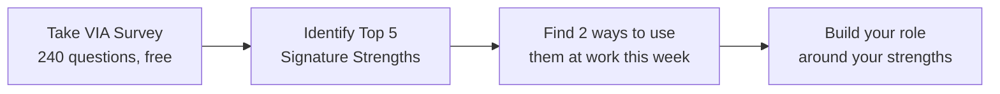
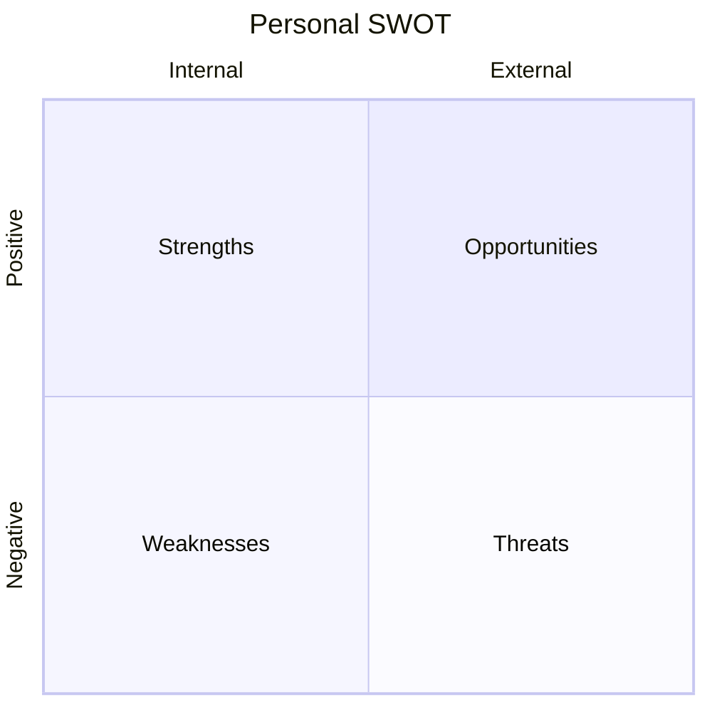
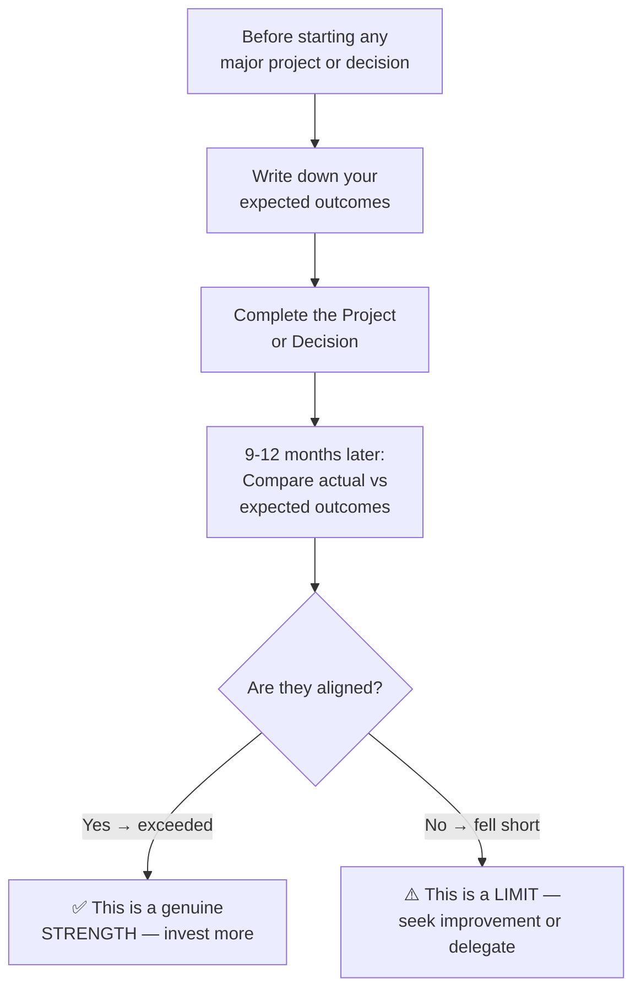

# 🛠️ Techniques & Frameworks — Knowing Your Strengths and Limits

---

## ⚡ Quick Reference (TL;DR)

> Use these 4 frameworks in sequence: **VIA Survey** → find raw strengths | **SWOT** → map the landscape | **Feedback Analysis** → calibrate vs reality | **Energy Audit** → find true vs false strengths.

---

## 🧠 Framework 1 — The VIA Character Strengths Survey

**Best for:** Discovering your signature character strengths using validated science.

**How to use:**

1. Visit [viacharacter.org](https://www.viacharacter.org) — the survey is free (15 min)
2. Note your **Top 5 Signature Strengths** (the ones that feel most "you")
3. These are your highest leverage zone — use them deliberately

**The 6 VIA Virtue categories:**

| Virtue | Sample Strengths |
|---|---|
| **Wisdom** | Creativity, Curiosity, Love of Learning, Judgment |
| **Courage** | Bravery, Perseverance, Honesty, Zest |
| **Humanity** | Love, Kindness, Social Intelligence |
| **Justice** | Teamwork, Fairness, Leadership |
| **Temperance** | Forgiveness, Humility, Prudence, Self-Regulation |
| **Transcendence** | Appreciation of Beauty, Gratitude, Hope, Humor, Spirituality |

> 🔑 **Mnemonic:** **W-C-H-J-T-T** → "Wise Courageous Humans Judge Things Transcendently"

---

## 🧠 Framework 2 — Personal SWOT Analysis

**Best for:** Getting a full 360-degree view of your strengths, weaknesses, opportunities, and threats as a professional.

**How to Fill It In:**

| Section | Question to Ask | Example |
|---|---|---|
| **Strengths** | What do I do better than most? What do people thank me for? | "I break down complex problems into simple steps" |
| **Weaknesses** | What do I avoid? What feedback do I keep getting? | "I struggle to say no; I take on too much" |
| **Opportunities** | What skills are in demand that I'm positioned for? | "AI + domain expertise is rare — I could lead this" |
| **Threats** | What trends or gaps could hurt me? | "I haven't upgraded my data skills in 2 years" |

---

## 🧠 Framework 3 — Feedback Analysis Method (Peter Drucker)

**Best for:** Cutting through self-perception bias and getting *data-driven* knowledge of your strengths.

**The Process (Quarterly Practice):**

> *"Whenever you make a decision or take a key action, write down what you expect will happen. Nine to twelve months later, compare the actual results with your expectations."*
> — **Peter Drucker**

---

## 🧠 Framework 4 — The Energy Audit (Drain vs. Gain)

**Best for:** Distinguishing true strengths (energizing) from learned competencies (draining).

**Weekly Practice — 15 minutes on Friday:**

| Task/Activity | Time Spent | Energy BEFORE (1-5) | Energy AFTER (1-5) | Net Energy |
|---|---|---|---|---|
| Leading the team standup | 30 min | 3 | 5 | **+2 ✅ GAIN** |
| Writing status reports | 60 min | 4 | 2 | **-2 ⚠️ DRAIN** |
| Debugging deep bugs | 90 min | 2 | 5 | **+3 ✅ GAIN** |
| Admin and scheduling | 45 min | 3 | 1 | **-2 ⚠️ DRAIN** |

**Interpret your results:**

- **Consistent net gain (+2 or higher):** True strength — maximize time here
- **Neutral (0):** Competency — sustain but don't invest growth energy
- **Consistent drain (-2 or lower):** Limit or learned behavior — delegate or systematize

---

## 🔑 Key Takeaways

1. **VIA Survey** gives you scientifically-validated strengths vocabulary
2. **Personal SWOT** gives you a strategic landscape view
3. **Feedback Analysis** cuts through self-perception bias
4. **Energy Audit** distinguishes true strengths from draining competencies
5. Use all four together for a complete, calibrated self-map

---

*← [`01_Theory_and_Concepts.md`](./01_Theory_and_Concepts.md) | Next → [`03_Practice_Exercises.md`](./03_Practice_Exercises.md)*
