# 🛠️ Techniques & Frameworks — Knowing Your Strengths and Limits

---

## ⚡ Overview — Choosing Your Tool

| Technique | What It Addresses | Time Investment | When to Use |
|---|---|---|---|
| **VIA Strengths Survey + Reflection** | Identifying signature character strengths | 20 min + 30 min reflection | Starting point — do first |
| **Energy Audit** | Distinguishing true strengths from draining competencies | 2 weeks observation + 30 min analysis | After VIA — essential calibration |
| **360° Feedback Protocol** | Accessing your blind spot quadrant | 2–4 weeks | Month 1 — before any development planning |
| **Strength Shadow Audit** | Identifying when strengths become liabilities | 20 min, quarterly | When relationships feel strained |
| **Limit Typing Framework** | Diagnosing what kind of limit you're facing | 15 min per identified limit | When deciding how to respond to any limit |
| **The Johari Mapping Exercise** | Building your full self-knowledge map | 60–90 min | After receiving 360° feedback |
| **Personal Board of Directors** | Creating a sustained external calibration system | Ongoing | Long-term architecture |

---

## 🔧 Technique 1 — VIA Strengths Survey + Deep Reflection Protocol

### The Limitation of Taking the Survey Alone

Most people take the VIA survey, read their top 5 results, say "that sounds right," and file it away. This produces very little usable information because it leaves the results at the label level rather than the behavioural level.

The real value emerges from systematic reflection on *how* these strengths manifest in your specific professional context — and especially from identifying where a signature strength is *not* being expressed in your current role (which is typically where friction, disengagement, or dissatisfaction lives).

### Step-by-Step Protocol

**Step 1 — Take the VIA Survey**
Complete the free assessment at [viacharacter.org](https://www.viacharacter.org). Record your top 7 strengths in ranked order.

**Step 2 — The Resonance Test**
For each of your top 7, complete this 3-question rapid assessment:

| Strength | Question 1: When do you most naturally express this? | Question 2: How much of your current role allows this? (1–10) | Question 3: What specifically blocks this strength? |
|---|---|---|---|
| | | | |
| | | | |

**Step 3 — Identify the Expressed vs. Suppressed Gap**
Group your top 7 into two categories:

```mermaid
graph LR
    V["Your VIA Signature Strengths"]
    V --> E["✅ EXPRESSED<br/>Role actively uses this<br/>Score 7–10<br/>→ Maintain and optimise"]
    V --> P["⚠️ PARTIALLY EXPRESSED<br/>Some opportunity, not enough<br/>Score 4–6<br/>→ Find more channels"]
    V --> S["❌ SUPPRESSED<br/>Role rarely or never allows this<br/>Score 1–3<br/>→ High disengagement risk<br/>Redesign role or find outlets"]
```



**Step 4 — The Overuse Check (For Each Top Strength)**
Ask: "Has anyone (manager, peer, partner) ever suggested this strength is 'too much' in some context?"

If yes — document: when does this strength create problems? What does overuse look like for you specifically?

**Failure mode of this technique:**
Taking it too literally. VIA describes character strengths, not job skills. "Curiosity" as a signature strength doesn't mean you are technically skilled at research — it means you are most engaged when learning is part of the work. Use it to identify *what kind of work energises you*, not to claim competencies.

---

## 🔧 Technique 2 — The Energy Audit (Two-Week Observation Period)

### The Most Calibrating Exercise in Strengths Work

This exercise is specifically designed to solve the problem that most strengths identification misses: distinguishing activities you are *good at* from activities that genuinely energise you. The distinction is not visible in a 20-minute survey. It requires real-world observation over time.

### The Protocol

**Setup — Before the Two Weeks**
Create a simple log. Divide a page (or a note) into two columns: "After this, I felt..." with options from *more energised → neutral → slightly drained → significantly drained.*

**During the Two Weeks — Three Times Per Day**
After every significant task (not every minute), note in 15 seconds:

```
Task: [brief description]
After → I felt: [energised / neutral / drained]
(Optional quick note: Why?)
```

**Analysis — End of Week 2**

Review your log and answer:

1. **The highest-energy activities:** What shows up repeatedly in the "energised" column? What do these have in common? (Type of task? Type of interaction? Which skill being used?)

2. **The quietly draining activities:** What shows up repeatedly in the "drained" column — especially things you do well but find depleting? These are your learned competencies, not your true strengths.

3. **The energy-task mismatch:** What percentage of your week is spent on activities in each category?

| Category | % of Week (Ideal) | Your Current % | Gap |
|---|---|---|---|
| High-energy / strengths zone | 60–70% | | |
| Neutral (necessary admin etc.) | 20–30% | | |
| Draining (necessary but depleting) | 10% maximum | | |

**Rationale: Why 10% maximum draining work?**
Research on flow states (Csikszentmihalyi, 1990) and engagement (Gallup, 2001) consistently shows that once energy-draining activities exceed approximately 25–30% of work time, engagement, quality, and wellbeing begin declining measurably. At 50%+, burnout risk increases substantially. The 10% maximum for draining work is a sustainable ratio for a high-performance professional.

### What to Do With the Data

- Activities in the **energised** column → find more of them; design your role toward them
- Activities in the **drained** column that others could do → delegate if possible; discuss with manager
- Activities in the **drained** column that are required → build recovery practices around them; batch them; sequence with high-energy activities

---

## 🔧 Technique 3 — The 360° Feedback Protocol (Accessing Your Blind Spot)

### Why Informal Feedback Is Insufficient

Most people receive occasional spontaneous feedback — comments from managers in reviews, informal peer input. This feedback is systematically biased: it tends to come from people whose relationship with you makes full honesty difficult, it is triggered by specific events rather than being representative, and it rarely reaches the Blind Spot because most feedback-givers avoid the most sensitive observations.

A structured 360° process is needed specifically because it creates conditions where the most valuable, difficult-to-hear feedback can safely surface.

### The Protocol for a Structured 360° (Without an Organisational Tool)

**Step 1 — Select 6–8 Respondents Strategically**
Include:

- 2 peers who see your day-to-day collaborative behaviour
- 1–2 direct reports (if applicable) — the most honest feeders about upward blind spots
- 1–2 people above you in the hierarchy (manager, skip-level)
- 1 person who gave you feedback that *surprised* you in the past (they can likely see what others won't say)
- Optionally: 1 trusted person from a different team or organisation

**Step 2 — Design the Questions**
Use open-ended, behavioural questions — not ratings. Closed ratings rarely surface blind spots. Open questions do.

Recommended questions:

```
1. What do you observe me consistently doing well that I might not fully appreciate?
2. In what situations do you think I'm most effective? What specifically do you see me doing?
3. What do you wish I did differently? (Please be specific — vague feedback is less useful.)
4. If you could change ONE thing about how I show up in our work together, what would it be?
5. Is there a pattern in my behaviour that you think limits my impact — that I may not be aware of?
```

**Step 3 — Create Safety for Honesty**
Tell respondents explicitly: "The feedback I most need is the feedback that's hardest to give. I am genuinely using this to improve. You will not hurt me with honesty — you'll help me. Please be direct."

Consider allowing anonymous submission (Google Forms with anonymous responses) if you want the most honest input, especially from direct reports.

**Step 4 — Analyse for Patterns, Not Incidents**
Single statements from one person carry limited weight. Look for *themes* — observations that appear independently from multiple people who don't coordinate their answers:

| Theme | Mentioned by How Many? | Their Specific Words | My Initial Reaction |
|---|---|---|---|
| | | | |

**Step 5 — Respond to the Data, Not Your Defensiveness**
Your immediate emotional reaction to challenging feedback is useful information — it often points to exactly where the blind spot is most defended. Observe the reaction without acting from it.

---

## 🔧 Technique 4 — The Strength Shadow Audit

### The Problem This Solves

Most strengths development work focuses on identifying and leveraging strengths. Far less attention is paid to the professional moment when a strength becomes a liability — when it is overused, applied in the wrong context, or deployed without the situational awareness to know when to pull back.

### The Strength Shadow Mapping Table

For each of your top 5 strengths, complete this audit:

| My Strength | What it looks like at its best | What it looks like when overused | Warning signals (that I've crossed the line) | What triggers the overuse? |
|---|---|---|---|---|
| *(e.g.) Attention to detail* | *(Catches errors; ensures production quality; thorough documentation)* | *(Holds up decisions waiting for perfect data; micromanages; misses deadlines reviewing for errors)* | *(Team members stop bringing me decisions; I'm the last approval bottleneck on everything)* | *(High-stakes deadlines; fear that something will go wrong)* |
| | | | | |

**The Audit Question to Ask Your Team (Informal)**:
> "I'm working on something — I'd really value your honest input. Is there a time when my [strength] feels like too much, or gets in the way? I want to understand the impact on our work."

This single question, asked with genuine openness, can surface years of unspoken feedback that people were protecting you from.

---

## 🔧 Technique 5 — The Limit Typing Framework

### Three Questions to Diagnose Any Limit

When you or others identify a limit — something you struggle with, avoid, or underperform in — the most important first step is to correctly type it. The wrong typing produces the wrong solution.

**The Diagnostic Sequence:**


**Critical distinction: Energy Drain vs. Values Conflict**
Both involve tasks you *can* do but resist. The difference is the quality of the resistance:

- **Energy drain:** "I can do this and will, but it takes a lot out of me." (No moral quality)
- **Values conflict:** "I resist this because something important to me says this isn't right / isn't me." (Has a moral or identity quality)

---

## 🔧 Technique 6 — The Johari Mapping Exercise (Post-360°)

### Building Your Full Self-Knowledge Map

After completing a 360° collection (Technique 3), this exercise helps you organise and use the data systematically.

**Step 1 — Map your 360° findings into the four quadrants**

Draw the Johari Window. Populate it with specific, named observations from your data:

| Quadrant | Contents (Specific Behaviours/Patterns) |
|---|---|
| **Open (Known to me + confirmed by others)** | Things you knew and 360° confirmed |
| **Blind Spot (Surprises from 360°)** | Things 360° revealed that you hadn't seen |
| **Hidden (Things you know but didn't put in the questions)** | Patterns you notice in yourself but haven't disclosed |
| **Unknown (Potential to explore)** | Areas no one commented on — possibly unexplored potential |

**Step 2 — Prioritise the Blind Spot for action**
For your top 3 Blind Spot items:

- What specifically is the behaviour?
- What impact is it having (based on what was said)?
- What one practice change would most directly address this?

---

## 🔧 Technique 7 — Building Your Personal Board of Directors

### The Long-Term Architecture of External Calibration

A "Personal Board of Directors" is a small, deliberate group of people (typically 4–6) whose perspectives provide ongoing calibration across different dimensions of your professional development. Unlike a single mentor, the board provides diverse angles.

**Roles to fill:**

| Role | What They Provide | Ideal Person |
|---|---|---|
| **The Challenger** | Honest, direct pushback on your thinking | Someone not invested in agreeing with you |
| **The Domain Expert** | Deep expertise in your current or target area | 5–10 years ahead of you in your field |
| **The Character Mirror** | Sees your character and integrity accurately | Someone who knows you across contexts |
| **The Future Lens** | Understanding of where your field is going | Someone working in the next version of your industry |
| **The Process Coach** | Helps you develop how you work, not just what | Someone who has solved your current developmental challenge |

**How to maintain it:**

- Quarterly 1:1 check-ins with each member (30 min)
- One specific question per check-in (don't show up without a focused question)
- Rotate members as your development needs shift (every 2–3 years)

---

*Next → [`03_Practice_Exercises.md`](./03_Practice_Exercises.md)*
