# ⚡ Practice Exercises — Knowing Your Strengths and Limits

---

## ⚡ Quick Reference (TL;DR)

> 5 exercises to build accurate self-knowledge: **Strength Story Bank** | **Peer Feedback Round** | **Limit Mapping** | **Energy Log** | **Johari Window Fill-In**

---

## ⚡ Exercise 1 — The Strength Story Bank (30 min, One-Time)

**Goal:** Build an evidence-based inventory of your real strengths — backed by stories, not opinions.

**Instructions:**

1. Set a timer for 30 minutes
2. Think back over the last 3-5 years. List **7-10 moments** where you performed at your best
3. For each moment, answer:
   - What was the situation?
   - What did YOU specifically do?
   - What was the outcome?
   - What strength does this demonstrate?

**Template:**

| Situation | What You Did | Outcome | Strength Demonstrated |
|---|---|---|---|
| Team was panicking before a big demo | I stayed calm and restructured the plan in 20 min | Demo succeeded, team thanked me | **Calm under pressure + Decisive thinking** |
| New engineer struggled for 2 weeks | I created a structured onboarding doc for them | Their velocity tripled in 1 week | **Mentoring + Systems thinking** |

> 💡 **Insight:** Your stories reveal patterns. If "calm under pressure" appears 4 times, that's a signature strength.

---

## ⚡ Exercise 2 — The Peer Feedback Round (1 week)

**Goal:** Discover your blind spots and confirm your perceived strengths against external reality.

**Instructions:**

1. Email 5-7 people (manager, peers, direct reports, or mentors) with:

> *"Hi [Name], I'm working on understanding my professional strengths and growth areas better. Would you share: (1) What do you see as my top 2-3 strengths? (2) Where do you think I have the biggest opportunity to grow? Your honest input is really valuable to me."*

1. Collect responses in a table:

| Person | Strength Mentioned | Growth Area Mentioned |
|---|---|---|
| Manager | Strategic thinking | Over-complicates simple decisions |
| Peer A | Clear communicator | Sometimes avoids conflict |
| Peer B | Fast learner | Impatient with slower colleagues |

1. Look for **patterns** — 3+ people mentioning the same thing = signal, not noise

---

## ⚡ Exercise 3 — The Limit Mapping Exercise (20 min)

**Goal:** Categorize your limits so you know *what kind of action* each one requires.

**Step 1:** List your top 5 self-identified growth areas

**Step 2:** Categorize each:

```mermaid
graph TD
    A[Name a Limit] --> B{What TYPE is it?}
    B -- "Haven't learned it yet" --> C[SKILL GAP\n→ Action: Training / Practice]
    B -- "Can do it, but exhausted after" --> D[ENERGY DRAIN\n→ Action: Delegate / Minimize]
    B -- "Conflicts with my values" --> E[VALUES CONFLICT\n→ Action: Clarify & Explore]
    B -- "Fear of judgment/failure" --> F[PSYCHOLOGICAL LIMIT\n→ Action: Coaching / Exposure]
```

**Example output:**

| Limit | Type | Recommended Action |
|---|---|---|
| Public speaking | Skill Gap + Psychological | Join Toastmasters, start small |
| Writing detailed reports | Energy Drain | Templatize; get admin support |
| Aggressive negotiation | Values Conflict | Explore interest-based alternatives |
| Asking for help | Psychological | Work with a coach on this |

---

## ⚡ Exercise 4 — The 7-Day Energy Log

**Goal:** Build data on what gives you energy vs. drains you over a real week.

**Daily log (5 min end-of-day):**

| Time | Activity | Duration | Energy Before (1-5) | Energy After (1-5) |
|---|---|---|---|---|
| 9am | Team standup | 30 min | | |
| 10am | Deep coding session | 2 hrs | | |
| 12pm | Stakeholder meeting | 1 hr | | |
| 2pm | Code reviews | 1 hr | | |
| 3pm | 1:1 with report | 30 min | | |

**At week's end: Calculate Net Energy for each activity type, then:**

- Put your top 3 "GAIN" activities on your weekly must-do list
- Identify 1-2 "DRAIN" activities to delegate, reduce or batch

---

## ⚡ Exercise 5 — Fill In Your Johari Window

**Goal:** Build a personal Johari Window using self-reflection and peer input.

**Step 1 — Self-input (what YOU know about yourself):**

List 10 adjectives or traits that describe you from this list:
`able, accepting, adaptable, bold, brave, calm, caring, cheerful, clever, complex, confident, dependable, dignified, empathetic, energetic, extroverted, giving, happy, helpful, idealistic, independent, intelligent, introverted, kind, logical, mature, observant, organized, patient, powerful, proud, relaxed, responsive, searching, self-assertive, self-conscious, sensible, sentimental, shy, silly, spontaneous, sympathetic, tense, trustworthy, warm, wise, witty`

**Step 2 — Peer input (what OTHERS say about you):**
Ask 3-5 trusted colleagues to pick 5-7 words from the same list that describe you.

**Step 3 — Map to your Johari Window:**

- Words **both you and others** chose → **Open Arena**
- Words **others chose but you didn't** → **Blind Spot**
- Words **only you chose** → **Hidden Area**
- Words **neither chose** → **Unknown**

---

## 📅 30-Day Progression

| Week | Focus |
|---|---|
| **Week 1** | Take VIA Survey + Complete Strength Story Bank |
| **Week 2** | Run Peer Feedback Round — send emails and collect responses |
| **Week 3** | Complete 7-Day Energy Log |
| **Week 4** | Fill Johari Window + Run Limit Mapping Exercise |

---

*← [`02_Techniques_and_Frameworks.md`](./02_Techniques_and_Frameworks.md) | Next → [`04_Real_World_Examples.md`](./04_Real_World_Examples.md)*
