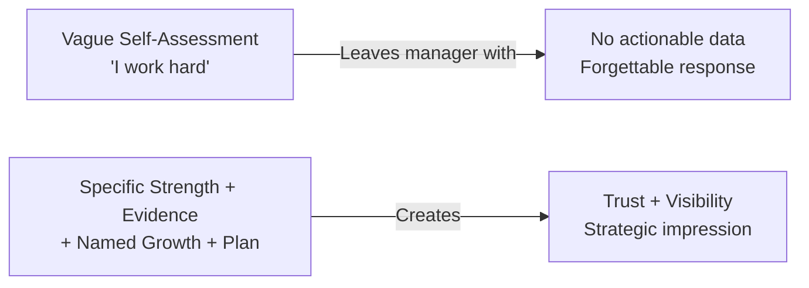
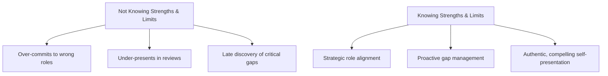

# 🌍 Real-World Examples — Knowing Your Strengths and Limits

---

## ⚡ Quick Reference (TL;DR)

> See how knowing (or not knowing) your strengths and limits plays out differently in 3 common workplace scenarios: performance reviews, project ownership, and career decisions.

---

## 📌 Scenario 1 — The Performance Review Conversation

**Context:** Your manager asks you: *"What do you consider your top strengths, and where do you want to grow?"*

---

### ❌ Reactive Response (Vague / Unaware)

> *"I'm a hard worker. I always give 100%. I guess I could improve my time management."*

**What went wrong:**

- No specific evidence — sounds like every response the manager hears
- "Hard worker" is not a strength — it's an attitude
- "Time management" is a generic non-answer with no plan behind it
- The manager leaves with no useful information

---

### ✅ Aware Response (Specific / Evidence-Based)

> *"My signature strength is breaking down ambiguous, complex problems into clear, actionable plans — I can point to the Q3 platform migration where I created the phased rollout that three teams adopted. On the growth side, I've noticed I struggle with delegating when I feel ownership strongly — I tend to over-retain work. I'm actively working on that by using the 70/30 rule: if someone can do it 70% as well, I hand it off."*

**What worked:**

- Specific strength with a concrete example
- Growth area is honest but framed with a *plan*
- Manager sees self-awareness + strategic thinking

---

## 📌 Scenario 2 — Taking On a Project

**Context:** A high-visibility project comes up. You have partial experience but are uncertain about some areas.

---

### ❌ Unaware Response (Overconfident)

> *"Yes, I can handle it — no problem!"*

**What happens:**

- 4 weeks in, you realize your gap in stakeholder management is critical
- You're scrambling, team trust drops, and the project delivery slips
- Your manager is confused because you said you could handle it

---

### ✅ Aware Response (Calibrated Confidence)

> *"I'm very strong on the technical architecture and delivery planning — those are squarely in my lane. I'll need support on the executive stakeholder management side or I need to build that skill quickly. Can we pair me with someone from leadership comms for that part?"*

**What happens:**

- You take on the challenge while flagging the gap *before* it becomes a crisis
- Manager respects your self-awareness and finds the support proactively
- You grow through the project and your honesty builds trust

---

## 📌 Scenario 3 — Career Decision Under Pressure

**Context:** You're asked to move into a manager role you're not sure you want. The role plays to your weaknesses.

---

### ❌ Unaware Response (Social Pressure Wins)

> *"Sure, I'll take it. It sounds like a great opportunity."*

**What happens:**

- You spend 12 months in a role that drains you daily
- Your technical skills atrophy
- You perform average (at best) as a manager
- You feel stuck, burned out, and resentful

---

### ✅ Aware Response (Values-Aligned)

> *"Thank you — I want to think carefully about this. My energy is highest when I'm solving hard technical problems and mentoring one-on-one, not in people management and administrative coordination. Could we explore a Staff Engineer or Technical Lead path instead? I think that's where I'd create more impact."*

**What happens:**

- You stay in your strength zone
- Your growth is *intentional*, not accidental
- The organization keeps a high performer in the right seat

---

## 🔑 Pattern Summary

---

*← [`03_Practice_Exercises.md`](./03_Practice_Exercises.md) | Next → [`05_Common_Mistakes.md`](./05_Common_Mistakes.md)*
