# ⚠️ Common Mistakes — Knowing Your Strengths and Limits

---

## ⚡ Quick Reference (TL;DR)

> The 5 most common traps: **Confusing Competence with Strength** | **Treating Limits as Fixed** | **Only Using Self-Assessment** | **Hiding Limits as Weakness** | **Strengths Overuse**

---

## ❌ Mistake 1 — Confusing Competence with Strength

**The trap:** "I'm good at it, so it must be my strength."

Many people are highly competent at things they *hate doing*. This is especially true for high performers who learn quickly — they get good at things just to survive a role, even when those things drain them.

| Competence | True Strength |
|---|---|
| Can do it well | Can do it well AND it energizes you |
| Produces output | Produces output AND feels natural |
| May be draining | Always leaves you feeling more alive |

**The fix:**

```mermaid
graph LR
    A[I'm good at X] --> B{Does X\nenergize me?}
    B -- Yes --> C[✅ Strength\nInvest more here]
    B -- No --> D[⚠️ Competency\nDo minimally or delegate]
```

---

## ❌ Mistake 2 — Treating Limits as Fixed Identity

**The trap:** *"I'm just not a people person."* / *"I'm not creative."* / *"I've never been good with numbers."*

This is a **fixed mindset** error. Research by Carol Dweck shows that treating abilities as fixed actually *prevents* the effort needed to grow them. Most perceived limits are actually:

- Skill gaps (no training yet)
- Exposure gaps (no opportunity yet)
- Fear-based avoidance (never tried safely)

**The fix:** Reframe limits as **"current boundaries, not permanent walls."**

| Fixed Mindset Statement | Growth Mindset Reframe |
|---|---|
| "I'm not good at public speaking" | "I haven't yet had enough practice with public speaking" |
| "I'm not a strategic thinker" | "I've been in execution mode — I haven't developed strategy muscles yet" |
| "I'm terrible at conflict" | "I avoid conflict because I fear it — I can learn to navigate it" |

---

## ❌ Mistake 3 — Relying Only on Self-Assessment

**The trap:** Building your "strengths inventory" entirely from introspection.

The Dunning-Kruger Effect proves that self-assessment alone is **systematically inaccurate** — we are the *worst* judges of our own competence level.

**Common results of self-assessment bias:**

| Bias | What Happens |
|---|---|
| **Overconfidence (Beginners)** | Take on too much, deliver poorly, damage credibility |
| **Underconfidence (Intermediate)** | Undersell, don't raise hand, miss opportunities |
| **Confirmation Bias (Everyone)** | Seek proof that confirms what you already believe about yourself |

**The fix:** Use a 3-source calibration model:

---

## ❌ Mistake 4 — Hiding Limits as "Showing Weakness"

**The trap:** Never admitting gaps because you fear being seen as incompetent.

This is one of the most expensive mistakes in professional settings. Hidden limits:

- Become crises when discovered late in a project
- Block others from helping you
- Erode trust when the gap eventually surfaces anyway

> *"The fastest way to lose credibility is to pretend you know something you don't — and get caught later."*

**The fix:** Distinguish between sharing limits *strategically* vs. *over-sharing.*

| ✅ Strategic Disclosure | ❌ Over-Disclosure |
|---|---|
| "I haven't worked in this domain before — here's how I'll bridge the gap quickly" | "I'm terrible at this, I always fail at X" |
| Share limits in private with manager or mentor | Announce limits in full team meetings unnecessarily |
| Frame with a plan: gap + action = credibility | Share gap with no plan = just liability |

---

## ❌ Mistake 5 — Overusing Your Strengths

**The trap:** Using your top strengths in every situation — even when the situation doesn't call for it.

> "If your only tool is a hammer, every problem looks like a nail."

Strengths overused become **derailers:**

| Signature Strength | When Overused Becomes... |
|---|---|
| **Attention to Detail** | Micromanagement / Analysis paralysis |
| **Empathy** | Avoiding hard conversations / Over-accommodating |
| **Drive / Ambition** | Burnout / Bulldozing others |
| **Creativity** | Impractical ideas / Never finishing anything |
| **Confidence** | Arrogance / Not listening |

**The fix:** For each of your top 3 strengths, ask: *"In what situations is dialing this back the smarter move?"*

---

## 🔑 Key Takeaways

1. **Good at ≠ Strength** — Energy is the differentiator
2. **Limits are current, not permanent** — reframe them as growth edges
3. **Self-assessment ≠ accurate** — triangulate with feedback and results
4. **Hiding limits is riskier** than strategic disclosure with a plan
5. **Every strength has a shadow** — watch for overuse

---

*← [`04_Real_World_Examples.md`](./04_Real_World_Examples.md) | Next → [`06_Tools_and_Resources.md`](./06_Tools_and_Resources.md)*
