# 🔧 Tools & Resources — Knowing Your Strengths and Limits

---

## ⚡ Quick Reference (TL;DR)

> Best free tools: **VIA Survey** (strengths), **CliftonStrengths** (career), **Johari Window generator**, **360Reach**. Best books: *StrengthsFinder 2.0*, *Mindset*, *The Big Leap*.

---

## 📖 Books

| Book | Author | Why It's Relevant | Best For |
|---|---|---|---|
| **StrengthsFinder 2.0** | Tom Rath | Introduces the CliftonStrengths model + free online assessment code | Finding your top 5 career strengths |
| **Mindset: The New Psychology of Success** | Carol Dweck | The definitive book on fixed vs. growth mindset and how to shift | Overcoming belief in fixed limits |
| **The Big Leap** | Gay Hendricks | Introduces the Zone of Genius framework — going beyond strengths to calling | Career alignment |
| **Now, Discover Your Strengths** | Buckingham & Clifton | Original Gallup strengths research and framework | Science behind strengths |
| **Working with Emotional Intelligence** | Daniel Goleman | Chapter on self-assessment and calibrated confidence | EQ + strengths integration |

**📚 Top Picks (Covers)**

| StrengthsFinder 2.0 — Tom Rath | Mindset — Carol Dweck |
|---|---|
|  |  |

---

## 🎥 Videos & Talks

| Video | Speaker | Platform | Why Watch |
|---|---|---|---|
| **The Power of Believing That You Can Improve** | Carol Dweck | TED Talk | 10-min masterclass on growth mindset |
| **Why You Don't Know Yourself** | Brian Little | TED Talk | Personality, traits, and self-knowledge |
| **How to Know Yourself** | The School of Life | YouTube | 12-min philosophical take on accurately knowing your character |
| **Understanding Your Strengths** | Tom Rath | YouTube (Gallup) | CliftonStrengths explained simply |

---

## 🛠️ Free Online Tools & Assessments

| Tool | What It Does | Link | Time |
|---|---|---|---|
| **VIA Character Survey** | 24-strength assessment — the gold standard in positive psychology | [viacharacter.org](https://www.viacharacter.org) | 15 min |
| **High5 Test** | 20 strengths — free, career-focused alternative to CliftonStrengths | [high5test.com](https://high5test.com) | 20 min |
| **Johari Window Generator** | Online tool to send to peers for collaborative Johari mapping | [kevan.org/johari](https://kevan.org/johari) | 10 min |
| **360Reach Personal Brand Survey** | Peer survey tool to discover your professional reputation | [360reach.me](https://www.360reach.me) | Send to 10 people |
| **Myers-Briggs Type Indicator (MBTI)** | Personality-based self-knowledge (use free 16Personalities version) | [16personalities.com](https://www.16personalities.com) | 12 min |

---

## 📊 Worksheets & Templates

### The Strength-Limit T-Chart

Use this template for annual self-review:

```
MY STRENGTHS                    |  MY CURRENT LIMITS
--------------------------------|--------------------------------
(with evidence)                 |  (type: skill/energy/values)
                                |
1.                              |  1.
2.                              |  2.
3.                              |  3.
4.                              |  4.
5.                              |  5.
--------------------------------|--------------------------------
HOW TO LEVERAGE STRENGTHS:      |  HOW TO ADDRESS LIMITS:
                                |
                                |
```

### Zone of Genius Framework (Gay Hendricks)

```mermaid
graph TD
    A[Zone of Incompetence\nOthers do better — delegate] --> B[Zone of Competence\nAdequate — minimize]
    B --> C[Zone of Excellence\nStrong — but not calling]
    C --> D[Zone of Genius\nSuperpower + Joy = Flow state 🎯]
```



> **Goal:** Spend at least 70% of your professional time in your **Zone of Genius.**

---

## 🔬 Scientific Research

| Study / Concept | Key Finding |
|---|---|
| **Dunning-Kruger Effect** (1999) | People systematically overestimate ability at low competence and underestimate at high |
| **VIA Classification** (Peterson & Seligman, 2004) | 24 universally recognized character strengths exist across cultures |
| **StrengthsBased Development** (Gallup) | People who use their strengths daily are 6x more engaged and 8% more productive |
| **Growth Mindset Research** (Dweck, 1998-2006) | Believing abilities can be developed leads to higher achievement and resilience |

---

*← [`05_Common_Mistakes.md`](./05_Common_Mistakes.md) | Next → [`07_Assessment_and_Reflection.md`](./07_Assessment_and_Reflection.md)*
