# 📊 Assessment & Reflection — Knowing Your Strengths and Limits

---

## How to Use This Assessment

Work through all sections in order. Write your answers *before* reading the model responses — the gap between your answer and the model is where the learning lives. The completion checklist at the end is your go/no-go for moving to the next concept.

**Completion checklist (use at end):**

- [ ] Section 1: Knowledge Check answered and model responses reviewed
- [ ] Section 2: Personal Strengths & Limits Profile filled with your specific data
- [ ] Section 3: Scenario Assessments written before reading model responses
- [ ] Section 4: Skill ratings done using behavioural anchors
- [ ] Section 5: Forward commitment with specific criteria written
- [ ] Section 6: Integration note completed

---

## Section 1 — Knowledge Check with Model Answers

*Write your answers before reading the model responses.*

---

**Q1 — The Distinction Question**

> *What is the difference between a true strength, a learned competency, and a developing strength? Give a concrete example of each for a software engineer in a mid-senior role.*

**Your answer:** _________________________ (write before reading model)

**Model Answer:**
> **True Strength:** Performance + Energy + Authenticity all present. *Example: The engineer who consistently produces elegant, well-documented architecture — and finds the design thinking process genuinely absorbing and energising after a full day of it. Using this strength leaves them more engaged, not less.*
>
> **Learned Competency:** High performance, but energy-draining or not authentically "them." *Example: The same engineer who writes accurate and comprehensive status reports — which are well-received by stakeholders — but who consistently feels drained after producing them. The work is good. It's not a strength.*
>
> **Developing Strength:** Energy and authenticity present, but performance still growing. *Example: The engineer who begins facilitating design review meetings and finds they genuinely enjoy bringing people's thinking together. They're not yet skilled at it — facilitation is clumsy and unconfident at this stage. But the energy and "realness" tell them this is worth developing.*
>
> **Why it matters practically:** If you build a role around a learned competency rather than a true strength, you will produce good work while running an energy deficit that compounds over years. The engineer who makes project management their career because they were the best organised person on the team — even though it drains them — is heading toward burnout, not fulfilment.

---

**Q2 — The Framework Question**

> *A colleague tells you: "I identified a major limit of mine — I'm terrible at public speaking. My manager wants me to take a presentation skills course." What three questions would you ask to determine if this is the right intervention? Why does the intervention depend on your answers?*

**Your answer:** _________________________

**Model Answer:**
> **Question 1:** "If you had a presentation skills coach for 3 months and practised consistently — do you think you could develop real competence here?"
> → YES = Likely a skill gap. The course may be appropriate.
>
> **Question 2:** "When you've given presentations that went well — did you feel depleted afterward even though they were good? Or energised?"
> → Depleted regardless of outcome = Energy Drain. A course makes you a more skilled, but still depleted, presenter. The right response is minimisation and structural design (can someone else present? Can you present less often?), not training.
>
> **Question 3:** "Is there something about public speaking that feels fundamentally wrong for you — not discomfort, but like a moral or identity conflict?"
> → Yes = Values Conflict. "Performing" in front of large audiences may conflict with deeply held authenticity values. A technique course doesn't address identity-level conflicts.
>
> **Why the intervention depends on the answers:** Three very different types of limits present with the same symptom ("I'm not performing well at public speaking"). They require three fundamentally different responses. Applying training to a values conflict, or delegation advice to a skill gap, wastes time and can make the person feel more inadequate when the wrong solution doesn't work.

---

**Q3 — The Application Question**

> *You ask a trusted colleague for honest feedback and they say: "I've noticed that when you're in a discussion and you disagree, you sometimes get quieter and more formal — it creates a distance that makes the conversation harder." Your immediate internal reaction is: "That's not accurate — I just become more precise when stakes are high." What is the professional-grade response to this feedback? Walk through each step.*

**Your answer:** _________________________

**Model Answer:**
> **Step 1 — Pause the defensive explanation.** The immediate reaction "That's not accurate" is a protective interpretation, not an evidenced conclusion. Before acting on it, notice: "I'm having a defensive response. That's worth noting."
>
> **Step 2 — Apply the Blind Spot Diagnostic.** The two interpretations ("becoming precise" vs. "creating distance through formality") can coexist. My internal experience ("I'm being more precise") and their behavioural observation ("you get quieter and more formal") may both be accurate descriptions of the same behaviour from different angles. The key question: which experience is *theirs* to describe? The impact on the conversation is their territory.
>
> **Step 3 — Ask a clarifying question, not a challenging one.** *"Can you give me a specific example of when you've seen that? I want to understand what exactly you're observing."* This is not to disprove the feedback — it's to understand it more precisely so I can evaluate it with better data.
>
> **Step 4 — Gather more data before deciding.** Ask 1–2 other people the same question, framed neutrally: "When I'm in a discussion where I disagree with something, what do you notice in how I engage?" Pattern across multiple people = likely Blind Spot. Single observation = still worth holding, but lower confidence.
>
> **Step 5 — Provisionally accept and experiment.** Even before full data, try this: in the next discussion where I disagree, make my engagement *explicitly warmer, not less*. Create the opposite condition from what they described. See what the effect is. This generates real data from real behaviour rather than from continued introspection.

---

## Section 2 — Personal Strengths & Limits Profile

*Fill this with your specific data — not generic aspirational answers.*

---

**My Current True Strengths** (all three criteria met: Performance + Energy + Authenticity)

| Strength | How I Know It's Genuine (Evidence) | How Much My Current Role Uses It (1–10) |
|---|---|---|
| | | |
| | | |
| | | |

**My Current Learned Competencies** (I do these well; they drain me)

| Competency | Energy Level When Done Well | Can I Minimise/Delegate? |
|---|---|---|
| | Draining | |
| | Draining | |

**My Current Limits** (typed correctly)

| Limit | Type (Skill Gap / Energy Drain / Values Conflict) | Correct Response |
|---|---|---|
| | | |
| | | |

**My Known Blind Spots** (confirmed by at least one external source)

| Blind Spot | How I Found Out | Impact on Others | My Practice to Manage It |
|---|---|---|---|
| | | | |

**My Current Johari Map Summary:**

- Open (most significant items): ___________________________
- Blind Spot (confirmed by external feedback): ___________________________
- Hidden (I know; relevant to share): ___________________________

---

## Section 3 — Scenario Response Assessments

*Write your response before reading the model.*

---

**Scenario A — The Strength Shadow in Action**

> *You are a Senior PM with "strategic thinking" as your primary strength. In a team planning session, a junior developer proposes a creative solution to a technical problem. Before she finishes explaining, you've already seen where the approach won't scale and say: "That's going to create issues at the infrastructure layer — let me walk through why that won't work at scale." She goes quiet. The rest of the meeting, no one else volunteers creative ideas.*

**Write: what happened here? What is the correct response in the moment? What practice change prevents this pattern?**

_________________________

**Model Response:**
> *What happened:* Strategic thinking — specifically the ability to rapidly identify downstream failure modes — was applied at the wrong stage of idea development. The strength itself (valid inference about scaling issues) produced the shadow effect (premature evaluation of creative thinking, shutting down contribution).
>
> *Correct response in the moment:* Notice the room go quiet. Name it and reset: *"I cut in too quickly there. [Name], please finish — I want to understand the full picture of what you're proposing before we assess it."* This repairs the psychological safety breach in the moment and models the behaviour reversal explicitly.
>
> *Practice change:* Before any planning or brainstorming session, establish a rule (with yourself and optionally with the team): "First 10 minutes of any new idea: curiosity and understanding only. No evaluation." This creates a structural buffer between idea generation and your strength's natural activation.

---

**Scenario B — The Wrong Limit Type Call**

> *Your manager tells you: "I've noticed you avoid the monthly business review presentations — you tend to pass them off to a team member or find reasons not to run them. I'm going to enrol you in a presentation confidence course." You are actually an experienced presenter who has run keynotes at conferences. You find the monthly business review presentations deeply frustrating because they require presenting data you believe is misleading — the metrics selected don't tell the real story of team performance.*

**Write: how do you respond to your manager? What is the correct limit type here?**

_________________________

**Model Response:**
> *Correct limit type:* Values Conflict — specifically professional integrity (presenting data you believe is misleading). This is not a skill gap (you have the skill; you've done conferences). It is not an energy drain in the sense of depleting you — it's an avoidance driven by identity resistance ("presenting misleading information feels fundamentally wrong to me").
>
> *Response to manager:* *"I appreciate your attention to this and I want to be fully honest with you. My avoidance isn't about confidence in presenting — I've presented at [conference level]. My resistance is to the specific content of these reviews. I believe the metrics we're presenting don't accurately reflect what's happening in the team, and I find it professionally difficult to present data I think could lead to wrong conclusions. Can we talk about whether there's a way to present the business review that I can stand behind — or alternatively, can we discuss who should own this presentation if that's not possible?"*
>
> This response correctly names the limit (values conflict with presenting misleading data), provides evidence against the incorrect assumption (skill gap), and offers a path forward that doesn't require either pretending there's no conflict or simply refusing.

---

**Scenario C — Updating the Map**

> *You completed a VIA survey 5 years ago, identified "Love of Learning" as your top strength, and built your career around research and analysis. You've recently moved into a Director role. For the past 8 months, your most energising moments at work have been 1:1s with your team — particularly when a team member has a breakthrough in a challenge they've been struggling with. Your energy in research work has been neutral rather than high.*

**Write: what is happening here, and what is the right professional response?**

_________________________

**Model Response:**
> *What's happening:* Your strengths map is updating. The 5-year-old VIA profile may have captured an accurate snapshot of 5 years ago. Your current energy observations (8 months of consistent data: 1:1s = high energy; research = neutral) suggest "Love of Learning" may now be most activated in human development contexts (watching people learn, grow, have breakthroughs) rather than in individual research. Alternatively, a new signature strength is emerging: something like "Developer of Excellence" (StrengthsFinder) or "Leadership + Kindness" (VIA) may now be your primary strength expression.
>
> *Right professional response:* (1) Run a new VIA to see if the rankings have shifted. (2) Treat the 8-month energy observation as significant quantitative data — not as a passing mood. (3) Deliberately examine your Director role's design: can you structure it to maximise the 1:1 development work that's energising you? If your role still requires significant research output but you're now most alive in people development — that's a map-to-role mismatch worth addressing.

---

## Section 4 — Skill Rating with Behavioural Anchors

Rate yourself using the *Observable Behaviour* descriptions — not where you want to be, but where you actually are.

---

**Skill 1 — Self-Knowledge Accuracy (Strengths)**

| Rating | Observable Behaviour |
|---|---|
| **1** | I list competencies as strengths without having applied the three-filter test; my main reference is what others have complimented me on |
| **2** | I've taken a strengths assessment (VIA or similar) and can name my top strengths, but haven't mapped them to my current role's activities |
| **3** | I have completed an Energy Audit within the last 6 months; I can name which of my current tasks are draining vs. energising; I understand the distinction between true strengths and learned competencies |
| **4** | I have a current strengths map that guides my role decisions; I actively seek ways to increase my time in true-strength activities; I have identified my top 3 strength shadows |
| **5** | I maintain a living self-knowledge map (updated quarterly); my role is deliberately designed around my true strengths; I proactively share strength-shadow awareness with collaborators when relevant |

**My current rating: ___ / 5**
**Specific evidence:** ___________________________

---

**Skill 2 — Blind Spot Maintenance**

| Rating | Observable Behaviour |
|---|---|
| **1** | I haven't asked anyone for specific feedback on my blind spots in the past year; I primarily rely on self-report for self-knowledge |
| **2** | I've received some 360° feedback (organisational or informal) but haven't acted on the findings systematically |
| **3** | I have asked at least 3 people specifically for blind spot feedback in the past year; I have named at least 1 confirmed blind spot; I have a practice in place to manage it |
| **4** | I have a systematic annual blind spot refresh; I have 3+ named, managed blind spots; when I receive feedback that surprises me, I treat it as Blind Spot data rather than reacting defensively |
| **5** | Seeking blind spot feedback is a regular, self-initiated practice; I have built relationships specifically designed for honest feedback exchange; my blind spot list is current and actively managed |

**My current rating: ___ / 5**
**Specific evidence:** ___________________________

---

**Skill 3 — Limit Typing and Response**

| Rating | Observable Behaviour |
|---|---|
| **1** | I treat all limits as skill gaps by default; my approach to any identified limit is to try harder or seek training |
| **2** | I'm aware of the three limit types but haven't applied the diagnostic to my actual limits; I still default to training as the first response |
| **3** | I have applied the three-diagnostic-question framework to at least 3 of my current limits; I have correctly typed at least 2 of my limits and chosen appropriate responses |
| **4** | My response to identified limits is routinely typed before an intervention is chosen; I have successfully redesigned around or delegated at least one energy drain in the last 12 months |
| **5** | Limit typing is automatic; I help others correctly type their limits before choosing development responses; my own development plan accurately distinguishes skill gaps from energy drains from values conflicts |

**My current rating: ___ / 5**
**Specific evidence:** ___________________________

---

## Section 5 — Forward Commitment

**The one practice I will implement starting this week:**

> Practice: ___________________________
> Frequency: ___________________________
> What success looks like after 21 days: ___________________________
> What I expect to understand about myself that I don't know yet: ___________________________

**The one limit I am committing to type correctly (using the diagnostic sequence) this week:**

> Limit: ___________________________
> My current assumption about its type: ___________________________
> After running the diagnostic, the correct type is: ___________________________
> The appropriate response is: ___________________________

---

## Section 6 — Connecting Forward

```mermaid
graph LR
    C02["Concept 02 ✅<br/>Strengths & Limits<br/>Map built + calibrated"]
    C03["Concept 03<br/>Self-Worth and<br/>Capabilities"]
    C04["Concept 04<br/>Identifying<br/>Personal Triggers"]
    SA["Self-Awareness<br/>Module Complete"]

    C02 -->|"Knowing where you're<br/>genuinely capable → stable<br/>foundation for self-worth"| C03
    C03 --> C04
    C04 --> SA
```

**Integration note:** How does accurate knowledge of your strengths directly support the self-worth and self-efficacy work in Concept 03? Write one sentence:

> ___________________________

---

## ✅ Concept Completion Checklist

Before moving to Concept 03, confirm:

- [ ] I can explain the three-filter distinction (Performance + Energy + Authenticity) without referring to notes
- [ ] I have completed a VIA Survey AND reflected on my top 5 results beyond just reading the labels
- [ ] I have started or completed a 2-week Energy Audit with specific data — not impressionistic recall
- [ ] I have asked at least 3 people for blind spot feedback using open-ended questions
- [ ] I have typed at least 3 of my current limits correctly (Skill Gap / Energy Drain / Values Conflict)
- [ ] I can name at least 1 Blind Spot pattern confirmed by external feedback
- [ ] I can explain the Dunning-Kruger curve and what it implies for the reliability of self-assessment

---

*Concept continues → [`../03_Developing_a_strong_sense_of_one's_selfworth_and_capabilities/01_Theory_and_Concepts.md`](../03_Developing_a_strong_sense_of_one's_selfworth_and_capabilities/01_Theory_and_Concepts.md)*
