# 🌟 Theory & Concepts — Developing a Strong Sense of Self-Worth and Capabilities

---

## ⚡ Quick Reference (TL;DR)

> **Self-worth** is your deep-seated belief that you are fundamentally valuable as a person — independent of your performance, titles, or achievements. **Capabilities** are the skills and potential you believe you can develop. Together, they form the bedrock of confidence, resilience, and ambition.

| Core Idea | One-Line Summary |
|---|---|
| Self-worth ≠ self-esteem | Worth is unconditional; esteem fluctuates with results |
| Capabilities are expandable | A growth mindset makes limits temporary |
| Imposter syndrome is common | Even top performers experience it |
| Healthy self-worth enables risk-taking | You try harder when failure doesn't define your value |

---

## 📖 Core Concepts Explained Simply

### Self-Worth vs. Self-Esteem — The Critical Difference

These two terms are often used interchangeably, but the distinction is transformative:

| Concept | Definition | What Drives It | Stability |
|---|---|---|---|
| **Self-Worth** | "I am valuable as a person" | Internal, unconditional | Stable — doesn't change with outcomes |
| **Self-Esteem** | "I feel good about myself right now" | External, performance-based | Fluctuates with successes and failures |

> 💡 **The key insight:** If your sense of worth depends on your last performance review, your relationship status, or how many people liked your post — you have *conditional* self-worth. This creates a fragile foundation for confidence.

```mermaid
graph TD
    A[External Events<br/>Promotion, Praise, Failure] --> B{Where is your worth anchored?}
    B -- Conditional Worth --> C[😰 Worth rises and falls<br/>with every result]
    B -- Unconditional Worth --> D[😌 Events are informative,<br/>not defining]
    C --> E[Fragile confidence,<br/>Fear of failure]
    D --> F[Resilient confidence,<br/>Healthy risk-taking]
```

---

### What Are "Capabilities"?

Capabilities in this context go beyond technical skills. They include:

| Layer | What It Covers | Example |
|---|---|---|
| **Hard Skills** | Learned, measurable abilities | Coding, data analysis, writing |
| **Soft Skills** | Interpersonal and emotional abilities | Empathy, communication, leadership |
| **Learning Agility** | Speed and openness to acquiring new skills | Adapting to a new role quickly |
| **Potential** | Capabilities not yet expressed | Unused leadership ability |

> 🔑 **Why it matters:** Believing you are *capable of growing* (not just competent today) is what sustains long-term development. This is the Growth Mindset, defined by Dr. Carol Dweck.

---

### The Growth Mindset vs. Fixed Mindset

Dr. Carol Dweck's landmark research at Stanford formalized how our beliefs about capability shape our behavior:

```mermaid
graph LR
    A[Challenge Encountered] --> B{Your Belief About Ability}
    B -- Fixed Mindset --> C["Abilities are born, <br/>not built"]
    B -- Growth Mindset --> D["Abilities grow <br/>with effort"]
    C --> E[Avoid → Can't risk<br/>exposing limits]
    D --> F[Engage → This is how<br/>I get better]
    E --> G[Stagnation]
    F --> H[Growth & capability expansion]
```

| Fixed Mindset Belief | Growth Mindset Belief |
|---|---|
| "I'm not good at this" | "I'm not good at this *yet*" |
| Failure = I am not capable | Failure = I haven't found the right approach yet |
| Feedback is threatening | Feedback is data for improvement |
| Effort means I'm not talented | Effort is how talent is built |

---

### Imposter Syndrome — When Capability Feels Fraudulent

First described by psychologists Pauline Clance and Suzanne Imes in 1978, **Imposter Syndrome** is the persistent internal experience of believing you are not as competent as others perceive you to be, despite evidence of your success.

> 📊 **Research finding:** ~70% of people experience Imposter Syndrome at some point (Sakulku & Alexander, 2011). It disproportionately affects high achievers, women, minorities, and those in new roles.

**The Imposter Cycle:**

```mermaid
graph LR
    A[New Task or Achievement] --> B[Self-Doubt: I might fail / I got lucky]
    B --> C{Coping Strategy}
    C -- Procrastination --> D[Panic → Over-prepare]
    C -- Over-preparation --> D
    D --> E[Success]
    E --> F[Credit Given to Luck or Others,<br/>NOT to Self]
    F --> A
```

> 💡 Breaking the cycle requires **internalizing success** — consciously attributing results to your effort, skill, and preparation.

---

### Self-Efficacy — Belief in Your Specific Capabilities

Albert Bandura's concept of **Self-Efficacy** is the belief in your ability to succeed at a *specific task* in a *specific context*. Unlike self-worth (global), self-efficacy is domain-specific.

**The 4 Sources of Self-Efficacy (Bandura):**

| Source | How It Builds Efficacy | Example |
|---|---|---|
| **Mastery Experiences** | Succeeding at progressively harder tasks | Completing your first difficult project |
| **Vicarious Learning** | Watching similar others succeed | "If they can, so can I" |
| **Social Persuasion** | Encouragement from credible people | A mentor saying "You're ready for this" |
| **Physiological States** | Interpreting calm as readiness, not weakness | Reframing nerves as excitement |

---

## 🔑 Key Takeaways

1. **Self-worth is unconditional** — decouple it from performance, titles, and praise
2. **Capabilities are expandable** — the Growth Mindset transforms limits into growth edges
3. **Imposter Syndrome is about attribution, not competence** — learn to internalize your successes
4. **Self-efficacy is domain-specific** — build it through progressive mastery, not just affirmations
5. **Fragile self-worth creates fear of failure** — robust self-worth enables bold, confident action

---

*Next → [`02_Techniques_and_Frameworks.md`](./02_Techniques_and_Frameworks.md)*
