# 🌟 Theory & Concepts — Developing a Strong Sense of Self-Worth and Capabilities

---

## ⚡ Quick Reference (TL;DR)

> **Self-worth** is your deep-seated, unconditional belief that you are fundamentally valuable as a person — independent of your performance, titles, wealth, or other people's approval. **Capabilities** are the skills, competencies, and potential you believe you can develop. Together, they form the bedrock from which genuine confidence, healthy ambition, and resilience grow. Without strong self-worth, even exceptional capability feels fraudulent. Without a belief in expandable capability, even high self-worth stagnates into complacency.

| Core Principle | The Deep Insight |
|---|---|
| Self-worth ≠ self-esteem | Worth is unconditional and stable; esteem fluctuates with results |
| Capabilities are expandable | A growth mindset turns current limits into temporary edges |
| Imposter syndrome ≠ incompetence | It's a problem of attribution, not actual ability |
| Self-efficacy is domain-specific | Confidence in one area doesn't automatically transfer to another |
| Self-compassion outperforms self-criticism | Neff's research: compassion drives growth; criticism drives avoidance |
| Conditional worth creates performance anxiety | Your worst professional decisions come from worth-under-threat |

---

## 📖 Part 1 — The Foundation: What Self-Worth Actually Is

### The Precise Definition (And Why Most Definitions Miss It)

Self-worth is commonly defined as "believing you are valuable." That definition, while accurate, fails to capture what makes self-worth *psychologically functional* — which is its **unconditional quality**.

A more precise definition:
> **Self-worth is the stable, internal sense that you are inherently valuable as a human being, regardless of what you achieve, how others perceive you, or what you possess.**

The word "regardless" is doing the critical work here. Most people operate with *conditional* self-worth — their felt sense of value rises and falls based on:

- Performance outcomes (success → worth up; failure → worth down)
- Others' approval (praised → worthwhile; criticised → inadequate)
- Status markers (the title, the salary, the recognition)
- Comparisons (performing better than peers → adequate; performing worse → threat)

The problem with conditional self-worth is not that it occasionally dips — it's that it is *structurally fragile*. When your worth depends on conditions you cannot fully control, you are permanently vulnerable to becoming worthless in your own eyes.

### The Neurological Cost of Conditional Self-Worth

> 📊 **Research — Crocker & Park (2004), "The Costly Pursuit of Self-Esteem," Psychological Bulletin:** Crocker and Park's landmark review found that people who stake their self-worth on contingent domains (academic performance, appearance, other people's approval) experience greater anxiety, greater shame after failure, impaired learning from mistakes, and paradoxically *lower* academic and professional achievement over time compared to those with more stable, non-contingent self-worth. The pursuit of conditional self-esteem actually undermines performance.

**Why this happens neurologically:**
When self-worth is conditional, every evaluative situation becomes an *existential threat* — not just a test of skill but a test of fundamental value. The amygdala registers this as danger. Cortisol floods the system. The prefrontal cortex (rational problem-solving, creativity, learning) is impaired. The person performs *worse* than their actual capability — precisely because the stakes feel so high.

**What this means in practice:** The person with unconditional self-worth can perform *better* in high-stakes situations because their nervous system is not simultaneously managing an identity threat. Failure is information, not condemnation.

---

### Self-Worth vs. Self-Esteem — The Precise, Useful Distinction

These terms are often used interchangeably in popular psychology — which creates confusion and limits practical application. Here is the distinction that actually matters:

| Concept | What It Is | What Drives It | Stability Over Time |
|---|---|---|---|
| **Self-Worth** | "I matter as a human being" | Internal, unconditional | Stable — shouldn't change with outcomes |
| **Self-Esteem** | "I feel good about myself right now" | External, performance/feedback-based | Fluctuates with successes and failures |
| **Self-Efficacy** | "I believe I can do this specific task" | Domain-specific track record + input from others | Variable by domain and context |
| **Self-Concept** | "This is who I am" | Accumulated beliefs about identity | Slow-changing; updated by significant experiences |

```mermaid
graph TD
    A["⚡ External Events<br/>(Promotion · Feedback · Failure · Praise · Exclusion)"]

    B["Self-Esteem<br/><i>Fluctuates with events</i>"]
    C["Self-Efficacy<br/><i>Domain-specific confidence</i>"]
    D["Self-Concept<br/><i>Your identity narrative</i>"]
    E["Self-Worth<br/><i>Stable, unconditional foundation</i>"]

    A --> B
    A --> C
    A -.->|"Should NOT affect"| E

    B --> F["Temporary feeling states:<br/>confident, proud, ashamed, embarrassed"]
    C --> G["Approach vs avoid decisions<br/>'Can I do this?'"]
    D --> H["How you introduce yourself<br/>Your professional identity"]
    E --> I["How you treat yourself<br/>under pressure"]

    style E fill:#2d6a4f,color:#fff
```

> 📊 **Research — Harter (1993), "Causes and Consequences of Low Self-Esteem in Children and Adolescents":** Harter distinguished between global self-worth (an overall sense of being a valuable person) and domain-specific self-esteem (feeling competent in particular areas like appearance, academics, social relationships). Her research showed that global self-worth provides a protective buffer — children with high global self-worth could tolerate low performance in specific domains without it threatening their entire sense of self. This distinction maps directly to adult professional experience.

---

## 📖 Part 2 — The Psychology of Capabilities: Fixed vs. Expandable

### Carol Dweck's Fixed vs. Growth Mindset — The Full Mechanism

Stanford psychologist Carol Dweck spent decades researching how people's beliefs about their own abilities shape their behaviour, resilience, and ultimately their outcomes. Her concept of **Mindset** — published in her 2006 book of the same name — is one of the most replicated findings in educational and organisational psychology.

The core discovery: *the belief you hold about whether your abilities are fixed or growable determines how you respond to challenge, failure, difficulty, and criticism — more than your actual current ability level.*

```mermaid
graph LR
    CHAL["🧗 Challenge Encountered<br/>(difficult task, feedback, failure)"]
    
    CHAL --> FM["Fixed Mindset Response<br/><i>'Abilities are innate'</i>"]
    CHAL --> GM["Growth Mindset Response<br/><i>'Abilities grow with effort'</i>"]
    
    FM --> F1["Threat detected:<br/>This could reveal<br/>my limits publicly"]
    FM --> F2["Avoidance behaviour:<br/>Don't try → can't fail"]
    FM --> F3["Attribution of failure:<br/>'I'm not capable'<br/>'I'm not smart enough'"]
    
    GM --> G1["Opportunity detected:<br/>This is how I get<br/>better at this"]
    GM --> G2["Approach behaviour:<br/>Engage → learn → improve"]
    GM --> G3["Attribution of failure:<br/>'I need a different strategy'<br/>'I haven't practised enough yet'"]
    
    F3 --> OUT1["Stagnation<br/>Fragile confidence<br/>Avoidance of challenge"]
    G3 --> OUT2["Growth<br/>Resilient confidence<br/>Progressive capability expansion"]
```

> 📊 **Research — Yeager & Dweck (2012), "Mindsets That Promote Resilience," Educational Psychologist:** Meta-analysis of Dweck's research showed that growth mindset interventions (teaching students that intelligence is malleable) produced significant improvements in academic achievement, particularly for students from disadvantaged backgrounds. The effect was strongest during transitional periods — new schools, new roles, significant challenges — precisely when fixed mindset beliefs are most likely to activate.

**The subtle version most resources miss:**
Dweck herself has repeatedly warned against the "false growth mindset" — where people say the growth mindset words but don't actually believe them. The reframe *must* be applied to the specific domain of struggle, not as a general positive statement. "I'm learning and growing in all areas" is false growth mindset. "I can't present confidently to senior leadership *yet* — and here is the specific practice I will do to build that" is the real version.

---

### The 4 Layers of Capabilities to Know and Develop

"Capabilities" in the context of self-awareness is broader than skill inventory:

| Layer | What It Covers | Why It Matters for Self-Worth |
|---|---|---|
| **Technical/Hard Skills** | Measurable, learnable competencies (coding, analysis, writing) | Creates domain-specific self-efficacy |
| **Interpersonal/Soft Skills** | Emotional and relational competencies (empathy, influence, conflict) | Determines how your hard skills get received |
| **Learning Agility** | Speed and openness to acquiring new skills when the old ones become obsolete | The meta-capability — determines ceiling |
| **Latent Potential** | Capabilities not yet expressed or developed | The gap between who you are now and who you could become — this is what Growth Mindset unlocks |

> 💡 **The practitioner insight:** A person with strong technical skills but poor learning agility becomes a high performer in a static environment and a liability in a changing one. The most durable professional asset is the belief that you can *keep learning* — which is why this concept is foundational rather than peripheral.

---

## 📖 Part 3 — Imposter Syndrome: The Attribution Error at the Heart of It

### What Imposter Syndrome Actually Is

First documented by psychologists Pauline Clance and Suzanne Imes (1978), **Imposter Syndrome** (formally: Imposter Phenomenon) is the persistent internal experience of believing you are not as competent as others perceive you to be — despite documented evidence of your success — combined with a fear of being "found out."

> 📊 **Research — Sakulku & Alexander (2011), "The Imposter Phenomenon," International Journal of Behavioral Science:** Review study found approximately 70% of people experience imposter syndrome at some point. It is not correlated with actual competence — in fact, it disproportionately affects high achievers, women, ethnic minorities, first-generation professionals, and people in new or senior roles.

**The critical distinction:** Imposter syndrome is not a *competence* problem. It is an *attribution* problem. The person IS competent. They simply explain their success using external attributions (luck, timing, fooling others) instead of internal attributions (skill, preparation, effort). This attribution error means that each success reinforces the imposter belief rather than correcting it.

### The Full Imposter Cycle — Why It Becomes Self-Sustaining

**The painful irony:** The harder the imposter works to compensate for their felt inadequacy, the more successful they become — and the more "evidence" they accumulate that they must be systematically fooling people, because success remains attributable to everything except themselves.

### Five Types of Imposter Syndrome (Clance's Typology)

> 📊 **Research — Clance (1985), "The Imposter Phenomenon":** Clance identified five characteristic patterns in imposter syndrome presentation:

| Type | Core Pattern | What It Looks Like |
|---|---|---|
| **The Perfectionist** | Success is never good enough to constitute real proof of competence | Redoing work repeatedly; focusing on what went wrong even in recognised success |
| **The Expert** | Believes competent people should know everything | Avoids roles/projects where they aren't already expert; feels shame around not knowing |
| **The Natural Genius** | Believes truly capable people learn things immediately | Gives up quickly when tasks don't come easily; avoids sustained effort |
| **The Soloist** | Believes asking for help reveals inadequacy | Struggles alone rather than collaborating; refuses delegation |
| **The Superhuman** | Compensates for felt inadequacy by working harder than everyone else | Works excessive hours; perfectionist output; burnout risk |

---

## 📖 Part 4 — Self-Efficacy: The Domain-Specific Confidence Engine

### Bandura's Self-Efficacy Theory — Why It's More Actionable Than "Confidence"

Albert Bandura (1977) introduced **Self-Efficacy** as a more precise and actionable concept than general "confidence." His definition: *the belief in your ability to succeed at a specific task in a specific context.*

*Albert Bandura, whose Social Cognitive Theory established self-efficacy as one of the most powerful predictors of achievement behaviour*

**Why domain-specificity matters:**
A surgeon with extremely high self-efficacy in the operating theatre may have very low self-efficacy in public speaking. A senior engineer who can present brilliantly to leadership may have low self-efficacy in interpersonal conflict resolution. Self-efficacy doesn't generalise automatically. It must be built *domain by domain* through the four specific mechanisms Bandura identified.

### The 4 Sources of Self-Efficacy — With Full Mechanism

| Source | The Mechanism | How to Deliberately Use It |
|---|---|---|
| **Mastery Experiences** | Succeeding at progressively harder versions of a task creates neurological evidence you can do it. Each success strengthens the "I can" belief; each failure handled well also builds resilience | Design a deliberate skill ladder (see Technique 4). Do not wait for accidental success. |
| **Vicarious Learning / Modelling** | Watching someone similar to you succeed activates the belief "if they can, so can I." The key is perceived similarity — watching Roger Federer doesn't help a beginner; watching a competent peer does | Find a "slightly ahead" model, not a distant expert. Observe their process, not just their results. |
| **Social Persuasion / Verbal Encouragement** | Credible encouragement from someone whose opinion you respect can temporarily boost self-efficacy enough to attempt something. But it must come from a credible source — empty praise doesn't work | Actively seek calibrated feedback from people you respect. Their specific encouragement provides scaffolding for attempts. |
| **Physiological & Emotional States** | How you interpret your body's arousal state affects efficacy. The same physiological arousal can be read as "I'm anxious (threat)" or "I'm excited (ready)." | Learn cognitive reappraisal: "The butterflies mean my brain is preparing me" rather than "The butterflies mean I'm going to fail." |

> 📊 **Research — Stajkovic & Luthans (1998), "Self-Efficacy and Work-Related Performance: A Meta-Analysis," Psychological Bulletin:** Meta-analysis across 114 studies found self-efficacy to be a significant predictor of work-related performance, accounting for a mean weighted effect size of .38. Critically, the relationship was strongest in tasks with moderate complexity — exactly the kind of developmental challenges professionals face when expanding their capabilities.

---

## 📖 Part 5 — Self-Compassion: The Counter-Intuitive Driver of Capability Growth

### Why Self-Criticism Doesn't Work (Despite Cultural Assumptions)

The dominant cultural narrative in high-performance environments is that self-criticism drives excellence — that holding yourself to high standards, being your own harshest critic, and feeling bad when you fail are the engines of improvement.

Kristin Neff's research comprehensively dismantles this assumption.

> 📊 **Research — Neff, Kirkpatrick & Rude (2007), "Self-Compassion and Adaptive Psychological Functioning," Journal of Research in Personality:** Neff's studies found that self-compassion (versus self-criticism) predicted: lower anxiety about performance, greater intellectual curiosity, more willingness to try again after failure, lower procrastination, greater emotional resilience, and — critically — *no reduction in accountability or motivation for improvement.* The cultural false belief that compassion = lowering standards is not supported by evidence.

**The actual mechanism of why self-criticism backfires:**

- Self-criticism activates the threat-defense system (amygdala → cortisol → fight/flight)
- In threat mode, the brain's learning systems are suppressed
- The person avoids the very situations where growth requires exposure to failure
- They become *less* willing to try challenging things because the emotional cost of failure is too high

**The mechanism of why self-compassion accelerates growth:**

- Self-compassion activates the soothing system (oxytocin, social warmth)
- In this state, the learning systems work optimally
- The person can examine their mistakes without shame-spiralling
- They are more willing to try difficult things because failure doesn't threaten their sense of worth

---

## 🔑 Key Takeaways — The Practitioner Summary

1. **Decouple self-worth from conditions.** If your worth rises with praise and falls with criticism, your entire professional experience is held hostage to other people's reactions. Unconditional self-worth is not arrogance — it is the stable foundation from which real excellence grows.

2. **Imposter syndrome is an attribution error, not a competence problem.** You are almost certainly more capable than you feel. The work is not producing more evidence of competence — it is changing how you attribute the evidence you already have.

3. **Growth mindset must be applied to specific domains, not as a general affirmation.** "I can develop my ability to present to senior leadership by doing X, Y, Z practice" — not "I believe in growth."

4. **Self-efficacy is built through progressive mastery, not declarations.** No amount of telling yourself you are capable substitutes for doing the thing at gradually increasing levels of difficulty.

5. **Self-compassion creates a paradox:** being gentler with yourself after failure makes you *more* likely to try again — which is the actual mechanism of improvement. Harsh self-criticism creates avoidance, not excellence.

6. **The 4 sources of self-efficacy are actionable.** You can deliberately engineer mastery experiences, find the right models, seek credible encouragement, and reframe your physiological arousal. Self-efficacy is not a gift — it is a construction project.

7. **Conditional self-worth impairs performance in high-stakes moments.** When worth is on the line, the executive function needed for excellent work is compromised by the identity threat. Counterintuitively, caring less about whether a result defines your worth helps you perform better.

---

*Next → [`02_Techniques_and_Frameworks.md`](./02_Techniques_and_Frameworks.md)*
