# 🛠️ Techniques & Frameworks — Developing Self-Worth and Capabilities

---

## ⚡ Quick Reference (TL;DR)

> Building self-worth and capabilities is not about positive thinking — it's about **deliberate practice, accurate attribution, and consistent self-compassion rituals** that rewire how you see yourself over time.

---

## 🔧 Technique 1: The Self-Worth Anchor (Decoupling Worth from Results)

**The Problem:** Many professionals unconsciously tie their value to their last performance. One bad meeting = "I am bad at this." This creates extreme performance anxiety.

**The Practice:**

Write and internalize a **"Core Worth Statement"** — a declaration of your value that is unconditional.

> *Template:*
> "My worth as a person is not determined by [any external result]. I bring [core values/qualities] to everything I do, and these remain true regardless of outcome."

**Example:**
> *"My worth is not determined by whether this pitch succeeds. I bring curiosity, diligence, and genuine care for my clients to every interaction. That is true whether I win or lose today."*

**Daily Practice:**

1. Each morning, name one *non-performance-based* quality you have (e.g., loyalty, humor, creativity).
2. Each evening, write down one moment where you *acted from* that quality — not what you achieved.

---

## 🔧 Technique 2: The Evidence Inventory (Combating Imposter Syndrome)

**The Problem:** In moments of self-doubt, your brain amplifies evidence of failure and dismisses evidence of competence. You need a countermeasure.

**The Tool — Your "Wins Archive":**

Keep a running log (journal, Notion, spreadsheet) with three columns:

| Date | What Happened | What It Reveals About My Capability |
|---|---|---|
| Jan 15 | Led the client kick-off meeting solo | I can hold authority in high-stakes conversations |
| Feb 3 | Solved the production bug in 2 hours | I think clearly under pressure |
| Mar 10 | Got positive feedback on my written report | My writing communicates complex ideas well |

**Rule:** When imposter thoughts strike, open the archive, read 5 entries. This is *anti-delusional* — it replaces cognitive distortions with documented evidence.

---

## 🔧 Technique 3: Growth Mindset Language Reframing

**The Problem:** Fixed mindset language is deeply automatic. You need to consciously rewire it.

**The Practice — "Not Yet" Reframing:**

| Fixed Mindset Statement | Growth Mindset Reframe |
|---|---|
| "I can't do presentations." | "I can't do presentations *well yet* — I'm building that skill." |
| "I'm not a strategic thinker." | "I'm developing strategic thinking through deliberate practice." |
| "I failed at this." | "This attempt taught me X. My next attempt will use that data." |
| "They're naturally talented; I'm not." | "They have more practice hours in this area. I can build that." |

**Implementation:** Every time you notice a fixed-mindset statement (in your head or out loud), immediately rephrase it. Do this for 21 days to break the automatic pattern.

---

## 🔧 Technique 4: The Mastery Ladder (Building Self-Efficacy)

Based on Bandura's model, self-efficacy is best built through **progressive mastery experiences** — succeeding at increasingly harder versions of a task.

```mermaid
graph TD
    A[Identify a Capability You Want to Build] --> B[Step 1: Find the smallest version you can succeed at NOW]
    B --> C[Step 2: Execute it. Succeed. Document it.]
    C --> D[Step 3: Increase difficulty by ~10%]
    D --> E[Repeat — Each success is a data point that you CAN do this]
    E --> F[Self-efficacy grows with each rung climbed]
```

**Example — Building Confidence in Public Speaking:**

| Ladder Rung | Task |
|---|---|
| 1 | Share an opinion in a 1-on-1 meeting |
| 2 | Speak up in a small team meeting (3–5 people) |
| 3 | Present a 5-minute update to your own team |
| 4 | Present to a cross-functional group of 10+ |
| 5 | Lead a client-facing meeting or all-hands |

> 💡 **Do not skip rungs.** Each step is building neurological evidence that you are capable.

---

## 🔧 Technique 5: Self-Compassion Practice (Kristin Neff's Model)

**Self-compassion is not self-pity.** Research by Dr. Kristin Neff shows it is more predictive of healthy self-esteem and resilience than self-criticism.

**The 3 Elements:**

**The Practice — The Self-Compassion Pause:**

When you make a mistake or feel inadequate, run through these 3 questions:

1. *Mindfulness:* "What am I feeling right now?" (Name it — shame, frustration, fear)
2. *Common Humanity:* "Is this something other humans also experience?" (99% yes)
3. *Self-Kindness:* "What would I tell my best friend in this exact situation?" (Say that to yourself)

---

## 🔧 Technique 6: The Capability Mapping Framework

Use this structured process to get a clear, honest picture of your current capabilities — and intentionally expand them.

| Step | Action | Output |
|---|---|---|
| **1. Inventory** | List your top 10 current skills/strengths | A clear starting point |
| **2. Categorize** | Mark each as: Core Strength / Developing / Weak | Prioritization clarity |
| **3. Validate** | Ask 3 trusted people: "What do you see me doing well?" | Calibrated self-view |
| **4. Target** | Choose 1–2 capabilities to actively develop this quarter | Focused growth plan |
| **5. Track** | Log evidence of capability growth weekly | Reinforces belief in growth |

---

## 🔑 Key Takeaways

1. **Anchor worth in values, not results** — write a Core Worth Statement and revisit it daily
2. **Build an Evidence Archive** — fight imposter syndrome with documented proof
3. **Reframe fixed-mindset language** — the word "yet" is a small word with large power
4. **Use the Mastery Ladder** — small wins compound into genuine self-efficacy
5. **Self-compassion accelerates growth** — self-criticism creates avoidance, compassion creates learning

---

*Next → [`03_Practice_Exercises.md`](./03_Practice_Exercises.md)*
