# 🛠️ Techniques & Frameworks — Developing Self-Worth and Capabilities

---

## ⚡ Overview — Choosing Your Tool

| Technique | What It Addresses | Time Investment | When to Start |
|---|---|---|---|
| **Self-Worth Anchor Statement** | Conditional self-worth — decoupling value from results | 10 min to write, daily 2 min | Day 1 |
| **The Wins Archive** | Imposter syndrome — building an evidence base | 5 min per entry | Day 1, ongoing |
| **Growth Mindset Language Reframe** | Fixed mindset language — automatic thought patterns | 21-day habit | Day 1 |
| **The Mastery Ladder** | Self-efficacy — domain-specific confidence building | Weeks to months | Week 1 |
| **The Self-Compassion Pause** | Self-criticism patterns after failure or mistakes | 3 minutes, as needed | Immediately |
| **Capability Mapping** | Unknown strengths/limits — calibrating your self-view | 60–90 minutes once, then quarterly | Month 1 |
| **The Imposter Interruption Protocol** | Active imposter syndrome episodes in real time | 5 minutes, as needed | As needed |

---

## 🔧 Technique 1 — The Self-Worth Anchor Statement (Decoupling Worth from Results)

### The Problem This Solves

Most professionals unconsciously *narrate* their worth in real time: "I presented well — I'm competent." "That feedback was harsh — maybe I'm not cut out for this." The narrative fluctuates constantly, and the nervous system follows it — celebrating briefly, then crashing, then trying to earn the next dose of approval.

The Self-Worth Anchor is a counter-practice: a *pre-established, written statement* about your worth that exists independently of any particular outcome, and that you can return to when the conditional-worth narrative starts running.

### Why This Works Psychologically

The anchor functions as what psychologists call a **cognitive reappraisal template** — a pre-formed narrative that you insert in place of the automatic threat-response narrative. The pre-forming is critical. In the moment of shame or failure, you cannot construct this rationality from scratch. Having already written and internalised the anchor means you can access it when the amygdala has partially suppressed prefrontal function.

> 📊 **Research — Crocker & Park (2004):** People who develop what Crocker calls "non-contingent self-esteem" — worth that is not staked on performance outcomes — show greater willingness to take on challenging tasks, better learning from failure, and higher long-term achievement. The anchor statement is a practical tool for building non-contingency.

### Creating Your Anchor Statement — Full Protocol

**Step 1 — Identify your performance-based worth statements**
Write down the exact statements that run through your head when things go wrong:

- "I'm only valuable here if I get the results."
- "They'll see I'm not as good as they thought."
- "I need this promotion to know I'm on track."

**Step 2 — Identify your unconditional worth sources**
These are qualities, values, and ways of being that are *true about you regardless of outcome*:

- How you show up for people (loyalty, honesty, care)
- Your character under pressure (integrity, persistence, humility)
- What you stand for, not just what you do

**Step 3 — Write the anchor statement using this template:**

```
My worth as a person is not determined by [the conditional thing you've been tying it to].
I am valuable because I bring [3 unconditional qualities] to everything I do.
These remain true whether I [succeed] OR [fail/don't get the result] today.
The outcome is information. It does not define me.
```

**Worked example:**
> *"My worth as a person is not determined by whether this promotion decision goes my way. I bring intellectual curiosity, genuine commitment to my team's growth, and honesty in difficult conversations to every situation. These remain true whether I get the promotion or not. The decision is information about the organisation's needs right now. It does not define my value as a professional or as a person."*

**Step 4 — Daily practice**

| Time | Practice | Duration |
|---|---|---|
| Morning | Read your anchor statement. Add one non-performance-based quality you embody | 2 minutes |
| Evening | Write one moment from the day where you *acted from* that quality — not what you achieved | 3 minutes |

**What to do when conditional worth spirals anyway:**
Say aloud (or write): "I notice the worth-from-results story is running. I know what it is — it's the old anchor pulling. What's my actual anchor?" Then read or recite the statement. The goal is not to eliminate the conditional thought — it is to create a competing, deliberate narrative.

---

## 🔧 Technique 2 — The Wins Archive (Evidence-Based Imposter Interruption)

### The Problem This Solves

During imposter syndrome episodes, the brain amplifies evidence of inadequacy and dismisses evidence of competence through a cognitive distortion called **confirmation bias** — selectively attending to information that confirms the existing belief ("I'm a fraud"). The Wins Archive is a systematic countermeasure.

### The Principle — Anti-Delusional, Not Positive Thinking

This is not a gratitude journal or an affirmation practice. It is a *documented, specific evidence record*. When imposter thoughts strike, you need facts — not feelings — as the counter. The archive provides them.

### Setting Up Your Wins Archive

Create in Notion, Obsidian, a spreadsheet, or a physical journal. Three columns:

| Date | What Happened (Specific Fact) | What It Reveals About My Capability |
|---|---|---|
| *(Jan 15)* | *(Led the client kick-off meeting solo — 8 stakeholders, high-stakes first impression)* | *(I can lead authority in ambiguous, high-pressure interpersonal situations)* |
| *(Feb 3)* | *(Identified the production bug in 2 hours when two senior engineers had been on it for a day)* | *(I debug complex systems quickly under pressure)* |
| *(Mar 10)* | *(Manager specifically cited my written report as "the clearest we've seen from this team")* | *(My writing translates complex technical ideas for non-technical audiences)* |

**Rules for making entries count:**

1. **Be specific.** Not "I did a good presentation" — "I fielded the CFO's hostile ROI question with data and composure and he nodded and moved on." Generic entries don't counter imposter syndrome. Specific facts do.

2. **Capture the capability, not just the event.** The third column is the most important. "What does this prove about what I can do?" not "What nice thing happened?"

3. **Add to it within 24 hours of a win.** Victories fade fast; imposter syndrome glosses them quickly. Real-time documentation is far more powerful than retrospective reconstruction.

4. **Read 5 entries whenever imposter thoughts spike.** Not the whole archive — just 5 specific facts. The brain's confirmation bias gets counteracted by specific, documented evidence.

### Worked Example of Usage in Practice

Maya presents a roadmap that gets approved by the CTO. On the way home, her inner voice says: "They approved it because they weren't paying close attention. They'll figure out the flaws later." She opens her archive and reads 5 entries. The last three include: two previous roadmaps that were approved and successfully delivered, and a piece of direct feedback from the CTO praising her technical reasoning.

She writes the newest entry:
> *March 18 — CTO approved the Q3 roadmap without a single revision request. Third roadmap approved this year. / What it reveals: My strategic thinking meets executive-level scrutiny consistently. This is not luck — this is pattern.*

The attribution shifts from external (luck, inattention) to internal (consistent strategic capability).

---

## 🔧 Technique 3 — Growth Mindset Language Reframing (21-Day Pattern Interrupt)

### The Problem This Solves

Fixed mindset self-talk is deeply automatic — it runs below conscious awareness. Most people don't notice how frequently they say (to themselves or aloud): "I'm not good at this," "I'm just not a numbers person," "Leadership isn't my strength." Each repetition reinforces the neural pathway that encodes that belief as factual.

### The Reframing System

**Phase 1 — Catch (Days 1–7)**
Build awareness before trying to change. Keep a small notebook or phone note. Every time you notice a fixed-mindset statement (in thought or speech), just **log it**. Don't correct it yet. Just observe how frequently it runs.

Common fixed-mindset statements to listen for:

- "I'm not good at [X]" — with no "yet"
- "I'm just not a [type of person]"
- "That's not my strength"
- "I'm not built for..."
- "I could never..."
- "People like me don't..."

**Phase 2 — Interrupt and Reframe (Days 8–21)**
When you catch a fixed-mindset statement, immediately complete this 3-part reframe:

```
1. WHAT I SAID: "I'm not good at X"
2. THE HONEST REFRAME: "I'm not good at X YET"
3. THE SPECIFIC PRACTICE: "To develop X I will specifically [do what / when / how often]"
```

| Fixed Mindset Statement | Growth Mindset Reframe | Specific Practice Add-On |
|---|---|---|
| "I can't do presentations." | "I can't present confidently *yet*." | "I'll practice by presenting at 3 team standups this month." |
| "I'm not a strategic thinker." | "I'm developing strategic thinking." | "I'll do one strategic framing exercise weekly using X framework." |
| "I'm not a leader." | "I'm building leadership capability." | "I'll take on facilitating next Friday's retro." |
| "I failed at this." | "This attempt gave me data." | "I'll implement the 3 specific changes I identified before next attempt." |

**Critical — The "Yet" Must Be Accompanied by a Plan**
Saying "not yet" without identifying the practice is the false growth mindset. It is a linguistic trick that doesn't change the underlying neural encoding. The third column — the specific practice — is what converts the reframe from words to belief-update.

> 📊 **Research — Paunesku et al. (2015), "Mind-Set Interventions Are a Scalable Treatment for Academic Underachievement," Psychological Science:** A large-scale growth mindset intervention study (1,594 students) found that even brief online exercises asking students to reflect on brain plasticity and write about growth for a struggling hypothetical student produced measurable academic improvement. The mechanism: increased willingness to engage with difficult coursework. The same principle applies to professional skill development.

---

## 🔧 Technique 4 — The Mastery Ladder (Building Self-Efficacy Domain by Domain)

### The Principle

Based directly on Bandura's finding that **mastery experiences** are the most powerful source of self-efficacy: each successful attempt at a progressively harder version of a task creates a new data point in the belief system — "I can do this." The key word is *progressively*. Attempting too-advanced versions too early produces failure rather than mastery, which erodes rather than builds efficacy.

### Designing Your Mastery Ladder

**Step 1 — Choose one specific capability you want to develop**
Not "become more confident" — too vague. Select a specific, observable behaviour:

- "Present to senior stakeholders with confidence and authority"
- "Give direct, honest feedback to someone more senior than me"
- "Lead a conflict conversation without shutting down or becoming defensive"

**Step 2 — Define success at 5 escalating difficulty levels**

```mermaid
graph TD
    R5["🏔️ Rung 5 — Advanced<br/>Full target behaviour in high-stakes context"]
    R4["🏔️ Rung 4 — Hard<br/>Target behaviour in moderately challenging context"]
    R3["🏔️ Rung 3 — Medium<br/>Target behaviour in low-risk context"]
    R2["🏔️ Rung 2 — Easy<br/>Simplified version of the behaviour"]
    R1["🏔️ Rung 1 — Entry<br/>Smallest possible version of the target behaviour"]

    R1 --> R2 --> R3 --> R4 --> R5
```



**Example Ladder — Building confidence in leadership feedback delivery:**

| Rung | Task | Success Criteria |
|---|---|---|
| 1 | Give positive feedback to a peer in a 1-on-1 | Said feedback aloud, clearly and specifically |
| 2 | Give one piece of constructive feedback to a peer in a 1-on-1 | Said it, peer received it, conversation continued productively |
| 3 | Give constructive feedback to someone you find intimidating, in a 1-on-1 | Said it with composure; didn't soften beyond recognition |
| 4 | Facilitate a feedback exchange in a small team setting | Team received feedback from you; no one shut down; discussion continued |
| 5 | Deliver honest developmental feedback to a direct report or a senior peer in a formal review | Delivered with clarity, care, and composure; behaviour-focused not person-focused |

**Critical rules:**

- **Do not skip rungs.** Each rung is building neural evidence. Skipping creates anxiety rather than confidence.
- **Document each success in your Wins Archive (Technique 2).** The archive and the ladder work together.
- **Failure on a rung is data, not disqualification.** Identify what broke down specifically, adjust the approach, retry the same rung.

---

## 🔧 Technique 5 — The Self-Compassion Pause (After Mistakes and Failures)

### The Problem This Solves

After a mistake, high-performing people often default to a brutal internal narrative: replaying the failure, cataloguing what they did wrong, comparing themselves unfavourably to the standard they expected of themselves. This feels like accountability but functions as avoidance — the shame it generates actually reduces the likelihood of accurate analysis and growth.

### Kristin Neff's Three Components Model

> 📊 **Research — Neff (2003), "Self-Compassion: An Alternative Conceptualization of a Healthy Attitude Toward Oneself," Self and Identity:** Neff's foundational research defined self-compassion as composed of three interacting elements, and demonstrated that it predicted greater emotional resilience, lower anxiety, and higher motivation than self-esteem measures based on self-evaluation.

```mermaid
graph TD
    SC["🌱 Self-Compassion"]
    SC --> MF["1. Mindfulness<br/>See the difficulty clearly<br/><i>Without suppression OR over-dramatising</i>"]
    SC --> CH["2. Common Humanity<br/>Suffering and failure<br/>are universal human experiences<br/><i>You are not uniquely flawed</i>"]
    SC --> SK["3. Self-Kindness<br/>Treat yourself with the same care<br/>you would give a good friend<br/><i>Not self-pity — active warmth</i>"]
```



### The 3-Minute Self-Compassion Pause — Exact Protocol

Use this immediately after a mistake, a failure, a harsh self-critical moment, or receiving difficult feedback:

**Step 1 — Mindfulness (30 seconds)**
Close your eyes. Breathe once slowly. Name what you are feeling precisely:
> "I feel _____________. I notice _____________ in my body."
Do not dramatise ("this is the worst thing") or minimise ("it's fine, it doesn't matter"). Just name with accuracy.

**Step 2 — Common Humanity (60 seconds)**
Say to yourself (or write):
> "This is hard. And difficulty, mistakes, and failure are part of the shared human experience. Every professional I admire has felt this way about something. I'm not uniquely broken for finding this hard."

**Step 3 — Self-Kindness (90 seconds)**
Ask: *"What would I say to a close friend who had just made this same mistake — someone I genuinely care about?"*
Write or say those words. Then: *"Can I offer that same response to myself right now?"*

**The "self-kindness test" most people fail initially:**
The words that come for a friend are typically: *"That sounds really hard. You were trying your best. What did you learn from it? What would you do differently? You're not defined by one mistake."*
The words that come for self are typically: *"What were you thinking? You should have known better. This proves you're not ready for this level."*
The gap between those two voices IS the self-compassion development opportunity.

---

## 🔧 Technique 6 — The Capability Mapping Framework (Calibrated Self-View)

### Purpose

Most self-worth and capability problems are worsened by an *uncalibrated self-view* — either inflated (overconfident blind spots) or deflated (underestimating genuine strengths). This framework creates an accurate, externally validated map of your current capabilities, which is the foundation for deliberate growth planning.

### The 5-Step Process

```mermaid
graph LR
    S1["Step 1<br/>INVENTORY<br/>List 10–15 current skills"] 
    --> S2["Step 2<br/>CATEGORISE<br/>Core Strength / Developing / Weak"]
    --> S3["Step 3<br/>VALIDATE<br/>3 trusted people confirm/challenge your map"]
    --> S4["Step 4<br/>TARGET<br/>Choose 1–2 to develop this quarter"]
    --> S5["Step 5<br/>TRACK<br/>Weekly evidence of capability growth"]
```



**Step 3 — The External Validation Questions (exact language)**

Ask 3 people who have worked closely with you (peers, managers, direct reports):

1. "What do you consistently observe me doing effectively that you might not always tell me?"
2. "If you were giving me one piece of honest developmental feedback, what would it be?"
3. "Is there a capability you think I underestimate in myself?"

**What to do with mismatches:**
If your self-rating on a capability differs significantly from your trusted reviewers' rating — in either direction — that gap is a data point about how your self-concept differs from your actual performance. Both underestimation (imposter syndrome) and overestimation (blind spots) are solvable when they are visible.

---

## 🔧 Technique 7 — The Imposter Interruption Protocol (Real-Time)

### For Active Imposter Episodes

When you are in the grip of an imposter thought (before a high-stakes presentation, during a difficult question, after receiving unexpected recognition), use this 3-step interrupt:

**Step 1 — Name the pattern, not the content**
> "This is the imposter pattern. It's an attribution error, not a fact about my competence."

**Step 2 — Counter with a specific attribution**
Replace the external attribution with the actual internal one:
> "I am being asked to present this roadmap because I built it. I built it through [X weeks of work / X interviews / X iterations]. My preparation is real. The ask is proportionate to my actual capability."

**Step 3 — Ask the preparation question**
> "Have I prepared appropriately for this? If yes — my preparation is real even if my feelings say otherwise. If no — what specific preparation would reduce the legitimate gap?"

---

*Next → [`03_Practice_Exercises.md`](./03_Practice_Exercises.md)*
