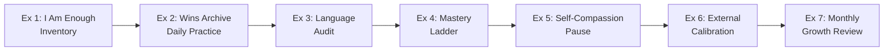

# 🏋️ Practice Exercises — Developing Self-Worth and Capabilities

---

## How to Use This File

Each exercise is tagged with:

- ⏱️ **Time required**
- 🔁 **Frequency**
- 🎯 **What it builds**

Work through the exercises progressively — start with the foundation builders and move toward the integration exercises.

---

## 🟢 Foundation Exercises (Start Here)

### Exercise 1: The "I Am Enough" Inventory

⏱️ 20 minutes | 🔁 Once, then revisit monthly | 🎯 Unconditional self-worth

**Instructions:**

Complete these prompts in writing — do not censor yourself:

1. List **5 qualities you have that have nothing to do with your job or achievements.**
   *(Examples: loyalty, humor, curiosity, warmth, creativity)*

2. For each quality, write **one specific time in the last month you expressed it.**

3. Write this sentence at the bottom:
   > *"I am valuable because of who I am, not because of what I achieve. My worth is not for sale and does not fluctuate with my results."*

4. Read it aloud, three times.

**Debrief question:** How did it feel to find evidence of your worth outside of performance? What resistance came up?

---

### Exercise 2: The Wins Archive (Start Today)

⏱️ 5 minutes/day | 🔁 Daily for 30 days | 🎯 Combating imposter syndrome

**Instructions:**

Create a dedicated document (digital or paper). Every evening, log:

| Date | What I did today | What capability it shows |
|---|---|---|
| *Today* | *Write one thing, however small* | *Write what it reveals about you* |

**Rules:**

- No result is too small. "I asked a clarifying question in a meeting" counts.
- Credit *yourself*, not luck. Replace "I got lucky" with "I was prepared" when true.
- After 30 days, reread the entire archive. Notice the pattern of capability.

---

### Exercise 3: Growth Mindset Language Audit

⏱️ 10 minutes | 🔁 Weekly for 4 weeks | 🎯 Rewiring fixed mindset beliefs

**Instructions:**

1. Set a timer for 5 minutes. Write down **every self-limiting belief** you have said or thought this week.

   Examples: *"I'm terrible with numbers," "I'm not a leader," "Public speaking isn't for me."*

2. For each statement, rewrite it using the **Growth Mindset template:**

   > *"I haven't developed [skill] yet. I can build this through [specific action]."*

3. Circle the **one reframe** that you want to internalize most this week. Put it somewhere visible.

---

## 🟡 Intermediate Exercises (After Week 1)

### Exercise 4: The Mastery Ladder — Pick One Skill

⏱️ 30 minutes to design | 🔁 Ongoing (4–6 weeks execution) | 🎯 Building self-efficacy through progressive wins

**Instructions:**

1. **Choose one capability** you want to build (e.g., assertive communication, data presentation, leading meetings).

2. **Design your personal Mastery Ladder** — 5 rungs from easiest to hardest:

   | Rung | My Specific Challenge | Done? |
   |---|---|---|
   | 1 (Easiest) | | ☐ |
   | 2 | | ☐ |
   | 3 | | ☐ |
   | 4 | | ☐ |
   | 5 (Hardest) | | ☐ |

3. Start at Rung 1 this week. Move to the next rung only after completing the current one.

4. After each rung: write in your Wins Archive *what the success tells you about your capability.*

---

### Exercise 5: The Self-Compassion Pause (Role Play Version)

⏱️ 10 minutes | 🔁 Any time after a mistake or criticism | 🎯 Self-compassion, resilience

**Instructions:**

Think of a recent situation where you felt like you failed or weren't good enough.

Step 1 — **Mindfulness:** Write what you felt. Don't minimize or overdramatize.
> *"I felt embarrassed and questioned whether I belong in this role."*

Step 2 — **Common Humanity:** Write a sentence acknowledging this is universal.
> *"Nearly every person in a high-stakes role feels this at times. I am not uniquely broken."*

Step 3 — **Self-Kindness:** Imagine your closest friend came to you with this exact situation. Write what you would say to them.
> *"I'd tell them: You made a mistake, but that's one data point. Look at all the times you've succeeded. You're learning. That's what growth looks like."*

Step 4 — **Apply it to yourself.** Say the same thing. Write it in the first person.

---

### Exercise 6: The External Calibration Interview

⏱️ 30–45 minutes (per person) | 🔁 Once per quarter | 🎯 Validating and expanding self-knowledge

**Instructions:**

Ask 2–3 people you trust (colleagues, managers, mentors) these specific questions:

1. *"What do you see as my clearest strengths?"*
2. *"Where do you think I'm playing it too safe or underestimating myself?"*
3. *"What is one capability you think I have that I might not fully recognize?"*

**After the conversations:**

- Compare their answers to your own self-assessment.
- Where do they see MORE capability than you do? (This is your underestimated potential)
- Add anything they said to your Wins Archive as external evidence.

---

## 🔴 Integration Exercise (After Week 3)

### Exercise 7: The Capability Growth Review

⏱️ 45 minutes | 🔁 Monthly | 🎯 Synthesizing all practices into a coherent self-image

**Instructions:**

At the end of each month, conduct a structured self-review:

**Part A — Worth Check**

- Is my sense of worth stable, or did it fluctuate with external events this month?
- What triggered feelings of unworthiness? What does that tell me about where my worth is still conditional?

**Part B — Capability Evidence**

- Review your Wins Archive. What 3 capabilities have you demonstrated most consistently?
- What is one capability you showed that you didn't believe you had a month ago?

**Part C — Growth Plan**

- What is the ONE capability to focus on developing next month?
- What is the smallest mastery step you can take in Week 1?

---

## 🔑 Exercise Progression Path

---

*Next → [`04_Real_World_Examples.md`](./04_Real_World_Examples.md)*
