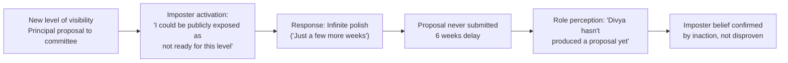

# 🌍 Real-World Examples — Developing Self-Worth and Capabilities

---

## How to Use These Examples

Read each scenario in two modes:

1. **Recognition mode** — does this character's pattern sound familiar? Do you recognise their internal logic in yourself?
2. **Analysis mode** — break down the worth mechanism, the capability belief, and the imposter pattern before reading the debrief

---

## Example 01 — "I Only Feel Like I Belong When I'm the Best in the Room"

**Context:** Mid-career engineering manager, 8 years experience, recently promoted to a senior leadership role.

**What happened:**
Kavitha was promoted to Engineering Manager 6 months ago. In individual contributor meetings, she had always felt sharp, capable, and at ease. Now attending VP-level product and strategy meetings, she consistently feels out of place. She goes quiet when executives debate strategy. She prepares elaborate pre-read notes for every meeting but rarely contributes. She has started declining optional senior leadership forums, telling herself she's "too busy."

**Inner experience:**
> *"I don't have enough strategic context yet. Once I've been in this role for a year I'll have something real to contribute. Everyone here has more context than me. If I say something now and it's not quite right, they'll wonder how I got promoted. It's better to watch and learn. I know my worth — I'm adding value in the team-level things."*

**The Self-Worth Mechanism:**

| Element | What's Actually Happening |
|---|---|
| **Worth condition** | Worth requires being the most capable person in the room |
| **The threat** | Senior forums have more experienced people → conditional worth drops |
| **The behaviour** | Withdrawal and silence disguised as "learning mode" |
| **The story told** | "I'm being strategic. I'll contribute when I know enough." |
| **The actual cost** | Invisible to senior leadership. Reinforces belief that she doesn't belong. Misses the early career-defining exposure moments. |

**What a skilled coach would say:**

> *"Let's test the logic: 'I'll contribute when I know enough.' When exactly is enough enough? You've been in this role 6 months. You have 8 years of engineering context. I hear you saying you need more strategic context — but how do you plan to get that if you keep opting out? The silence is not building capability. It is confirming the fear that you don't belong."*
>
> *"And the deeper question: your worth — are you tying it to being the sharpest in the room? Because you have just entered a room full of people who've been doing this 5–10 years longer. If your worth requires being ahead of them, every senior room you enter will feel threatening."*

**Reactive Outcome:**
Kavitha continues declining forums, contributing minimally for 12 months. At her annual review, her skip-level manager notes that she is highly regarded in her own team but "not yet quite visible at the next level." The promotion path to Director is unclear.

**Regulated Outcome:**
Kavitha identifies that her worth is tied to comparative superiority. She writes a new anchor: *"My contribution at this level is my engineering depth and my team perspective — both of which are genuinely underrepresented in these rooms. I don't need to know the most. I need to contribute what I actually know."* In the next meeting, she asks a single clarifying question from her engineering lens. It reframes the discussion. The VP says: "That's an important angle — I'm glad you raised it."

---

## Example 02 — The Wins Don't Register

**Context:** Senior Data Scientist, consistently high performer with an active imposter syndrome pattern.

**What happened:**
Rohan just received the highest performance rating in his team — "Exceptional." His manager specifically praised his predictive modelling work in front of the department. Walking back to his desk, his thought is: "She had to say something positive to offset the critical feedback she gave me last month." By the next morning, he has both dismissed the praise and mentally filed it as "not really about my actual ability." He begins preparing for his quarterly review by listing every mistake and misfire from the past quarter — he has 11 items. His list of successes has 2.

**Imposter Anatomy:**

| Element | Rohan's Pattern |
|---|---|
| **Achievement** | Exceptional performance rating; public department recognition |
| **External attribution** | "She had to balance the prior feedback" / "Politics" |
| **Selective memory** | 11 failures catalogued; 2 successes |
| **Imposter type** | The Perfectionist — success is never sufficient or 'clean' enough |
| **What this reveals** | Classic imposter attribution error: every negative = real data; every positive = asterisked or discounted |

**The Wins Archive Application:**

If Rohan had been running a Wins Archive for the past quarter, reading it now would show:

- 14 specific, documented achievement entries
- 3 entries specifically about the predictive model (weeks of work, iterations, stakeholder feedback at each stage)
- A pattern note from 2 months ago: "My manager said my model architecture was the best she's seen from a mid-level DS"

**What a coach would say:**
> *"Here's what I notice: you have a highly sophisticated system for cataloguing your failures with specificity and accuracy — 11 items, detailed. You have a very primitive system for cataloguing your successes — 2 items, vague. If you were applying your analytical rigour to both with equal precision, what would your evidence picture actually show?"*

> *"The question isn't 'do I deserve this rating.' The question is: 'Have I been applying my skills seriously and consistently, and do the results reflect that?' You can answer yes to both without requiring that nothing went wrong."*

**Regulated Outcome:**
Rohan starts a Wins Archive. By his next quarter review, he has 19 documented entries. When his manager praises his work, he opens the Archive, adds the entry, and — for the first time — writes in the attribution column: *"My preparation was thorough. My choice of the validation approach was the right call. This was recognising genuine preparation, not compensating for something."* The imposter thought still fires. But the Archive provides documented, specific facts that counter it before it solidifies.

---

## Example 03 — The Fear of Being "Found Out" After Promotion

**Context:** Software architect newly promoted to Principal, first 3 months in role.

**What happened:**
Divya was promoted to Principal Engineer. She was regarded as one of the strongest technical voices on her team. Three months into the new role, she has become aware that Principal Engineers at her company regularly present architecture proposals to a committee of 8 senior engineers for review. She has delayed submitting her first proposal for 6 weeks. Each time she opens the document, she identifies another thing to add before it's "ready."

**Inner experience:**
> *"When I was a Senior, I always had someone above me who could catch my mistakes before they became public. Now THIS is the thing they submit to the committee. If this proposal has a flaw they catch immediately, everyone will know I'm not actually ready for this level. Better to make it airtight first. A few more weeks of polish and it'll be solid."*

**The Imposter Type:** The Expert — believes that truly competent people at this level should already know the answer before they present. Does not know that the architecture review process exists precisely to debate and refine ideas collaboratively.

**The Mechanism:**

**What a coach would say:**
> *"The architecture review is not a test of whether your proposal is perfect. It's a conversation about whether the direction is sound. Every Principal in that room has had proposals challenged, revised, and improved through the committee. The process is collaborative refinement — not a pass/fail exam."*
>
> *"Here's the real question: what specifically are you protecting yourself from by delaying? A flawed proposal submitted and improved, or a strong proposal never submitted? Which of those is the actual Principal-level behaviour?"*

**Imposter Interruption Protocol Applied:**
> *"This is the imposter pattern. I am attributing the review to 'exposure risk' when it is actually 'collaborative development.' I have been producing high-quality architectural work for 3 years. The committee's job is to improve this, not to grade me. My preparation is real. Submitting this proposal is what a Principal Engineer does."*

**Regulated Outcome:**
Divya submits the proposal. Three significant revisions are suggested in the review. She incorporates two and pushes back on one with a well-reasoned argument. The committee lead says: "This is exactly the kind of proposal review we want — you've got a strong foundation and you argued your position well." Her imposter archive entry reads: *"Submitted first Principal proposal. Committee improved it — as designed. I held my position on one point and won the argument. This is what the role actually looks like."*

---

## Example 04 — The Praise That Doesn't Land

**Context:** Product Manager; high performer; praise is regular but doesn't register.

**What happened:**
Ananya's manager gives her specific positive feedback in their 1-on-1: "Your stakeholder communication on this project was genuinely excellent — I've heard from three VPs that you made a complex integration clear and manageable." Ananya nods, says thank you, and within 15 minutes is focused on the one thing that didn't go well in the same meeting where the communication was praised.

**The Pattern:**
Ananya has **imposter filtering** — a pattern where positive information is processed briefly and dismissed, while negative information receives extended attention and storage.

| Information Type | Processing | Storage |
|---|---|---|
| Praise from manager | 15 second receipt → "they're being kind" → dismissed | Shallow; not retained |
| One VP criticism in a meeting | Replayed 7 times in the following 3 hours | Deep; retained for weeks |
| Project success | "It came together this time" | Little attribution; low retention |
| One project failure | "This is an indicator of my limits" | Strong attribution; long retention |

**Worth Mechanism:** Worth requires continuous high performance validated by others. Positive feedback is discounted as social courtesy. Negative feedback is treated as revealing truth.

**Regulated Response — Building the Archive:**
Ananya begins a Wins Archive with a specific rule: every piece of unsolicited positive feedback from a credible source gets documented verbatim, with the name of the person and the date. After 6 weeks, she reads back through it before a difficult meeting. The archive has 12 entries. She reads two from the VPs mentioned by her manager. The emotional impact of seeing their words in writing — documented, specific, with names and dates — is different from the half-second processing she gave them at the time.

---

## Example 05 — "I'm Not a Leadership Person"

**Context:** Senior Backend Engineer, technically excellent, approaching a career choice point.

**What happened:**
Sanjay has been offered a tech lead opportunity — leading a team of 5, no direct management but technical direction and mentoring responsibility. He tells his manager: "Honestly, I'm not a leadership person. I'm better as a deep technical contributor." His manager knows he has informally been the person juniors on the team turn to for architectural guidance for 18 months.

**The Fixed Mindset at Work:**
"I'm not a leadership person" is a fixed mindset statement: treating leadership not as a skill to develop, but as an innate trait either possessed or absent.

| Fixed Mindset Interpretation | Growth Mindset Reframe |
|---|---|
| "I'm not a leadership person" | "I'm not yet confident in the formal leadership behaviours" |
| "Leadership isn't my strength" | "Leadership is a capability I haven't deliberately developed" |
| "I'm better as a deep contributor" | "Right now I'm more practised at technical work than informal team guidance" |

**What the evidence actually shows:**
For 18 months, Sanjay has been: the first person juniors consult for architecture decisions, running ad hoc code review sessions, and writing the most-referenced internal technical documentation on the team. These are leadership behaviours, practised informally without the label.

**Regulated response from manager:**
> *"I want to push back on 'not a leadership person.' You have been doing the substantive work of technical leadership for 18 months — you just haven't been doing it with a title or formal responsibility. The difference between where you are now and the tech lead role is mostly the formalisation and the scope. What specific part of the role do you feel unready for?"*

Sanjay identifies one thing: "performance conversations." Manager proposes a 90-day plan with 3 specific feedback conversations as the first mastery rung, with coaching support. He accepts the role.

---

## Example 06 — The Self-Criticism Loop That Prevents Learning

**Context:** Junior Engineer who made a production error; technically recoverable but emotionally devastating.

**What happened:**
Preethi pushed a change that caused a 20-minute production outage. The engineering team resolved it quickly. Her manager sent a message: "Good resolution. Let's do a blameless post-mortem Friday and build it into our process." For the next 48 hours, Preethi is unable to focus on work. She replays the error repeatedly. She stops contributing in Slack. She tells a colleague: "I'm not sure I'm cut out for production work."

**Self-Criticism Mechanism:**

- One error → evidence of fundamental incapacity
- Recovery and team support → not registered
- Manager's blameless framing → re-interpreted as "he's being nice to avoid making me feel bad"
- 20-minute outage → catastrophised to "I may not belong in this field"

**Self-Compassion Application:**

*1. Mindfulness:*
"What happened was: I caused a 20-minute outage by pushing a change without adequate test coverage verification. This is a real technical mistake. It was also recovered in 20 minutes by the team."

*2. Common Humanity:*
"Production outages caused by junior engineers are a universal part of the learning curve in every engineering org. Every senior engineer in this company has done something similar or worse. This is a standard developmental event, not evidence of unique incompetence."

*3. Self-Kindness:*
"What would I tell Rohan if he pushed a change that caused a 20-minute outage? I would say: 'That's a hard 48 hours. What did you learn about your deployment checklist? The team rallied and fixed it. That's the culture working. Now — what's the specific thing you'll add to your process? That's the only thing that matters now.'"

**What Preethi says to herself (self-compassion applied):**
> "That was a hard experience. 20 minutes of outage from a junior engineer, recovered quickly by a team with good incident response — that is a normal developmental event in this field. My manager ran a blameless post-mortem, which means the org treats this as systemic learning, not individual failure. What did I learn specifically about deployment verification? That's the only question that matters now."

**The Learning:**
Preethi goes into the post-mortem with specifics: three steps she will add to her personal deployment checklist. The senior engineers add two more to the team checklist. Her outage becomes the origin of a documented process improvement. That is learning. That is growth. Self-compassion made the learning accessible; self-criticism would have created avoidance.

---

*Next → [`05_Common_Mistakes.md`](./05_Common_Mistakes.md)*
