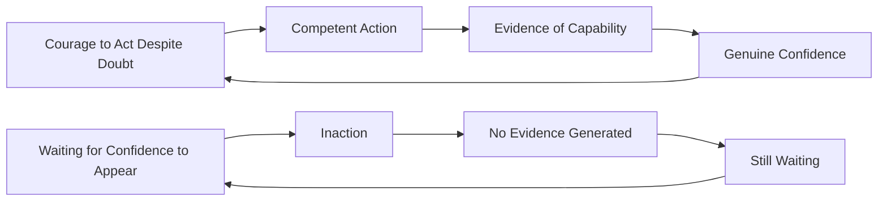

# ⚠️ Common Mistakes — Developing Self-Worth and Capabilities

---

## ⚡ Overview

> Most people *want* strong self-worth and greater capability confidence — but unknowingly engage in habits that undermine both. This file names the most common and costly mistakes so you can recognize and correct them before they compound.

---

## ❌ Mistake 1: Confusing Self-Worth with Arrogance

**What it looks like:**
> *"If I believe I'm inherently valuable, won't I become arrogant or complacent?"*

Many people — especially in cultures that prize humility — are conditioned to suppress self-worth because they fear it looks like arrogance.

**Why it's wrong:**

| Healthy Self-Worth | Arrogance |
|---|---|
| "I am valuable as a person" | "I am more valuable than others" |
| Allows honest acknowledgment of mistakes | Denies or deflects mistakes |
| Curious and open to learning | Already knows everything |
| Stable under pressure | Feels threatened by challenge |

**The fix:** Healthy self-worth is *quiet confidence*. It does not require putting others down or ignoring your limits. It is the secure platform from which genuine growth and connection happen.

---

## ❌ Mistake 2: Using Achievement as Proof of Worth

**What it looks like:**
Tying your sense of being "enough" to external metrics — a job title, a salary level, a project outcome, someone's approval.

> *"Once I get promoted, I'll finally feel like I deserve to be here."*
> *"When this project succeeds, I'll know I'm actually competent."*

**Why it's wrong:**

This is the "arrival fallacy" — the belief that achieving something will permanently fix your self-worth. Research consistently shows it doesn't. The goalpost moves. The next achievement becomes the new condition.

**The fix:** Separate worth from achievement deliberately. Worth is unconditional. Achievements are *expressions* of your effort, not *measurements* of your value.

---

## ❌ Mistake 3: Mistaking Imposter Syndrome for Reality

**What it looks like:**
Treating feelings of not belonging or not being qualified as **evidence** rather than as **cognitive distortions.**

> *"I feel like a fraud, therefore I must be a fraud."*

**Why it's wrong:**

Feelings are not facts. Imposter syndrome is specifically defined as feelings of fraudulence *that persist despite evidence of competence.* The data (your results, feedback, track record) contradicts the feeling — but people ignore the data and trust the feeling.

**The fix:** Build the habit of asking: *"What does the actual evidence say?"* Every time imposter thoughts arise, open your Wins Archive. **Evidence beats feeling.**

---

## ❌ Mistake 4: Deflecting Compliments

**What it looks like:**
Responding to genuine positive feedback with self-dismissal:

> *"Oh, it was nothing."*
> *"I just got lucky."*
> *"Anyone could have done that."*

This is often framed as humility. It's actually **internalized self-doubt performing as politeness.**

**Why it's wrong:**

Every deflected compliment is a rejected piece of evidence about your capability. Over time, you build a reality where your wins don't count and only your failures register. Your archive of self-worth stays empty.

**The fix:** Practice receiving positive feedback. The simplest script:
> *"Thank you — I'm glad it was useful."*

Nothing more required. No deflection. No over-elaboration. Just receive it.

---

## ❌ Mistake 5: Interpreting Difficulty as Incapability

**What it looks like:**
> *"This is hard for me — it must mean I'm not suited for it."*

When something takes significant effort or doesn't come naturally, people with a fixed mindset read this as a signal they shouldn't be doing it.

**Why it's wrong:**

Difficulty is the mechanism of learning, not evidence of incapability. Neurologically, new skills require high cognitive effort before they become automatic. The feeling of struggle IS the feeling of building new neural pathways.

> 💡 **Reframe:** Difficulty doesn't mean "I can't." It means "I'm building."

**The fix:** Use the Growth Mindset language reframe: *"This is hard right now. That's information about where I am on the learning curve, not information about my ceiling."*

---

## ❌ Mistake 6: Comparing Your Internal State to Others' External Presentation

**What it looks like:**
> *"She looks so confident. I feel uncertain inside. I must be less capable than she is."*

You compare your *full internal experience* (doubt, fear, uncertainty) to someone else's *visible behavior* (confident delivery, polished output). You are always comparing behind-the-scenes to highlight reel.

**Why it's wrong:**

Research shows that virtually everyone experiences doubt internally. High performers are not those who feel no self-doubt — they are those who act *despite* it. You never see someone else's inner dialogue.

**The fix:** Replace comparison with curiosity. Instead of *"Why am I not like them?"* ask *"What habits or practices create the outcomes I observe in them?"*

---

## ❌ Mistake 7: Waiting to Feel Confident Before Acting

**What it looks like:**
> *"Once I feel ready and confident, I'll volunteer for the leadership role / give the talk / have the difficult conversation."*

**Why it's wrong:**

Confidence is a *result* of action, not a prerequisite. Research by Amy Cuddy and others confirms that confidence is generated neurologically through the act of doing — not through waiting for a feeling.

**The fix:** Act at 70% confidence. The remaining 30% is built by the action itself.

---

## 🔑 Common Mistakes Summary

| Mistake | Core Confusion | The Fix |
|---|---|---|
| Self-worth = arrogance | Worth is conditional on humility | Worth is stable; humility is behavior |
| Achievement proves worth | Outcomes define value | Worth is unconditional; achievements are expressions |
| Feelings = facts | "I feel fraudulent" = "I am fraudulent" | Evidence-based self-assessment |
| Deflecting compliments | Humility requires self-dismissal | Receive evidence gracefully |
| Difficulty = incapability | Hard = I can't | Hard = I'm building |
| Internal vs. external comparison | Others have no self-doubt | Everyone has an inner dialogue you don't see |
| Waiting for confidence | Confidence precedes action | Action generates confidence |

---

*Next → [`06_Tools_and_Resources.md`](./06_Tools_and_Resources.md)*
