# 📚 Tools & Resources — Developing Self-Worth and Capabilities

---

## ⚡ Overview

> This file curates the most impactful, evidence-based resources across books, assessments, frameworks, and online tools. Each resource is tagged with its use case so you can choose what fits your current development focus.

---

## 📖 Essential Books

### Tier 1 — Must Read (Core Framework Books)

| Book | Author | Key Insight | Best For |
|---|---|---|---|
| **Mindset: The New Psychology of Success** | Carol S. Dweck | Fixed vs. Growth Mindset — the foundational framework for capability beliefs | Everyone — most impactful first read |
| **Self-Compassion: The Proven Power of Being Kind to Yourself** | Kristin Neff | Research-backed alternatives to self-criticism that actually improve performance | High achievers who are hard on themselves |
| **The Gifts of Imperfection** | Brené Brown | Worthiness, vulnerability, and wholehearted living grounded in research | People whose worth is tied to external approval |

### Tier 2 — Deep Dive (For Specific Challenges)

| Book | Author | Key Insight | Best For |
|---|---|---|---|
| **The Confidence Code** | Katty Kay & Claire Shipman | How confidence is partially genetic but mostly built through action and risk-taking | Those waiting to "feel ready" before acting |
| **The Imposter Cure** | Jessamy Hibberd | Clinical guide to identifying and dismantling imposter syndrome patterns | Those actively experiencing imposter syndrome |
| **Atomic Habits** | James Clear | Small consistent actions compound into identity and capability | Building capability through sustainable daily practice |
| **What Got You Here Won't Get You There** | Marshall Goldsmith | Identifying subtle behaviors that cap growth at senior levels | Mid-to-senior professionals |

---

## 🌐 Online Assessments & Tools

### Free Assessments

| Tool | What It Measures | Link |
|---|---|---|
| **VIA Character Strengths Survey** | Your top 24 character strengths from positive psychology | [viacharacter.org](https://www.viacharacter.org) |
| **CliftonStrengths (StrengthsFinder) — Free Preview** | Talent themes (paid for full 34; top 5 free with some editions) | [gallup.com/cliftonstrengths](https://www.gallup.com/cliftonstrengths) |
| **Kristin Neff's Self-Compassion Scale** | Measures your current levels of self-compassion across 3 dimensions | [self-compassion.org/self-compassion-scales-for-researchers](https://self-compassion.org) |
| **Carol Dweck's Mindset Quiz** | Assess your current growth vs. fixed mindset orientation | Available via Mindset Works or psychology research sites |

---

## 🎬 Video & Audio Resources

| Resource | Format | Key Content |
|---|---|---|
| **Carol Dweck: The Power of Believing You Can Improve** | TED Talk (~10 min) | Core growth mindset concepts — excellent starting point |
| **Brené Brown: The Power of Vulnerability** | TED Talk (~20 min) | How vulnerability and worthiness are connected |
| **Amy Cuddy: Your Body Language May Shape Who You Are** | TED Talk (~21 min) | How "acting as if" changes self-perception and performance |
| **The Tim Ferriss Show — Episodes with Ryan Holiday, Brené Brown** | Podcast | In-depth conversations on worth, identity, and resilience |

---

## 🧠 Research Papers & Academic Sources

> For those who want to go deeper into the science:

| Paper | Authors | Key Finding |
|---|---|---|
| *Implicit Theories of Intelligence* | Carol Dweck & Ellen Leggett (1988) | Foundational research showing how beliefs about intelligence affect learning behavior |
| *The Impostor Phenomenon in High Achieving Women* | Pauline Clance & Suzanne Imes (1978) | Original Imposter Syndrome research — still highly relevant |
| *Self-Efficacy: Toward a Unifying Theory of Behavioral Change* | Albert Bandura (1977) | The original paper on self-efficacy — explains the 4 sources model |
| *The Role of Deliberate Practice in the Acquisition of Expert Performance* | Anders Ericsson, Krampe & Tesch-Römer (1993) | How expertise is built through structured effort, not innate talent |

---

## 🛠️ Practice Tools & Apps

| Tool | How to Use It | Format |
|---|---|---|
| **Day One / Notion / Obsidian** | Your Wins Archive — daily capability logging | App (iOS/Android/Desktop) |
| **Headspace / Insight Timer** | Self-compassion meditations — Kristin Neff's guided practices available on Insight Timer | App |
| **Reflectly** | Structured journaling with prompts for self-reflection and growth mindset | App |
| **Notion Templates** | Create your Mastery Ladder, Wins Archive, and Monthly Growth Review templates | Web/App |
| **Habitica / Streaks** | Gamify your daily self-worth practices to build habit consistency | App |

---

## 📋 Quick-Reference Frameworks (Print or Save)

### The Self-Worth Stress Test

When you feel your worth wavering, run through these five questions:

1. **What specifically triggered this feeling?** (Name the event)
2. **Is my worth actually at stake, or just my performance?** (Separate them)
3. **What does my Wins Archive say about my actual capability?** (Evidence check)
4. **What would I tell a friend in this situation?** (Self-compassion)
5. **What is one action I can take from a place of worth (not fear)?** (Grounded next step)

### Growth Mindset Trigger Phrases

Post this somewhere visible:

| When you think... | Replace with... |
|---|---|
| "I can't do this" | "I can't do this *yet*" |
| "I failed" | "I got data. What do I do differently?" |
| "They're better than me" | "They've practiced more in this area than I have" |
| "I'm not ready" | "I'll build readiness by doing, not waiting" |
| "This is too hard" | "This is exactly where growth happens" |

---

## 🔑 Recommended Learning Path

```mermaid
graph TD
    A[Start: Take the VIA Strengths Survey] --> B[Read: Mindset by Carol Dweck]
    B --> C[Practice: Daily Wins Archive for 30 days]
    C --> D[Watch: Brené Brown on Vulnerability TED Talk]
    D --> E[Practice: Self-Compassion Pause after each mistake]
    E --> F[Read: Self-Compassion by Kristin Neff]
    F --> G[Practice: Monthly Capability Growth Review]
```

---

*Next → [`07_Assessment_and_Reflection.md`](./07_Assessment_and_Reflection.md)*
