# 📊 Assessment & Reflection — Developing Self-Worth and Capabilities

---

## How to Use This Assessment

This assessment is not a test — it is a calibration tool. It is most useful when you are honest rather than when you are impressive. Work through all 5 sections. The goal is to leave with a precise understanding of where you currently are, what is working, what specific practices need reinforcement, and what concrete next step you are committing to.

**Completion checklist (use at end):**

- [ ] Section 1: Knowledge Check completed (written answers, model answers reviewed)  
- [ ] Section 2: Personal Profile filled in (your specific data, not generic)
- [ ] Section 3: Scenario Assessments written before reading model responses
- [ ] Section 4: Skill rating done using behavioural anchors
- [ ] Section 5: Forward commitment with specific criteria written
- [ ] Section 6: Connecting Forward — diagram reviewed and integration identified

---

## Section 1 — Knowledge Check with Validation Questions

*Write your answers before reading the model responses.*

---

**Q1 — The Mechanism Question**

> *A junior engineer, Arjun, has received consistently positive performance reviews for 2 years. He recently joined a high-profile project. Despite his track record, he finds himself staying silent in technical design discussions, spending 3x longer preparing materials than his peers, and attributing the positive feedback he receives to "the team's patience with a relatively new engineer." Identify: what specific psychological pattern is Arjun experiencing? What is the precise mechanism producing it? What specifically should he do to address the root cause rather than the symptoms?*

**Your answer:** _________________________ (write before reading model)

**Model Answer:**
> Arjun is experiencing **Imposter Syndrome** — specifically the Attribution Subtype, where external success is consistently attributed to factors outside his control (the team's patience, luck) rather than to his own skill and preparation. The mechanism is an **attribution error**: his actual capability and his internal explanation of his successes are misaligned. He IS competent (2 years of positive reviews is documented evidence). He is not *believing* he is competent because every success gets re-explained externally.
>
> The precise failure point: his internal model of "what causes my success" doesn't include himself in a reliable way. Each new success is therefore surprising rather than confirming.
>
> **What to do:** The root cause is attribution, not ability. The intervention is *evidence-based attribution rewriting*: (1) Build a Wins Archive with specific documented achievements, (2) In the attribution column, force himself to identify the specific internal factors (preparation, decision-making, technical reasoning) that drove each success, (3) When the imposter pattern fires ("I was lucky"), counter with the archive and write the accurate attribution. The goal is not "feel more confident" — it is "construct a more accurate internal model of what is causing your results."

---

**Q2 — The Distinction Question**

> *Explain the difference between self-worth and self-esteem. Why does this distinction matter practically in a professional context? Give a concrete example where someone with low self-esteem could still demonstrate healthy self-worth.*

**Your answer:** _________________________

**Model Answer:**
> **Self-worth** is the unconditional, stable sense that you are inherently valuable as a human being, regardless of outcomes. **Self-esteem** is the fluctuating, performance- and perceptions-based sense of "I feel good/bad about myself right now."
>
> The distinction matters because: people incorrectly assume that the goal is to always feel good about themselves (high self-esteem). That requires continuous positive outcomes — which is neither achievable nor desirable as a permanent state. The actual goal is to maintain a stable foundation of self-worth *through* the inevitable fluctuations in self-esteem.
>
> **Concrete example:** A product manager's roadmap is rejected by the executive team. Her self-esteem drops — she feels frustrated, disappointed, and uncertain about her judgment. Her self-worth remains intact: she doesn't conclude she is inept or doesn't belong in this role. She is able to think: "I'm disappointed. This feedback is hard. And I know what quality of thinking I brought to this roadmap, and it was genuine. What do I need to understand about what they need that I missed?" — Her emotional state is impaired (self-esteem down) but her capacity to engage productively with the problem is preserved (self-worth intact).

---

**Q3 — The Application Question**

> *Describe the 4 sources of self-efficacy (Bandura) and explain, for a specific professional capability you want to develop, how you would design a 90-day plan that deliberately uses all 4 sources.*

**Your answer:** _________________________

**Model Answer:**
> Bandura's 4 sources: (1) **Mastery experiences** — succeeding at progressively harder versions of the target task. (2) **Vicarious learning** — observing someone similar to you succeed at the target behaviour. (3) **Social persuasion** — receiving specific encouragement from a credible person. (4) **Physiological reappraisal** — interpreting arousal (nerves) as readiness rather than threat.
>
> **Example 90-day plan for "leading cross-functional meetings with authority":**
>
> - *Mastery (Weeks 1–4):* Lead three low-stakes team standups. Increase to facilitating a retrospective (weeks 5–8). Lead one cross-functional planning meeting (weeks 9–12).
> - *Vicarious (Weeks 1–3):* Identify one peer who leads cross-functional meetings well. Observe 2 of their meetings. Note specific behaviours (how they open, manage disagreement, close for decisions).
> - *Social Persuasion:* Ask your manager, before the cross-functional meeting in week 12: "I'm developing my meeting facilitation — I'd value 3 specific observations after you watch me run the month-end."
> - *Physiological:* Before each meeting, practise labelling arousal as "I'm energised and ready" rather than "I'm nervous and might fail." Use one deep slow breath before starting.

---

## Section 2 — Personal Worth & Capability Profile

*Complete with your own specific data — not generic answers.*

**My current self-worth conditions (from my Worth Audit):**

| The Condition | How Often is it Met? | My Control Over It? | Risk to My Worth When It Fails |
|---|---|---|---|
| | | | |
| | | | |
| | | | |

**My 3 unconditional worth sources:**

1. I am a person who ___________________________
2. I am a person who ___________________________
3. I am a person who ___________________________

**My dominant imposter syndrome type (from Clance's 5):**
> My type is: ___________________________, and I recognise it in myself when: ___________________________

**My primary fixed-mindset domains (where I most use fixed-mindset language):**

1. ___________________________
2. ___________________________

**The capability I am currently developing on my Mastery Ladder:**
> Capability: ___________________________
> Current rung: ___________________________
> Next rung (specific task and due date): ___________________________

---

## Section 3 — Scenario Response Assessments

*Write your response to each scenario before reading the model. Be specific.*

---

**Scenario A — The Harsh Feedback Loop**

> *Your manager gives you direct feedback in your 1-on-1: "Your communication in the all-hands this week was not clear — I heard from three people that they left confused." You feel a sharp wave of shame and an internal voice says "I'm not a good communicator." It's 2 PM and you have back-to-back meetings for the next 3 hours.*

**Write what you would do and say (to yourself and, if relevant, to your manager):**
_________________________ (write before reading model)

**Model Response:**
> *Immediately after the feedback, internal acknowledgement:* "I feel shame. That's the right word. My manager got feedback from three people — that's real data."
>
> *During the next 3 hours of meetings:* Self-compassion pause at the bathroom break. Step 1 (mindfulness): "What happened: my communication in the all-hands wasn't structured clearly enough for some audience members." Step 2 (common humanity): "This is a professional development moment — everyone who presents regularly has had a version of this." Step 3 (self-kindness): "I was trying to cover complex content in limited time. That's a legitimate challenge. I can get better at this specifically."
>
> *What I will NOT do:* Spiral from "that communication wasn't clear" to "I'm not a good communicator." That's the globalisation mistake — one instance is not a stable trait.
>
> *What I will do:* After meetings, send manager: "Thanks for the direct feedback today. Can we spend 10 minutes at our next 1-on-1 debriefing what specifically was unclear? I want to understand the gap accurately." This demonstrates: I receive feedback without shutting down, I take it seriously without spiralling, I convert it into specific developmental inquiry.

---

**Scenario B — The Skipped Rung Temptation**

> *You've been working on your Mastery Ladder for "leading difficult performance conversations." You're currently on Rung 2 (giving constructive feedback to a peer in a 1-on-1). You've done it twice successfully. Your manager asks if you'd be willing to step in for her and lead a formal performance conversation with a junior team member next week — that's Rung 5 on your ladder.*

**Write: do you accept? What do you say? What's your internal reasoning?**
_________________________

**Model Response:**
> *Internal reasoning:* "This is 3 rungs ahead of where I am. On my ladder, Rung 5 is 'lead a formal performance conversation with a junior team member.' I have done Rungs 1–2 but not 3 (constructive feedback to someone challenging) or 4 (team-level feedback facilitation). Skipping to 5 risks a high-visibility failure that could reduce my efficacy in this domain significantly."
>
> *What I might say to my manager:* "I appreciate the confidence. I want to be honest with you — I'm actively developing this specific skill and I'm currently at an earlier stage than feels right for jumping directly to a formal performance conversation with a junior team member. Is there a way I could participate alongside you — either co-leading or being present to observe — and use this as a Rung 3/4 experience? I'd like to step into the full version with more intentional scaffolding."
>
> **What this response demonstrates:** Accurate self-assessment (growth mindset, not fixed — "I'm developing this"), honest communication, suggested an alternative that benefits both parties. This is capable professional behaviour. Accepting the Rung 5 task to seem capable, then under-performing, would demonstrate the opposite.

---

**Scenario C — Praise That Doesn't Land**

> *After a difficult project delivery, your CTO specifically messages you: "Really impressive work navigating the stakeholder complexity on this one — I've heard great things from both teams." Your first internal response is: "The project went well, so she's being generous."*

**Write: what do you do with this in the next 5 minutes?**
_________________________

**Model Response:**
> *Within the next 5 minutes:*
>
> 1. Pause the internal dismissal — recognise it as the imposter attribution pattern: "I'm about to file 'stakeholder navigation' under 'luck/generosity of manager' rather than 'skill I demonstrated.'"
> 2. Recall specifically: what DID I do on this project in the stakeholder complexity dimension? (I ran 4 alignment calls before the main review. I escalated one blocker early. I wrote the summary document that both teams used as a reference point.) Those are specific actions. They are not luck.
> 3. Add a Wins Archive entry: *"[Date] — CTO messaged specifically about stakeholder navigation. Context: I ran 4 pre-alignment calls, escalated early, wrote the clarity document. Attribution: my preparation and process created this outcome. The praise was proportionate to the specific work."*
> 4. Reply briefly: "Thank you — this project taught me a lot about stakeholder alignment. I'll carry those approaches forward."
>
> *The discipline here:* Do not dismiss AND do not over-inflate. The accurate attribution is that you prepared and executed specific practices that worked. Documenting that is what builds genuine self-efficacy from success rather than letting the success evaporate through imposter filtering.

---

## Section 4 — Skill Rating with Behavioural Anchors

Rate yourself on each skill using the specific behavioural descriptions:

---

**Skill 1 — Self-Worth Stability Under Pressure**

| Rating | Observable Behaviour |
|---|---|
| **1 — Not yet** | I regularly feel inadequate after negative feedback; my internal experience of my value fluctuates significantly with each performance signal |
| **2 — Early** | I notice when worth-conditional patterns activate; I can sometimes slow the spiral but often still experience worth drops from significant feedback |
| **3 — Developing** | I have a written Worth Anchor; I consult it when conditional patterns activate; my worth dips are shorter-lived and I can re-anchor within hours |
| **4 — Practising** | I can name conditional worth patterns in real time and apply my anchor before spiralling; significant failures cause brief dips (hours, not days) |
| **5 — Deep Practitioner** | My sense of worth is functionally stable across performance fluctuations; I experience disappointment, frustration, pride — but not identity threats from outcomes |

**My current rating: ___ / 5**
**Evidence for this rating (specific observable behaviour, not desired state):** ___________________________

---

**Skill 2 — Imposter Syndrome Management**

| Rating | Observable Behaviour |
|---|---|
| **1 — Not yet** | Imposter thoughts lead me to avoid opportunities; I regularly attribute successes externally; I haven't documented any wins in a systematic way |
| **2 — Early** | I can identify imposter thoughts after the fact; I still often decline opportunities or over-prepare to compensate |
| **3 — Developing** | I have a Wins Archive with 10+ entries; I can use it to counter imposter thoughts; I accept some opportunities I would previously have declined |
| **4 — Practising** | I can apply the Imposter Interruption Protocol in real time; I notice external attribution and rewrite it within hours; I accept most opportunities proportionate to my capability |
| **5 — Deep Practitioner** | I proactively seek challenges at the edge of my capability; I experience imposter thoughts as recognisable patterns, not facts; my attribution is consistently accurate |

**My current rating: ___ / 5**
**Evidence for this rating:** ___________________________

---

**Skill 3 — Growth Mindset Application**

| Rating | Observable Behaviour |
|---|---|
| **1 — Not yet** | I regularly avoid or exit challenges where I'm not already competent; fixed-mindset self-talk runs unchallenged |
| **2 — Early** | I know the growth mindset concept; I occasionally catch fixed-mindset statements but rarely complete the reframe with a specific practice |
| **3 — Developing** | I complete the 3-part reframe (catch → "not yet" → specific practice) for at least one fixed-mindset statement daily; I'm building a mastery ladder for one capability |
| **4 — Practising** | Fixed-mindset language is noticeably reduced; I pursue challenges in my development domains with consistency; I persist through difficulty rather than exiting |
| **5 — Deep Practitioner** | Growth mindset is the default frame for difficulty and feedback; I actively seek challenges at the edge of my capability; I help others apply growth mindset in our interactions |

**My current rating: ___ / 5**
**Evidence for this rating:** ___________________________

---

## Section 5 — Forward Commitment

**The one practice from this concept I will implement starting this week:**

> Practice: ___________________________
> Frequency: ___________________________
> What "success at this practice" looks like after 14 days: ___________________________
> What result in my professional life I am expecting after 30 days of this practice: ___________________________

**The one habit I am letting go of:**

> I am stopping: ___________________________
> Because it costs me: ___________________________

---

## Section 6 — Connecting Forward

```mermaid
graph LR
    C03["Concept 03 ✅<br/>Self-Worth &<br/>Capabilities"]
    C04["Concept 04<br/>Identifying<br/>Personal Triggers"]
    SA["Self-Awareness<br/>Module Complete"]
    SR["02_Self_Regulation<br/>Managing emotions<br/>and impulses in check"]

    C03 -->|"Unconditional worth → Can observe<br/>triggers without identity threat"| C04
    C04 -->|"All four concepts integrated"| SA
    SA --> SR
```

**Integration prompt:** How does your self-worth stability directly affect your ability to identify your emotional triggers without spiralling? Write one sentence connecting what you've learned here to the Triggers concept:

> ___________________________

---

## ✅ Concept Completion Checklist

Before moving to the next concept, confirm:

- [ ] I have a written Self-Worth Anchor Statement
- [ ] I have started or established a Wins Archive (minimum 5 entries)
- [ ] I have identified my dominant Imposter Syndrome type (Clance's 5 types)
- [ ] I have completed a Growth Mindset language reframe for at least 3 of my fixed-mindset statements, including specific practices
- [ ] I have designed the first 2 rungs of a Mastery Ladder for one specific capability
- [ ] I have practised the Self-Compassion Pause at least once with a real recent mistake
- [ ] I can explain the difference between self-worth (unconditional, stable) and self-esteem (performance-based, fluctuating) without referencing these notes

---

*Module continues → [`../04_Identifying_personal_triggers_that_cause_emotional_reactions/01_Theory_and_Concepts.md`](../04_Identifying_personal_triggers_that_cause_emotional_reactions/01_Theory_and_Concepts.md)*
