# 🔥 Theory & Concepts — Identifying Personal Triggers That Cause Emotional Reactions

---

## ⚡ Quick Reference (TL;DR)

> An **emotional trigger** is a stimulus — a word, tone, silence, memory, or environment — that activates a disproportionately intense emotional reaction rooted in your past, not your present. Triggers are not character flaws. They are neurologically encoded survival responses that got locked in when your brain was protecting you from a real threat — and haven't updated since.

| Core Principle | The Deep Insight |
|---|---|
| Triggers are learned, not inherited | Every trigger has a specific origin story in your life |
| The reaction is about the past | The trigger is present-day; the wound is historical |
| Intensity = diagnostic signal | The bigger the reaction, the more important the wound underneath |
| Identification IS intervention | Simply naming a trigger begins to interrupt its automatic power |
| Triggers = unmet needs speaking | Beneath every trigger is a core need that isn't being honoured |

---

## 📖 Part 1 — What is an Emotional Trigger? The Full Mechanism

### The Firearm Analogy (and Why It's Accurate)

The word "trigger" comes from the mechanism that fires a gun. In emotional terms: the **gun** (the loaded emotional charge) was assembled in your past — through formative experiences, wounds, and unresolved pain. The **trigger** (the present-day event) is just the tiny mechanism that releases that force. Without the gun being loaded, the trigger mechanism would be inert.

This is why two people can experience the same event — say, being corrected by a manager in a meeting — and have completely different reactions. One person hears it as neutral feedback. The other feels a shame spiral and can't function for the rest of the day. The *event* was identical. The *guns* they brought into the room were different.

> 💡 **The practitioner insight:** When you are trying to reduce the power of your triggers, removing the trigger events from your life is impossible and misguided. Working on *unloading the gun* — reducing the emotional charge stored from the original wound — is where transformation happens.

*The sensory path to the amygdala (low road) is faster than the path to the prefrontal cortex (high road). This is why emotional reactions can occur before conscious thought registers what happened.*

---

### The Trigger Response Loop — Step by Step

Most people only become conscious of a trigger *after* the reaction has already happened — during the regret and confusion phase. Understanding every stage of the loop gives you multiple intervention points:

```mermaid
graph TD
    A["⚡ Triggering Stimulus<br/>Word · Tone · Silence · Look · Smell · Memory"] --> B

    B["🧠 Thalamus receives signal<br/>Routes it simultaneously to TWO paths"] --> C
    B --> D

    C["🐍 LOW ROAD — 20ms<br/>Direct to Amygdala<br/>Coarse, fast, threat-detection"] --> E

    D["🧩 HIGH ROAD — 500ms<br/>Through Cortex<br/>Detailed, contextual analysis"] --> F

    E["⚠️ Amygdala matches to past threat<br/>Releases cortisol + adrenaline<br/>Body in fight/flight/freeze state"] --> G

    F["✅ Prefrontal Cortex appraises<br/>Is this actually a threat?"] --> H

    G["🔥 HIJACK triggered<br/>Body is already reacting<br/>before rational mind has processed"] --> I

    H["⚖️ Regulated response<br/>Thoughtful action"] --> J

    I["😤 Reactive behavior:<br/>Snap / Shutdown / Overexplain / Withdraw"] --> K

    K["😞 Aftermath: Regret, confusion<br/>'Why did I react so strongly?'"]
    J["✅ Chosen response<br/>Situation handled well"]
```

**The critical fact:** The gap between the low road and high road is approximately **480 milliseconds** — less than half a second. In that tiny window, your body has already committed to an emotional state before your rational mind has even registered the stimulus. This is why willpower alone cannot stop triggered reactions — your nervous system has already acted.

**What this means in practice:** You cannot think your way out of a trigger in real time. The intervention has to come *before* (awareness work, trigger identification) or *after* (regulation techniques, post-event processing) — not during the 480ms window.

---

## 📖 Part 2 — The Neuroscience of Triggers (Why Your Brain Does This)

### The Amygdala as a Threat-Pattern Library

The amygdala is a small, almond-shaped structure deep in the brain's limbic system. Its primary job is **rapid threat detection**. It does this by pattern-matching incoming stimuli against a stored library of emotionally charged memories — particularly those associated with past pain, danger, or unmet needs.

Here's the critical detail most explanations miss: **the amygdala does not distinguish between past and present**. When a current stimulus resembles a past threat closely enough, the amygdala fires the same alarm — regardless of whether the threat still exists.

> 📊 **Research — LeDoux (1996), "The Emotional Brain":** Neuroscientist Joseph LeDoux demonstrated that emotional memories processed by the amygdala are essentially indelible — they can be suppressed or overridden by cortical processes, but the original emotional memory trace remains. This is why a smell, tone of voice, or phrase that echoes a past trauma can activate an emotional response *decades* later as vividly as the original experience.

**What the amygdala stores vs. what the hippocampus stores:**

| Brain Structure | What It Stores | Trigger Relevance |
|---|---|---|
| **Amygdala** | Emotional charge of a memory ("this felt dangerous/shameful/terrifying") | Fires the alarm when current stimulus resembles the stored threat |
| **Hippocampus** | Contextual narrative of a memory ("this happened in 2010 when I was 12") | Provides the *story* — but can be bypassed when threat is perceived |
| **Prefrontal Cortex** | Rational appraisal and regulation | Arrives late (480ms+) — the damage is often done |

The result: You can *intellectually know* that your current colleague is not your critical father — and your amygdala still fires the same alarm.

---

### Cortisol and the Window of Reactivity

When the amygdala triggers, it signals the hypothalamus to activate the HPA axis (Hypothalamic-Pituitary-Adrenal axis), flooding the body with cortisol and adrenaline within seconds. These hormones:

1. **Increase heart rate and blood pressure** — preparing for physical action
2. **Redirect blood flow** away from the prefrontal cortex and toward muscles — literally impairing rational thought
3. **Narrow attentional focus** — you stop seeing context, nuance, or alternative interpretations
4. **Stay in the system for 20–60 minutes** — even after the triggering event has passed

> 📊 **Research — Arnsten (1998), Yale University:** Stress hormones demonstrably impair prefrontal cortex function. Even mild stress was shown to cause significant deterioration in working memory, decision-making, and impulse control — the exact capacities needed to respond thoughtfully to a trigger rather than reactively.

**What this means in practice:** When you are in the grip of a trigger reaction, you are biologically *less capable* of rational thought for 20–60 minutes. This is not weakness. It is chemistry. Accepting this physiological reality changes how you work with your triggers — instead of demanding willpower *during* the hijack, you learn to interrupt the loop *before* it reaches that threshold.

---

### The "High Road" — Your Path to Choice

Daniel Goleman, who popularized the "amygdala hijack" concept in Emotional Intelligence (1995), also made the critical point: the **high road** (slow cortical processing) is what separates reactive animals from reflective humans. Every emotional intelligence skill in existence is, fundamentally, a technique to strengthen and speed up the high-road response relative to the low-road automatic reaction.

*The prefrontal cortex (frontal lobe, front-left) is responsible for rational appraisal and emotional regulation. During an amygdala hijack, blood flow and neural priority shift away from this region.*

> 📊 **Research — Lieberman et al. (2007), UCLA "Putting Feelings Into Words":** Using fMRI neuroimaging, Lieberman's team showed that simply *labeling an emotion in words* activated the right prefrontal cortex and simultaneously reduced amygdala activity. In effect, finding language for what you are feeling engages the high road — and calms the alarm system. This is the neuroscientific basis for the "Name It to Tame It" practice.

---

## 📖 Part 3 — Where Triggers Come From: The Formation Story

### The Learning Process Behind Every Trigger

Triggers are not random. Each one was *learned* through a specific mechanism: **your nervous system associated a particular stimulus with a particular outcome**, usually involving pain, threat, or the absence of something you deeply needed. Over repetition, the association became automatic.

The technical term from behavioural psychology is **conditioned emotional response** (CER) — the same principle Pavlov demonstrated with dogs, but applied to the full complexity of human emotional experience.

**The formation pattern typically looks like this:**

**The key point:** The original emotional response was *completely appropriate and adaptive* at the time. The problem isn't that your nervous system learned it — the problem is that it hasn't been updated now that you are an adult with different resources, capabilities, and circumstances.

---

### Sources of Trigger Formation

| Origin | How the Trigger Forms | Long-Term Pattern |
|---|---|---|
| **Childhood experiences with caregivers** | Repeated criticism, dismissal, unpredictability, or neglect from primary attachment figures | Hypersensitivity to similar behaviours from any authority figure; feedback = attack |
| **Developmental shame experiences** | Being publicly humiliated, corrected harshly, or made to feel "wrong" at a formative age | Intense shame response to mistakes, exposure, or being wrong in public |
| **Attachment wounds** | Inconsistent, unavailable, or enmeshed parenting creating anxious, avoidant, or disorganized attachment | Triggers around abandonment, intimacy, control, and trust |
| **Peer and social rejection** | Bullying, exclusion, or social failure during formative years (especially adolescence) | Hypervigilance around belonging, being liked, and social acceptance |
| **Workplace or institutional trauma** | Being fired unjustly, scapegoated, micromanaged, or betrayed by an organisation | Distrust of authority, overwork, perfectionism, or avoidance at work |
| **Cultural and familial conditioning** | Unspoken rules about emotions, gender, success, failure, and worth absorbed over years | Shame triggers that are invisible because they are culturally normalised |
| **Single-incident trauma** | An acute traumatic event (accident, assault, loss, public failure) | PTSD-type triggers where sensory cues from the event reactivate the full emotional response |

---

## 📖 Part 4 — Attachment Theory and the Roots of Core Triggers

### Why John Bowlby's Work Matters for Your Daily Triggers

British psychologist and psychiatrist John Bowlby (1969) developed **Attachment Theory** — the foundational framework explaining why humans develop the emotional vulnerabilities they do. His core finding: humans are biologically wired to seek closeness with attachment figures (caregivers), and when that proximity is threatened or inconsistently available, the nervous system develops adaptive strategies to manage the resulting threat.

These adaptive strategies become so deeply embedded that they continue to operate in adult relationships — with managers, colleagues, partners, and even perceived slights from strangers. They are the root system from which most recurring emotional triggers grow.

**The Four Attachment Styles and Their Adult Trigger Patterns:**

| Attachment Style | Early Experience | Core Wound Belief | Common Adult Triggers |
|---|---|---|---|
| **Secure** | Consistent, responsive caregiving | "I am worthy of love; others are trustworthy" | Triggers are mild and recover quickly; high distress tolerance |
| **Anxious (Preoccupied)** | Inconsistent caregiving — sometimes available, sometimes not | "I must earn love; I could be abandoned at any moment" | Silence, delayed responses, perceived withdrawal, ambiguity |
| **Avoidant (Dismissing)** | Emotionally unavailable / critical caregiving | "Needs are a burden; self-reliance is survival" | Demands for intimacy, emotional expression from others, feeling 'smothered' |
| **Disorganised (Fearful)** | Caregivers were both comfort AND source of fear | "Love is dangerous; I don't know if I'm safe" | Push-pull dynamics, both intimacy and rejection, chaos, unpredictability |

> 📊 **Research — Hazan & Shaver (1987):** Extended Bowlby's attachment framework to adult romantic relationships. Found that ~55% of adults are securely attached, ~25% anxiously attached, ~20% avoidant. These proportions help explain why certain interpersonal triggers are so widespread in professional settings.

---

## 📖 Part 5 — Core Wounds: The Deepest Layer of Triggers

### What a Core Wound Is (and Isn't)

A **core wound** is a deeply embedded belief about yourself or others that formed as a result of repeated painful experiences, typically in childhood. It is not a clinical diagnosis. It is not a label. It is simply the conclusion a young nervous system drew from its experience — and then filed as "truth."

Core wounds are the *loaded gun* from our earlier analogy. They are what triggers activate.

**The 6 Most Common Core Wounds and Their Trigger Signatures:**

```mermaid
graph TD
    W1["💔 Abandonment Wound<br/>'People always leave me'"]
    W2["🚫 Rejection Wound<br/>'I am not good enough'"]
    W3["😶 Betrayal Wound<br/>'I can't trust anyone'"]
    W4["😳 Shame Wound<br/>'I am fundamentally flawed'"]
    W5["🔐 Powerlessness Wound<br/>'I have no control'"]
    W6["👁️ Humiliation Wound<br/>'I was/am made to feel small'"]

    T1["Silence · Not replying · Someone leaving"]
    T2["Criticism · Exclusion · Being overlooked"]
    T3["Broken promises · Secrets · Dishonesty"]
    T4["Mistakes · Exposure · Failure · Being watched"]
    T5["Micromanagement · Overruled · Having no say"]
    T6["Public correction · Mockery · Being talked down to"]

    W1 --> T1
    W2 --> T2
    W3 --> T3
    W4 --> T4
    W5 --> T5
    W6 --> T6
```

**Going deeper on each:**

**Abandonment Wound**
This is not just fear of physical abandonment. In adult professional and personal life, it manifests as extreme sensitivity to *emotional* or *psychological* withdrawal — a colleague going quiet, a manager becoming distant, a partnership ending. People with a strong abandonment wound often interpret normal, unrelated silence as rejection and will engage in significant relationship maintenance activity to prevent the perceived threat.

**Rejection Wound**
Most common wound in high-performing professionals. It drives perfectionism, overwork, and approval-seeking not from genuine ambition but from a need to avoid the confirmation of the core belief: "I am not enough." Feedback triggers this wound powerfully — even gentle, well-framed developmental feedback can feel like an existential threat.

**Shame Wound**
Distinguished from guilt (which is "I did something bad") by its pervasiveness: shame says "I *am* bad." People with strong shame wounds have elaborate avoidance systems — they rarely make mistakes publicly, avoid situations where incompetence could be visible, and experience disproportionate reactions when they are "caught" not knowing something. In Brené Brown's research (2010), shame was found to be the most disruptive emotion to professional and personal wellbeing.

**Betrayal Wound**
Creates hypervigilance around trust. People with this wound are often perceived as cynical, guarded, or difficult to work with — because their threat-detection system is calibrated to find signs of betrayal before it happens. Often develops when authority figures (parents, teachers, institutions) violated trust in formative years.

**Powerlessness Wound**
Drives reactions to any form of control, top-down decision making, or being overridden. Can look like a problem with authority, or stubbornness, but is fundamentally a nervous system protecting someone from the terror of helplessness. Often formed in highly controlled or unpredictable households.

**Humiliation Wound**
Specifically tied to public or relational exposure. The body-memory of being made small in front of others. People with this wound have extremely strong reactions to being corrected, criticised, or contradicted in front of others — even when the correction itself is gentle and factual.

---

## 📖 Part 6 — The Language of Triggers: Proportionality as Diagnostic Tool

### The Most Useful Question to Ask Yourself

> **"If I rated this situation's actual severity from 1–10 on an objective scale, and rated my emotional reaction from 1–10 — is there a gap?"**

When the reaction intensity significantly exceeds the situational severity, you are almost certainly looking at a trigger — not just a difficult situation. The *size* of the gap is roughly proportional to the *depth* of the wound.

| Situation Severity | Reaction Intensity | What It Suggests |
|---|---|---|
| 2 | 3–4 | Normal variation in emotional sensitivity |
| 2 | 6–7 | Likely a moderate trigger — review past patterns |
| 2 | 8–10 | Strong trigger — almost certainly linked to a core wound |
| 7 | 7–8 | Proportionate — possibly just a very difficult situation |
| 7 | 10+ | Wound activation compounding a genuinely hard situation |

---

## 🔑 Key Takeaways — The Practitioner Summary

1. **Triggers are neurologically normal** — every human brain has them. Having triggers is not pathology. Being unaware of them is the only problem.

2. **The trigger is present-day; the wound is historical** — you are almost never as upset *about* the current event as you are about the past event it resembles.

3. **480ms is your window** — the amygdala fires before your rational mind registers the situation. You cannot out-think a trigger in the moment. Work upstream (awareness, identification) and downstream (regulation, recovery).

4. **Cortisol stays in your system for 20–60 minutes** — allow for a cooling-off period before making important decisions or continuing important conversations after a trigger fires.

5. **Attachment style is the root system** — understanding your attachment style unlocks the pattern beneath your specific triggers. Most recurring professional and personal triggers are attachment-based.

6. **Core wounds are not life sentences** — they are learned responses. They can be updated through consistent awareness work, relational healing, and — where needed — professional therapeutic work.

7. **Proportionality is your compass** — when your reaction is bigger than the situation warrants, treat that as a signal to investigate, not a symptom to suppress.

---

*Next → [`02_Techniques_and_Frameworks.md`](./02_Techniques_and_Frameworks.md)*
