# 🛠️ Techniques & Frameworks — Identifying Personal Triggers

---

## ⚡ Overview — Choosing Your Tool

| Technique | When to Use It | Time Investment | Difficulty |
|---|---|---|---|
| **S.T.O.P. Pause** | In the exact moment of a trigger firing | 30 seconds | Low — with practice |
| **Body Scan Method** | To catch triggers via physical signals before cognition catches up | 1–2 minutes | Low–Medium |
| **Trigger Mapping Journal** | To identify patterns across multiple events over time | 10–15 min per entry, 2+ weeks | Medium |
| **The Trigger Interview** | To deeply understand a single specific reaction after the fact | 20–40 minutes | Medium–High |
| **Core Wound Tracing** | To identify the root source of a recurring trigger theme | 45–60 minutes | High |
| **The 3-R Framework** | As a daily sustainable discipline integrating all the above | Ongoing | Low–Medium |
| **Proportionality Audit** | To quickly assess whether what you're feeling is triggered or genuinely proportionate | 2 minutes | Low |

---

## ⏸️ Technique 1 — The S.T.O.P. Pause (In-the-Moment Interruption)

### What It Is and Why It Works

The S.T.O.P. technique is a **mindfulness-based circuit breaker** — a four-step sequence that, when executed in the moment of a trigger firing, gives the prefrontal cortex enough time to come online and interrupt the automatic reactive chain.

The reason this works is physiological: a slow, deliberate exhale activates the **vagus nerve**, which runs from the brain through the chest and abdomen. The vagus nerve is the primary channel of the parasympathetic nervous system — the body's "rest and digest" mode. Activating it even briefly creates a measurable shift away from sympathetic dominance (fight/flight) and toward a more regulated state.

> 📊 **Research — Porges (1995), "Polyvagal Theory":** Stephen Porges identified the vagus nerve as the physiological key to social engagement and emotional regulation. Controlled slow breathing — specifically longer exhales than inhales — reliably activates vagal tone, which counteracts the cortisol surge of an amygdala hijack. You are not just "calming down" — you are literally changing your neurochemistry.

### The Four Steps — With Full Rationale

**🛑 S — STOP (Physical freeze)**
Pause all physical movement and speech. This is intentional disengagement from the momentum of the reactive state. Even pausing for 2 seconds before speaking creates a micro-break in the automaticity of the trigger loop.

*Why this step matters:* The reactive behavior (snapping, withdrawing, overexplaining) almost always happens while the body is still in motion — talking, typing, moving toward the door. Physically stopping interrupts the physical-behavioral component of the reaction even before the emotional component is resolved.

**💨 T — TAKE a breath (Physiological regulation)**
One slow inhale to a count of 4. One slow exhale to a count of 6 or 8. The exhale must be *longer* than the inhale for vagal activation.

*Why longer exhale:* The parasympathetic nervous system is activated primarily during the exhale phase of the breath cycle. A short, sharp exhale (like a sigh of frustration) does not activate it meaningfully. A controlled, extended exhale does.

**👁️ O — OBSERVE (Non-judgmental inventory)**
Notice without judgment: What am I feeling physically right now? What emotion is this? What story is my mind telling? Do not try to change anything — only observe it accurately.

*Why non-judgmental observation matters:* Self-judgment ("I shouldn't feel this way") adds the layer of shame on top of the original triggered emotion, compounding the dysregulated state. Neutral observation creates the psychological distance that allows you to become the watcher of the emotion rather than being consumed by it.

**▶️ P — PROCEED (Choosing a response)**
From this slightly more regulated state, now ask: "What response would the best version of me give right now?" This may be silence, a question, a statement of need, or choosing to have the conversation later.

*Why "best version of me" framing works:* It bypasses the inner critic and invokes an aspirational standard rather than demanding perfection. It also engages the prefrontal cortex — the moment you ask yourself a complex question, you are neurologically pulling resources back to rational processing.

```mermaid
graph LR
    S["🛑 STOP<br/>Pause. Do not speak yet."] 
    --> T["💨 TAKE a breath<br/>In 4 counts / Out 6–8 counts<br/>Vagal activation"]
    --> O["👁️ OBSERVE<br/>Body · Emotion · Story<br/>Without judgment"]
    --> P["▶️ PROCEED<br/>'What would the best version<br/>of me do right now?'"]
```



### What to Do When S.T.O.P. Doesn't Work

**Common failure mode 1:** The trigger is too strong and you've already spoken reactively before S.T.O.P. occurs to you.
*Solution:* Don't compound the reaction with self-criticism. After S.T.O.P., you can say: "Actually, let me step back — I want to give this a more considered response." Returning to regulated behavior *after* a reactive moment is more powerful than expecting perfection.

**Common failure mode 2:** The environment makes pausing feel impossible (fast-paced meeting, phone call, real-time conflict).
*Solution:* Pre-agree with yourself on an "exit phrase." Something like "I need a moment to think about that" gives you 30–60 seconds without requiring you to explain your internal state. Practice this phrase so it comes automatically.

**Common failure mode 3:** The trigger fires outside your awareness and you only realise you were triggered hours later.
*Solution:* S.T.O.P. is not the right tool for this scenario — use the Trigger Interview (Technique 4) retrospectively. Over time, body scan practice (Technique 2) will bring your awareness earlier in the trigger cycle.

---

## 🧘 Technique 2 — The Body Scan Method (Pre-Cognitive Detection)

### Why the Body Speaks Before the Mind Does

All emotional experiences have a physical component that *begins before conscious awareness*. This is not metaphor — it is physiology. The stress hormones released during amygdala activation reach the muscles, heart, stomach, and skin before the cortex has finished processing what happened. Learning to read your body's specific signals is, therefore, an earlier entry point into the trigger cycle than trying to catch your thoughts.

Antonio Damasio (1994) called this the **Somatic Marker Hypothesis** — the idea that the body generates physiological "markers" (sensations) that signal emotional states and guide decision-making. Becoming fluent in your personal somatic markers dramatically shortens the lag between trigger firing and conscious awareness.

### Mapping Your Personal Signal Library

Your body signals are **unique to you**. Below are common patterns, but building your own personal library is the practice:

| Body Region | Common Trigger Signals | What Emotion It Often Indicates |
|---|---|---|
| **Head / Temples** | Pressure, throbbing, mental fog, ringing | Overwhelm, anxiety with cognitive load |
| **Face / Jaw** | Flushing, jaw clenching, eyes stinging | Shame, anger, frustrated helplessness |
| **Throat** | Tightening, lump, difficulty swallowing | Fear, unexpressed emotion, vulnerability |
| **Chest** | Constriction, heaviness, racing heart, shallow breath | Fear, dread, grief, anxiety |
| **Solar Plexus** | Knotted, hollow, nauseous, dropping sensation | Betrayal, powerlessness, abandonment |
| **Shoulders / Upper Back** | Bracing, rising, tension | Defensive anger, anticipatory threat |
| **Hands** | Clenching, trembling, sweating | Anger (clenching), anxiety (trembling) |
| **Legs / Feet** | Urge to run, frozen, weak knees | Avoidance impulse, fear, helplessness |

### The 60-Second Pre-Meeting Body Scan

This is particularly powerful before entering high-stakes situations (difficult conversations, performance reviews, conflict-prone meetings). It creates a baseline reading so you can detect changes.

```
1. Pause 60 seconds before entering the situation
2. Close eyes if possible; take one slow breath
3. Scan from top → down: head, face, throat, chest, stomach, hands, legs
4. Note: What is already activated before I even begin?
5. Ask: "Is there a trigger already primed by something earlier today?"
6. Name whatever you find: "I notice tension in my chest — I am already anxious about this"
7. Decide: Do I need to do S.T.O.P. breathing before I walk in?
```

> 🔑 **The key skill to develop:** The speed at which you detect the physical signal. Most people initially only notice body signals after they reach high intensity (level 7–8/10). With practice, you begin to detect them at level 2–3 — early enough to choose your response.

---

## 🗺️ Technique 3 — Trigger Mapping Journal (Pattern Discovery Over Time)

### The Purpose: From Isolated Events to Patterns

Individual trigger events feel random from inside the experience. But documented over 2–4 weeks, they reveal repeating themes — specific people types, situations, words, tones, or dynamics that consistently activate you. **Patterns are where the real insight lives.**

### The Full Trigger Map Entry

For each significant emotional reaction, complete the full entry *within 1–2 hours while memory is fresh*:

```
═══════════════════════════════════════════════════════════
TRIGGER MAP ENTRY
Date & Time: _______________
─────────────────────────────────────────────────────────
SITUATION: What happened? (Facts only — no interpretation)
___________________________________________________________

SPECIFIC TRIGGER: What was the EXACT moment my emotion spiked?
(A specific word · a tone of voice · a silence · a look · a phrase)
___________________________________________________________

BODY: First physical signal I noticed (location + sensation):
___________________________________________________________

EMOTION: Name the emotion(s) precisely. Intensity 1–10: ___
___________________________________________________________

REACTIVE IMPULSE: What I wanted to do or actually did:
___________________________________________________________

THE STORY: What narrative ran in my head? What did I believe
was happening / what it meant about me or them?
___________________________________________________________

PROPORTIONALITY: Situation severity (1–10): ___
                  Reaction intensity (1–10): ___
                  Gap: ___
                  What does the gap tell you?
___________________________________________________________

ECHO: Does this feel familiar? When have I felt this before?
___________________________________________________________
═══════════════════════════════════════════════════════════
```

### Week 2 Analysis — Finding Your Trigger Themes

After 14 days of entries, categorise your entries:

| Category | Tally | Most Common Specific Trigger | Highest Avg. Intensity |
|---|---|---|---|
| People triggers | | | |
| Situational triggers | | | |
| Cognitive triggers (thoughts) | | | |
| Physiological triggers | | | |
| Sensory triggers | | | |

**The questions that reveal your wound:**

- What is the common thread across your top-5 reactions?
- What is the story that runs every time?
- What need is consistently not being met?

---

## 🔍 Technique 4 — The Trigger Interview (Deep Post-Event Analysis)

### When to Use It

This is the technique to deploy *after* a significant reactive event — particularly one where your reaction surprised you or left you feeling confused about why you reacted so strongly. It is an investigative interview with yourself — structured, thorough, honest.

Ideal timing: 2–6 hours after the event when the cortisol has cleared but the memory is still fresh.

### The Full Interview Protocol

**Phase 1: Establish the Facts**

*Question 1.1 — The Observer View*
"Describe what happened from the perspective of a CCTV camera. No interpretation. Only observable facts."
> What was said / done? Who was present? What was the sequence of events?

*Question 1.2 — The Exact Trigger Moment*
"Point to the single moment when your emotional intensity jumped. What specifically happened at that exact moment?"
> Was it a specific word? A change in tone? A silence? A facial expression? A decision?

**Phase 2: Map the Internal Experience**

*Question 2.1 — The Body Story*
"Where did you feel it first in your body? Describe the physical sensation."

*Question 2.2 — The Emotion Story*
"Name the emotion(s) precisely. Not 'I felt bad' — but what specifically? Shame? Rage? Dread? Grief? Helplessness?"

*Question 2.3 — The Narrative Story*
"What was the story running in your head? If your internal monologue had subtitles, what would they say?"
Common patterns: "They don't respect me" / "I'm going to be exposed" / "I'll be left out" / "They think I'm incompetent"

**Phase 3: Trace to the Source**

*Question 3.1 — The Proportionality Check*
"Rate the objective severity of the event: 1–10. Rate your emotional reaction: 1–10. Is there a gap? How large?"

*Question 3.2 — The Age Question*
"When this emotion hit, how old did it make you feel? Not intellectually — intuitively. 8 years old? 14? 23?"

*Question 3.3 — The Echo Question*
"When is the earliest memory you have of feeling this SAME emotion, with this same intensity? Who was there? What was happening?"

*Question 3.4 — The Belief Question*
"What did that early experience teach you to believe — about yourself, or about how people treat you?"

**Phase 4: Update and Reappraise**

*Question 4.1 — The Truth Test*
"Is that belief still true today, with everything you know as an adult?"
List 3 pieces of current evidence that contradict the old belief.

*Question 4.2 — The Adult Response*
"If the adult version of you, with all your current resources and perspective, had been in that same situation — how would they have chosen to respond?"

---

## 🌱 Technique 5 — Core Wound Tracing (Root-Source Investigation)

### Beyond Individual Events to Deep Patterns

If you have completed the Trigger Interview for 3–5 different events and notice they all trace back to the *same* underlying belief or the *same* type of early experience — you have likely identified the root wound that is generating them.

Core wound tracing is not about blame or rehearsing grievances. It is about *acknowledging* the formative learning so that your nervous system can begin to update it.

### The Tracing Process

```mermaid
graph TD
    A["Present Trigger Pattern<br/>(recurring theme across multiple events)"]
    --> B["Emotion that runs through all of them<br/>(name it precisely: shame / fear of abandonment / powerlessness)"]
    --> C["Earliest memory of this exact feeling<br/>(age? situation? who was there?)"]
    --> D["Belief formed at that time<br/>'I learned that...' / 'I concluded that I am...'"]
    --> E["How did this belief help you survive or cope<br/>at the time it formed?"]
    --> F["Is this belief still true today?<br/>What has changed since then?"]
    --> G["What belief would better serve you now?<br/>(Not forced positivity — a more accurate truth)"]
```



### Recognising When Professional Support Is Needed

Core wound tracing on your own is appropriate when:

- The traces lead to painful but not traumatic memories
- You can engage with the material without becoming dysregulated
- The emotions feel uncomfortable but manageable

Core wound tracing should include a therapist when:

- Traces lead to acute trauma (abuse, neglect, violence, major loss)
- Engaging with the material causes significant dissociation, panic, or shutdown
- You have been working on the same wound for months without movement

Recommended therapeutic modalities for trigger and wound work: **IFS (Internal Family Systems), EMDR, Somatic Experiencing, ACT (Acceptance and Commitment Therapy)**

---

## 📊 Technique 6 — The Proportionality Audit (2-Minute Reality Check)

### When to Use It

Any time you notice a strong emotional reaction and are unsure whether it is a genuine proportionate response to a real problem OR a triggred reaction amplified by a past wound.

### The Audit Questions

```
1. Objective situation severity:        /10
2. My emotional reaction intensity:     /10
3. The gap:                         _____

If gap is 3+:
→ There is likely a trigger component
→ Do I recognise this feeling from other situations?
→ What is the story running beneath this reaction?
→ What core need feels threatened right now?

If gap is 0–2:
→ This may be a genuine, proportionate response
→ What action does the situation actually call for?
→ Am I currently in adequate condition to respond? (Sleep / hunger / prior stress)
```

---

## 🔄 Technique 7 — The 3-R Daily Practice (Sustainable Integration)

The 3-R Framework is not a technique for acute situations — it is a **daily operating rhythm** that integrates all the triggger awareness skills into an ongoing practice:

| Phase | When | Key Action | Time |
|---|---|---|---|
| 🔴 **RECOGNIZE** | In the moment | Use body scan + S.T.O.P. | 30 sec – 2 min |
| 🟡 **REFLECT** | Same day, post-event | Trigger Map entry or Trigger Interview | 10–30 min |
| 🟢 **RESPOND** | Next day or in future | Plan the altered response for next time | 5 min |

**The 3-R Evening Prompt (3 sentences):**
> "Today I noticed I was triggered by _________________________.
> The emotion underneath was _________________________.
> Next time this fires, I will _________________________ instead."

This daily reflection, done consistently, compresses the learning cycle from months to weeks.

---

*Next → [`03_Practice_Exercises.md`](./03_Practice_Exercises.md)*
