# ⚠️ Common Mistakes — Identifying Personal Triggers

---

## Overview

The mistakes below are not obvious errors. Most of them feel, in the moment, like the *reasonable and intelligent* thing to do. Several are particularly common in high-performing, analytical, technically-minded people. Understanding the psychology behind each mistake — not just what to do differently — is what makes the difference between reading about it and actually changing.

| # | Mistake | Why Smart People Make It | The Real Cost |
|---|---|---|---|
| 01 | Denying triggers entirely | Feels like strength; confusing calm with no wounds | Triggers run the person; no awareness = no agency |
| 02 | Blaming the trigger instead of examining the reaction | Logically defensible; easier than self-examination | Permanent dependency on others changing; relationship damage |
| 03 | Confusing triggers with causes | The event really does matter — so the confusion is natural | Wrong intervention (try to remove triggers; ignore the wound) |
| 04 | Suppression instead of recognition | "Professionalism" culture rewards outward composure | Charges accumulate; eruptions happen elsewhere |
| 05 | Intellectualising as avoidance | Intelligence as a defence mechanism | Understands the map but never visits the territory |
| 06 | Labelling all strong emotions as triggers | Overcorrected learning from trigger awareness | Loses touch with legitimate, proportionate responses |
| 07 | Expecting triggers to disappear with awareness | Awareness should produce results — so why doesn't it? | Disappointment undermines the practice |
| 08 | Working in isolation without relational healing | Independent, self-sufficient identity | Root wounds formed in relationships need relational healing |

---

## Mistake 01 — Denying You Have Triggers at All

### Why Smart People Make This Mistake

High-performers — especially engineers, analysts, and senior professionals — often build their identity around *rational self-control*. They can disaggregate complex systems, manage ambiguity, and maintain composure under pressure. This becomes part of how they see themselves: "I'm not someone who is emotionally reactive. I understand logic. I don't have triggers — I have opinions and justifiable reactions."

This denial is seductive because it contains a kernel of truth: they *are* generally calm. They handle many situations well. The problem is not with their general composure — it is with the handful of situations that consistently break through it and produce reactions that even they acknowledge are disproportionate. Those are the triggers. And because the person has built a self-image that doesn't include "I am triggered," those reactions get reframed as The World Being Wrong rather than The Trigger Being Activated.

### What It Sounds Like in Practice

> *"I'm not triggered — that situation genuinely warrants my reaction."*
> *"My colleague IS disrespectful. Any reasonable person would react the way I did."*
> *"I don't have childhood wounds. I had a normal upbringing. This psychology stuff doesn't apply to me."*
> *"I just have high standards. That's not a trigger — that's professionalism."*

### The Diagnostic Test for Denial

Ask yourself honestly:

- Are there specific situations, people, or types of behaviour that *consistently* produce strong reactions in you?
- After those reactions, do you sometimes feel regret about the intensity, even if not about the content?
- Does a trusted person in your life look concerned or take a step back when certain topics come up?

If yes to any of these — triggers are present, regardless of what you call them.

### The Real Cost

No awareness → no possibility of change → the triggers continue to run the person's decisions, relationships, and career trajectory. The person remains convinced the problem is external (everyone else, the environment, the culture) and so is permanently powerless to change their experience.

---

## Mistake 02 — Blaming the Trigger Event as the Cause

### The Psychology Behind This Mistake

This mistake follows naturally from Mistake 01. Once you accept that something is happening to you emotionally, the easiest explanation is *external causation*: "The reason I feel this way is because of what they did." This is also partially true — the trigger event did happen. This legitimacy makes the mistake hard to see.

The subtle error: there is a massive difference between:

- "Their behaviour was problematic AND I want to address it" (accurate, actionable)
- "Their behaviour is what made me react the way I did, and until they change, my experience won't" (external locus of control; disempowering)

### The External Control Trap

### The Critical Nuance People Miss

Working on your trigger reaction does **not** mean the other person's behaviour was acceptable. Both can be true simultaneously:

1. Their behaviour was genuinely problematic and worth addressing
2. Your reaction contained a trigger-amplified component that is yours to work with

Separating these two truths is the sophisticated move. Collapsing them — "If I work on my reaction, I'm letting them off the hook" — keeps you stuck.

> 📊 **Research — Victor Frankl (1959), "Man's Search for Meaning":** Frankl, a Holocaust survivor and psychiatrist, identified what he called "the last human freedom" — the ability to choose one's response between stimulus and response. His framework makes clear that even in extreme circumstances, the internal response remains a domain of self-determination. This is not victim-blaming. It is reclaiming agency.

---

## Mistake 03 — Confusing Triggers With Causes

### What This Looks Like

> *"I react this way because of how they speak to me."*

Partially true. But more precisely: you react this way because you have an emotional charge (a loaded gun, from our theory section) that their way of speaking activates. If the gun were unloaded — if the underlying wound had been processed and integrated — their way of speaking might produce mild irritation rather than a 9/10 reaction.

### The Intervention Mismatch

When people believe the trigger *causes* the reaction, they pursue the wrong solution:

| Wrong Intervention | What's Actually Needed |
|---|---|
| Avoiding the person or situation | Processing the wound the person/situation activates |
| Demanding the other person change | Reducing the intensity of the stored charge |
| Changing jobs / ending relationships | Understanding the portable trigger pattern |
| Managing others' behaviour to prevent your reactions | Building internal regulation capacity |

The critical test: **if you change the environment but take the wound with you — does the pattern repeat?** Almost always yes. The trigger pattern follows the person because it lives inside the person, not in the environment.

---

## Mistake 04 — Suppression Instead of Recognition

### Why This Feels Like the Professional Thing to Do

Workplace culture, especially in high-performance technical environments, often implicitly rewards emotional suppression: "Keep it together. Be professional. Don't be the person who 'has emotions' in meetings." This cultural norm trains people to push their triggered reactions down and present a composed exterior.

### What Research Says About Suppression

> 📊 **Research — James Gross (1998), Stanford University, "Emotion Regulation: Antecedent and Response Modulation":** Gross identified two primary emotion regulation strategies — **cognitive reappraisal** (changing how you think about the situation before the emotion peaks) and **expressive suppression** (hiding the emotion after it has peaked). His research consistently showed:
>
> - Suppression reduces *outward expression* but does NOT reduce internal physiological arousal — the emotion is still fully active inside
> - Suppression *impairs* cognitive function, memory encoding, and decision quality during the event
> - Suppression increases "emotional leaking" — suppressed reactions emerge in unrelated contexts (snapping at family, passive aggression in other meetings)
> - Suppression applied chronically leads to measurable health consequences — elevated cortisol, increased cardiovascular reactivity

### Suppression vs. Regulation — The Actual Distinction

| Suppression | Regulation |
|---|---|
| *"I will not let this show"* | *"I am noticing this — what is it telling me?"* |
| Pushes the charge down | Acknowledges the charge then processes it |
| Body remains in physiological stress | Body can settle because the signal was received |
| Charge accumulates over time | Charge discharges through recognition and processing |
| Eruptions in unrelated contexts | Integrated, sustainable emotional health |

The goal is never to not feel things. The goal is to feel them consciously and choose your response — rather than suppressing them unconsciously and have them choose your response for you.

---

## Mistake 05 — Over-Intellectualising as Avoidance

### The Intelligence Trap

This is perhaps the most counterintuitive mistake — and the one most common among highly intelligent, reflective people. They read extensively, understand the concepts deeply, can explain neuroscience articulately, and give insightful advice to others about their triggers. And yet their own trigger patterns remain unchanged.

The reason: **intellectualising is a defence mechanism**. Its function is to produce the *feeling* of engaging with emotional material while actually maintaining a safe cognitive distance from the emotions themselves.

You know you are intellectualising when:

- You can describe your triggers in precise clinical language but cannot recall the last time you cried, raged, or grieved about what created them
- You understand the theory of the Core Wound Letter but haven't written one
- You have read three books on attachment theory but have never sat with the body sensation of your abandonment trigger for more than 20 seconds
- Your journal entries sound like academic essays rather than raw personal material

### The Diagnostic Test

> "Can you describe — right now, in precise physical terms — what it feels like in your body during your strongest trigger reaction?"

If the answer is primarily conceptual ("it activates my shame response which is linked to my early conditioning"), you are in the intellectual layer. The work is in the felt sense — the physical, embodied experience of the emotion.

> 💡 **What to do instead:** When you notice yourself explaining your triggers rather than *exploring* them, deliberately move from thought to body. Close your eyes. Breathe. Find where the emotion lives physically. Sit with the *sensation* rather than the *narrative* about the sensation. This is the actual work.

---

## Mistake 06 — Labelling All Strong Emotions as Triggers

### The Overcorrection

After learning about triggers, some people begin seeing triggers everywhere — pathologising all strong emotional responses as wounds in disguise. This overcorrection creates its own problem: it disconnects people from their legitimate emotional signals.

### The Actual Distinction

A **genuine, proportionate emotional response:**

- The intensity roughly matches the situation's severity
- The emotion provides useful information about what matters to you and what needs to happen
- It resolves naturally once the situation is addressed

A **trigger reaction:**

- The intensity significantly exceeds the situation's severity
- The emotion brings with it a narrative about identity or past patterns ("this always happens," "I'm never respected")
- It persists or escalates even after the situation itself should be resolved

| Proportionate | Triggered |
|---|---|
| Frustration when a process genuinely fails | Rage when a process fails, plus narrative about never being respected |
| Sadness when a project you cared about is cancelled | Inability to function for days, revisiting old professional wounds |
| Nervousness before a genuinely high-stakes presentation | Shame paralysis in low-stakes situations that feel high-stakes due to old patterns |

**The test:** Proportionality. The gap between situation severity and reaction intensity is your diagnostic instrument.

---

## Mistake 07 — Expecting Triggers to Disappear With Awareness

### The Unrealistic Expectation

> *"I've identified my triggers. I've journaled about them. I understand where they come from. Why are they still firing?!"*

This expectation confuses identification with elimination. Identifying a trigger is the *beginning* of the work, not the completion of it.

### What Progress Actually Looks Like

```mermaid
graph LR
    A["Before awareness:<br/>TRIGGER → cannon blast<br/>No warning, massive reaction<br/>Total loss of choice"]
    B["With identification:<br/>TRIGGER → loud bang<br/>You notice it firing<br/>Limited choice begins"]
    C["With ongoing practice:<br/>TRIGGER → noticeable pop<br/>You catch it early<br/>S.T.O.P. works reliably"]
    D["After deep integration:<br/>TRIGGER → subtle signal<br/>Mild reaction, quick recovery<br/>Full choice available"]
    A --> B --> C --> D
```

Moving from A to D takes **months to years**, not sessions to weeks. And almost no trigger reaches complete silence — the neural pathway exists. The goal is dramatically smaller reactions, caught earlier, recovered from faster. That is real, measurable, meaningful progress — even if the trigger still fires.

---

## Mistake 08 — Working Only in Isolation

### Why This Approach Hits a Ceiling

Journaling, self-reflection, and solo awareness work are essential — and limited. The reason: most core wounds formed *in relationships*. They are relational injuries — shaped by interactions with caregivers, peers, and authority figures. Solo work can identify, name, and begin to process them — but full integration often requires relational healing.

This means:

- A trigger around being dismissed is ultimately best healed in relationships where you are genuinely heard
- A shame wound around competence is best updated by receiving real, sustained evidence from credible people that you are capable
- A betrayal wound is best processed with a therapist who creates a consistent, trustworthy relational experience over time

### When to Seek Professional Support

| Signal | Appropriate Resource |
|---|---|
| Triggers fire often and significantly impair relationships or work | Therapist (IFS, ACT, somatic, or EMDR focus) |
| Tracing consistently leads to early trauma | Trauma-informed therapist — do not do this alone |
| Stuck in the same pattern despite months of solo work | IFS therapist or structured therapeutic container |
| Anxiety, panic, or depression accompanying trigger reactions | Clinical psychologist or psychiatrist |
| Want specific interpersonal practice, not just understanding | Executive coach with EQ specialisation |

---

*Next → [`06_Tools_and_Resources.md`](./06_Tools_and_Resources.md)*
