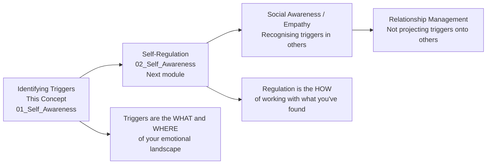

# 📝 Assessment & Reflection — Identifying Personal Triggers

---

## How to Use This Assessment

This is your completion checkpoint — but it is designed to do far more than quiz recall. Every section below requires you to draw on your *actual personal experience* with the exercises, examples, and your own trigger patterns. A strong response here will look nothing like a textbook answer. It will look like your honest, specific, personal data.

If you haven't worked through the exercises yet, **do not complete this assessment** — go back and complete at least Exercises 01, 02, and 05 first. This assessment will be meaningless without that foundation.

---

## Section 1 — Knowledge Check With Anchors

Rate your confidence 1–5, then answer the validation question for each:

**1. Can you explain the difference between a trigger and a proportionate emotional response?**

My confidence: ___ /5

> **Validation question:** A colleague gives you direct, honest feedback that your code review approach has been making people feel undermined. You feel defensive and slightly hurt. Is this a trigger or a proportionate response? What is your reasoning?

*A strong answer would say:* This is potentially both. The hurt is proportionate — feedback about your impact is meaningful. But if the defensiveness reaches 7–8+ intensity and activates a story like "I'm not respected" or "My work is never good enough," a trigger component is likely overlaying the proportionate response. The diagnostic is proportionality + the narrative that accompanies the emotion.

---

**2. Can you explain what happens neurologically during an amygdala hijack — specifically including the 480ms gap and what cortisol does to prefrontal function?**

My confidence: ___ /5

> **Validation question:** Someone says: "I know I was being irrational — I should have just thought it through clearly." What does your understanding of the neuroscience tell you about how accurate this self-criticism is?

*A strong answer would say:* The self-criticism is neurologically uninformed. During an amygdala hijack, cortisol and adrenaline measurably impair prefrontal cortex function — the literal biological machinery of rational thought becomes less effective. Demanding rational thought "in the moment" of a hijack is asking for something the chemistry of the brain cannot deliver at that instant. The intervention must happen before (awareness, identification) or after (regulation, post-event processing) — not during the 480ms window when the reactive state is fully engaged.

---

**3. Can you name the 6 primary core wounds and the specific trigger signatures of each?**

My confidence: ___ /5

> **Self-test:** Without looking back at the Theory file, complete this table from memory:

| Core Wound | Typical Trigger Signatures |
|---|---|
| Abandonment | |
| Rejection | |
| Betrayal | |
| Shame | |
| Powerlessness | |
| Humiliation | |

*Check your answers against the Theory file's Core Wounds section. If you recalled 4+ accurately, confidence should be 4/5.*

---

**4. Can you explain what the Polyvagal theory adds to your understanding of the S.T.O.P. technique — specifically why the longer exhale works?**

My confidence: ___ /5

> **Validation question:** Someone tells you: "I tried the breathing but it didn't calm me down at all. I inhaled for 4 and exhaled for 4 and felt no difference." What would you tell them?

*A strong answer would say:* The exhale must be *longer* than the inhale for vagal activation — specifically at least 1.5x the inhale duration (e.g., in for 4, out for 6–8). The parasympathetic nervous system (rest and digest) is primarily activated during the *exhale* phase of the breathing cycle. An equal inhale-exhale at a slow pace has mild effects. The extended exhale is the mechanism. Also: one breath may not be enough — sometimes 3–5 slow extended exhales are needed before cortisol starts to clear.

---

## Section 2 — My Personal Trigger Profile

Complete this from your own data gathered across the exercises. This is the most valuable section — your honest personal inventory.

### 2.1 — My Top 3 Trigger Patterns

| # | The Trigger Pattern (be specific — not "being criticised" but the specific form it takes) | Core Wound Underneath | Avg Intensity (1–10) | First Traced To (situation / age) |
|---|---|---|---|---|
| 1 | | | | |
| 2 | | | | |
| 3 | | | | |

---

### 2.2 — My Body Signal Library

> "My earliest physical signal of a trigger firing is:"
> _______________________________________________

> "The specific emotion this signal is most often linked to is:"
> _______________________________________________

> "My body signal for ANGER specifically:"
> _______________________________________________

> "My body signal for SHAME specifically:"
> _______________________________________________

> "My body signal for FEAR/ANXIETY specifically:"
> _______________________________________________

---

### 2.3 — My Dominant Reactive Pattern

When triggered, I most commonly respond with: *(be honest — choose your primary pattern)*

> [ ] **Fight** — I become defensive, aggressive, or challenging
> [ ] **Flight** — I withdraw, go quiet, leave the situation
> [ ] **Freeze** — I go blank, lose access to words and thoughts
> [ ] **Fawn** — I over-accommodate, apologise, try to placate
> [ ] **Flood** — I talk too much, over-explain, fill the silence

*What I would say this pattern costs me most in professional settings:*
_______________________________________________

---

### 2.4 — My Primary Core Wound

Based on the Trigger Interview and Core Wound Tracing work, what is the wound that appears most consistently beneath my strongest triggers?

> [ ] Abandonment — *"People always leave / go quiet / withdraw"*
> [ ] Rejection — *"I'm not good enough to be valued here"*
> [ ] Betrayal — *"I cannot trust people with important things"*
> [ ] Shame — *"My competence / worth / adequacy is always potentially exposed"*
> [ ] Powerlessness — *"I have no real control over what happens to me"*
> [ ] Humiliation — *"Being made small in front of others is intolerable"*
> [ ] Other (describe): _______________________________________________

*When did I first identify this wound, and what experience does it trace back to?*
_______________________________________________

---

## Section 3 — Scenario Response Assessment

For each scenario, write your response as if you were in the situation with full trigger awareness. Then assess your own response quality.

---

**Scenario A:** You receive a Slack message from your manager at 9pm: "Can we find 15 minutes tomorrow? I'd like to catch up on a few things." No further context.

> *What is your internal experience over the next hour? (Be completely honest — what thoughts and feelings actually arise?)*
> _______________________________________________

> *What body signal might fire, and what does it indicate?*
> _______________________________________________

> *If a trigger fires: which core wound might this be activating?*
> _______________________________________________

> *What is the proportionate interpretation of the message?*
> _______________________________________________

> *What would the S.T.O.P. moment look like if needed?*
> _______________________________________________

**Self-assessment:** Did I spot the potential trigger before it became a full reaction? Could I hold both the wound-activation signal AND the proportionate interpretation simultaneously? ___

---

**Scenario B:** In a team design discussion, a senior colleague says: "I think we're overcomplicating this. Can we go back to basics?"

> *What is your immediate internal reaction — emotion + body signal?*
> _______________________________________________

> *Is this likely proportionate, or is there a trigger overlay? What is the gap?*
> _______________________________________________

> *If triggered: what is the story running? What does the story believe about what their comment means?*
> _______________________________________________

> *What is the regulated response — what would you actually say?*
> _______________________________________________

**Model response for comparison:**
*Regulated version says:* "Good instinct — let me show you the constraint that makes simplification harder here than it looks." This addresses the real question without carrying the shame of "my thinking is being dismissed." The regulated response can still be assertive — it just isn't fighting the wound.

---

**Scenario C:** You notice that a project you led was referenced in a company blog post — but your name is not mentioned. A colleague's name is.

> *Rate the objective situation severity (1–10):* ___
> *Rate your emotional reaction intensity (1–10):*___
> *The gap:* ___

> *What wound does this gap indicate?*
> _______________________________________________

> *What is the fastest way to gather accurate information before drawing conclusions?*
> _______________________________________________

> *If this is a recurring pattern for you: what single action would most directly address the wound?*
> _______________________________________________

---

## Section 4 — Skill Rating With Behavioural Anchors

Rate yourself honestly using the behavioural anchors below:

| Skill | 1 | 3 | 5 | My Rating |
|---|---|---|---|---|
| **In-the-moment recognition** | "I only realise I was triggered hours or days later" | "I catch it within 30 minutes and can name what happened" | "I notice the body signal in real time and can name the emotion as it rises" | |
| **Proportionality diagnosis** | "I rarely stop to question whether my reaction is proportionate" | "I can sometimes step back and see the gap, especially in retrospect" | "I check proportionality reliably, in the moment or within an hour" | |
| **S.T.O.P. execution under pressure** | "I haven't sincerely tried it in a live trigger situation" | "I've used it successfully in mild-moderate situations" | "I can execute S.T.O.P. even in high-intensity triggers reliably" | |
| **Trigger source tracing** | "I know my triggers fire but have no idea where they come from" | "I've traced 1–2 triggers back to a general time/relationship" | "I can trace most strong triggers to a specific origin experience" | |
| **Response to own reactive moment** | "I feel shame and try not to think about it" | "I can review what happened without excessive self-criticism most of the time" | "I consistently treat reactive moments as data and use them to refine my approach" | |

---

## Section 5 — My Commitment

The most effective precision commitment you can make is one that is specific, time-bound, and connected to your highest-intensity trigger:

```
My primary trigger pattern identified through this module:
_____________________________________________________________

The specific S.T.O.P. or technique I commit to applying when it fires:
_____________________________________________________________

The specific situation where I will practice this first:
_____________________________________________________________

How I will know in 2 weeks that I have made meaningful progress:
_____________________________________________________________
(Not "I will never be triggered again" — what specific, observable change?)

If this trigger fires and I respond reactively anyway, I will:
_____________________________________________________________
(Address how you will respond to yourself — compassion vs shame-criticism)
```

---

## Section 6 — Connecting Forward

This concept connects directly to the next module:



> 🔑 **The integration insight:** Everything you gathered in this concept — your body signals, your core wound, your trigger patterns, your primary reactive behaviour — is the *raw material* for the entire Self-Regulation module that follows. You cannot regulate what you haven't identified. You have done the foundational work.

---

## ✅ Concept Completion Checklist

Mark each item honestly when complete:

- [ ] Read `01_Theory_and_Concepts.md` — can explain amygdala hijack, core wounds, and attachment styles with specificity
- [ ] Completed `02_Techniques_and_Frameworks.md` — know which technique to apply in which situation and why each step works
- [ ] Completed at least **3 exercises** from `03_Practice_Exercises.md`, including the Body Signal Calibration and at least one map/journal entry
- [ ] Read all 6 examples in `04_Real_World_Examples.md` — identified which patterns resonate with your own experience
- [ ] Reviewed `05_Common_Mistakes.md` — identified your top 2 personal risk areas
- [ ] Noted at least 1 specific resource from `06_Tools_and_Resources.md` to use next
- [ ] Completed **all sections of this assessment** with personal, specific answers

**When all are checked:** Mark `04_Identifying_personal_triggers_that_cause_emotional_reactions` as `[x]` in the master task tracker, and proceed to `02_Self_Regulation → 01_Keeping_disruptive_emotions_and_impulses_in_check`.

---

*End of Concept 04 — Identifying Personal Triggers That Cause Emotional Reactions*
*Module continues: `02_Self_Regulation` — the next phase of building emotional mastery*
